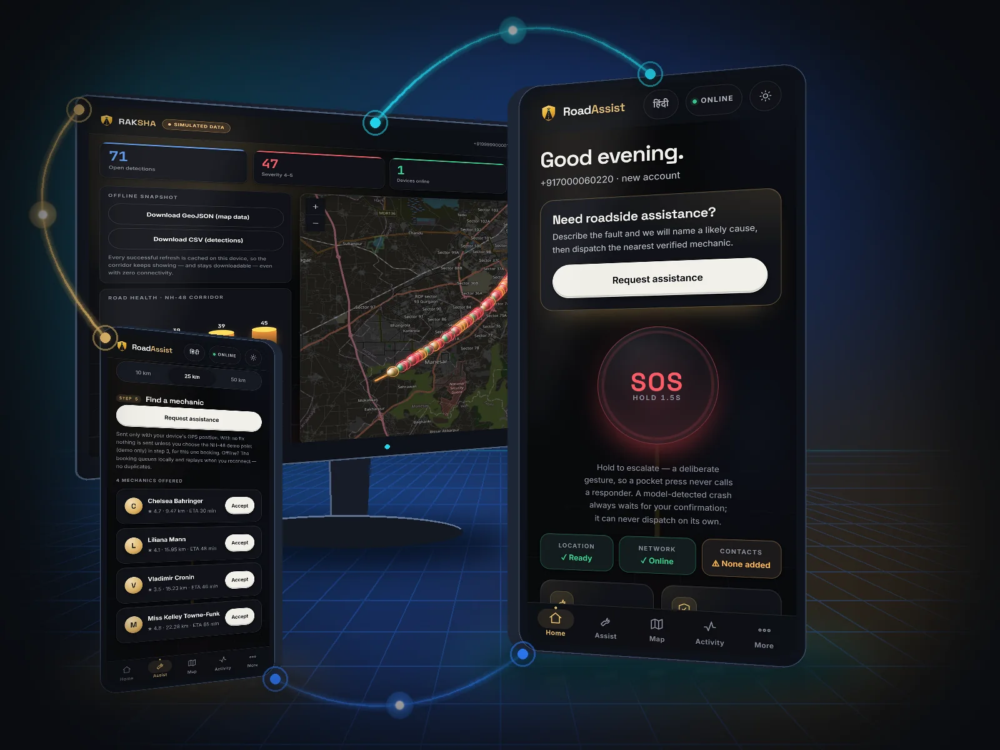
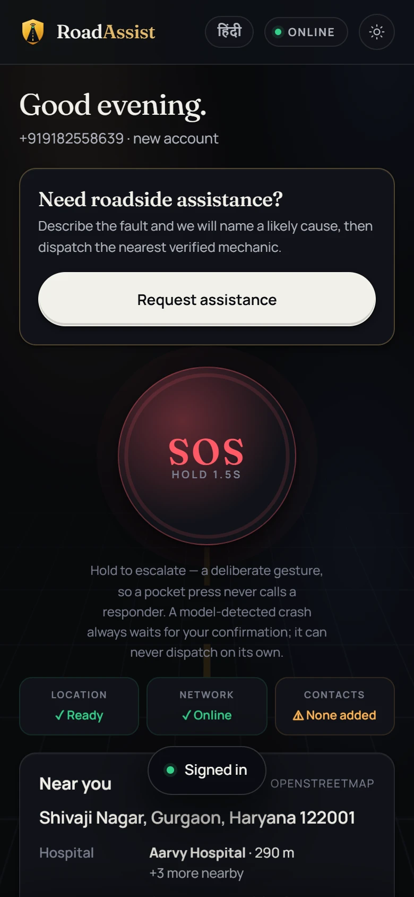
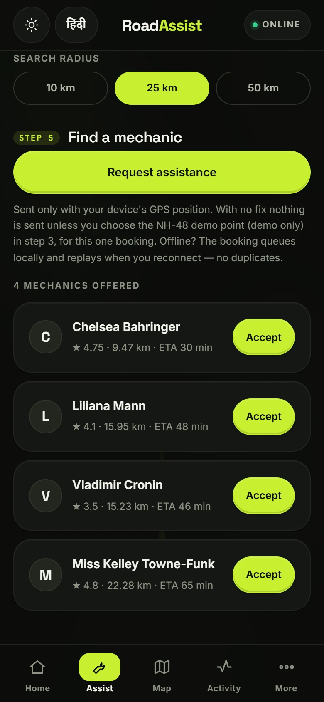
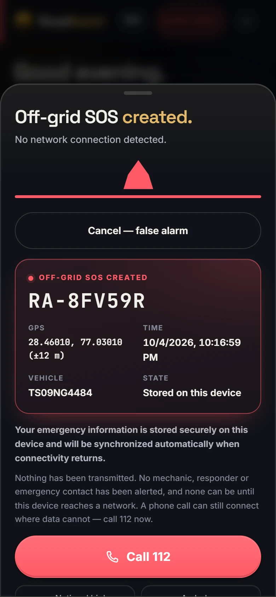
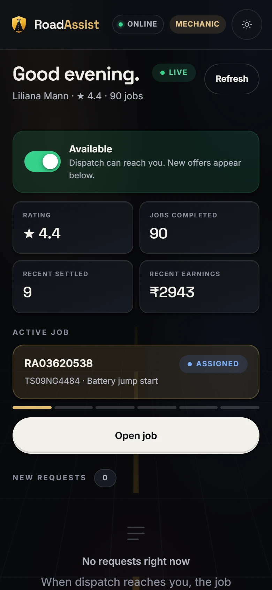
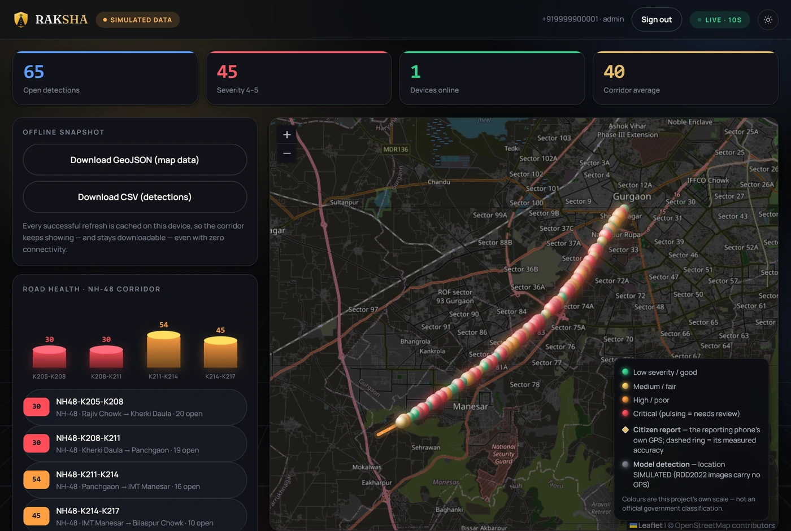
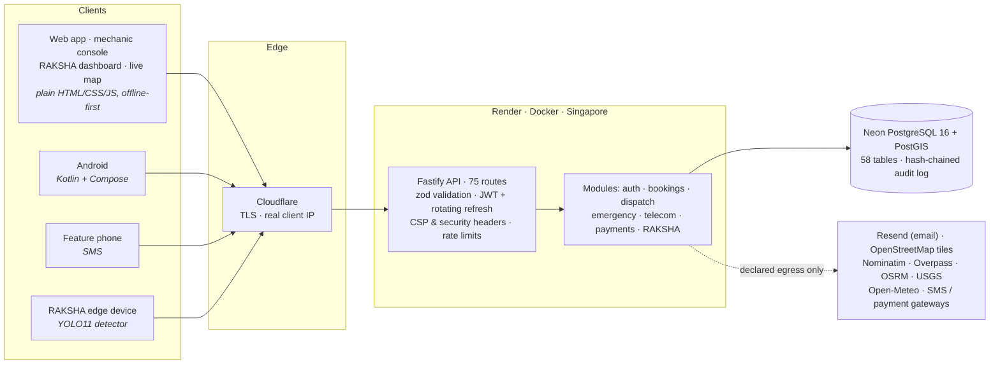

<div align="center">

<picture>
  <source media="(prefers-color-scheme: dark)" srcset="brand/lockup-dark.png">
  
</picture>

### One Platform. Every Vehicle. Every Phone. Every Road.

An offline-first roadside-assistance and road-safety platform for India,
built for the roads where coverage is worst.

[](https://github.com/saatwik-1157/roadassist-bharat/actions/workflows/ci.yml)
[](https://github.com/saatwik-1157/roadassist-bharat/actions/workflows/publish-image.yml)
[](https://github.com/saatwik-1157/roadassist-bharat/actions/workflows/pages.yml)


**[Live platform](https://app.roadassistbharat.online)** ·
**[Showcase](https://roadassistbharat.online)** ·
**[Layers in 3D](https://app.roadassistbharat.online/layers.html)** ·
**[Security](app/docs/SECURITY.md)** ·
**[Testing](app/docs/TESTING.md)** ·
**[Deployment](DEPLOYMENT.md)**



<sub>Real screenshots of the running system, placed into device frames. They are not mockups.</sub>

</div>

---

## Contents

- [What it is](#what-it-is)
- [Team](#team)
- [What runs today](#what-runs-today)
- [Architecture](#architecture)
- [Which half is AI](#which-half-is-ai)
- [Measured, not estimated](#measured-not-estimated)
- [Security](#security)
- [Quick start](#quick-start)
- [The five decisions worth defending](#the-five-decisions-worth-defending)
- [Repository layout](#repository-layout)
- [Non-negotiables](#non-negotiables)
- [Deliberately not built](#deliberately-not-built)
- [Documentation](#documentation)

---

## What it is

A breakdown on a national highway at night is a connectivity problem as much as
a mechanical one. RoadAssist Bharat connects stranded drivers, verified
mechanics and road-safety authorities through **one API and five ways in**: a
web app, a native Android app, a mechanic console, an authority dashboard and a
plain SMS from a feature phone.

- **Request help.** The fault is diagnosed first, then the nearest verified
  mechanic is found, offered the job and tracked live. Payment is settled
  server-side.
- **SOS that degrades gracefully.** The SOS ladder falls from data to SMS to
  112 to an on-device queue, and exactly one of those channels owns each
  emergency.
- **Off-Grid Mode.** An SOS raised with no signal is stored on the device with
  its own reference and GPS fix. It replays itself when the network returns,
  and a replay never creates a second incident.
- **RAKSHA road safety.** A trained YOLO11 detector reports road damage onto an
  authority dashboard and a live map.
- **Feature phones are users.** A complete booking works over SMS, in eight
  languages, with no app at all.

## Team

A four-person team project for **SWE4004: Cloud Computing and Applications**.

| Member | Reg. no. | Workstream |
|---|---|---|
| [V. Saatwik Sairaam](https://github.com/saatwik-1157) | 24MIC7131 | Backend & cloud database |
| P. Sai Nirisha Chowdary | 24MIC7122 | Frontend & mobile |
| T. V. S. Jignesh | 24MIC7190 | AI & data services |
| G. Parthavi | 24MIC7145 | DevOps, QA & cloud security |

The 18-phase plan divided the work into four lead workstreams, D1 to D4,
which map onto the four members in that order. The repository is pushed from a single account, so
`git log` shows one committer. That reflects how the code reached GitHub, not
how the work was split.

---

## What runs today

| Surface | Where | State |
|---|---|---|
| Citizen progressive web app | [`/app.html`](https://app.roadassistbharat.online/app.html) | Ships |
| Mechanic console | [`/mechanic.html`](https://app.roadassistbharat.online/mechanic.html) | Ships |
| RAKSHA authority dashboard | [`/raksha.html`](https://app.roadassistbharat.online/raksha.html) | Ships |
| Live operational map | [`/map.html`](https://app.roadassistbharat.online/map.html) | Ships |
| Architecture in live 3D | [`/layers.html`](https://app.roadassistbharat.online/layers.html) | Ships. It reads live figures from the running platform |
| Native Android client | [`mobile/`](mobile/) | Ships. Kotlin + Compose, release APK under R8 |
| Feature phone over SMS | `POST /v1/telecom/sms` | Ships. A complete booking with no app at all |
| "Near you" card in the citizen app | `/app.html` home screen | Ships. Nearest address and help from OpenStreetMap, [below](#location-services) |
| iOS · Android Auto · IVR · USSD | n/a | **Designed, not built** |

<table>
  <tr>
    <td align="center"><br><sub>Citizen home</sub></td>
    <td align="center"><br><sub>Dispatch to the nearest mechanic</sub></td>
    <td align="center"><br><sub>SOS with no signal</sub></td>
    <td align="center"><br><sub>Mechanic console</sub></td>
  </tr>
</table>



### Where it runs

| | |
|---|---|
| **Platform** | <https://app.roadassistbharat.online>: one Render web service (Docker, region Singapore) serving the API and every web surface from one process |
| **Database** | Neon PostgreSQL 16 + PostGIS, Singapore (`ap-southeast-1`), TLS required |
| **Edge** | Cloudflare in front of Render. The client address comes from `CF-Connecting-IP`, which the caller cannot forge |
| **Showcase** | <https://roadassistbharat.online>: a static page on GitHub Pages that embeds the live platform |
| **Email** | Alert emails and sign-in codes go through Resend from a verified domain |
| **Open data** | Server-side only: Open-Meteo weather and air quality, OpenStreetMap Nominatim and Overpass, the OSRM demo router and the USGS earthquake feed. All are outside India |
| **Mode** | `NODE_ENV=demo` with the `mock` payment provider and no SMS gateway, and every screen says so |

**Signing in to the demo.** With no SMS gateway, the server shows the one-time
code on screen, and only for the published demo numbers: `+917000000000` to
`+917000009999` (the demo citizen `+917000009876` is one of them), and the
demo mechanics `+919600000000` to `+919600000099`. Any other number is refused with
`demo_number_required`. The admin, RAKSHA officer and listed mechanic accounts
sign in by emailed code only.

**Simulated data, labelled as such.** The 24 mechanics and the police and
ambulance responders on the live map are seeded and marked "(simulated)".
RAKSHA's detections are real YOLO11 output placed at simulated NH-48 positions.

### Location services

Open map data, fetched by the server and never by the browser
([ADR-0012](app/docs/adr/0012-open-map-location-services.md)). Four signed-in
routes in `apps/api/src/routes/geo.ts`:

| Route | What it answers | Source |
|---|---|---|
| `GET /v1/geo/address` | A readable place for a point | OpenStreetMap Nominatim |
| `GET /v1/geo/nearby` | Hospitals, police, fuel, EV charging, repair and tyres around a point | OpenStreetMap Overpass |
| `GET /v1/geo/route` | Road distance and driving time, with no live traffic | OSRM demo router |
| `GET /v1/geo/earthquakes` | Magnitude 4+ in and around India, last 7 days | USGS |

The RAKSHA corridor report (`GET /v1/trip/prepare`) also reads air quality
from Open-Meteo at the corridor's two ends and adds a "poor air quality" risk
factor above US AQI 150.

- **Where it shows.** The citizen home screen's "Near you" card (nearest
  address and help, `tel:` links only when the map has a number, and "call
  112"). It loads by itself only if location permission is already granted,
  and otherwise waits for a tap. A live rescue's tracking card adds a road ETA,
  and Trip Guardian an air-quality line. RAKSHA gains a "Corridor conditions"
  panel and a nearest address in the photo viewer, labelled "Simulated point
  near …" for device detections.
- **What leaves.** Coordinates are rounded to about 110 m (address, route) or
  about 1 km (nearby) first, and a point outside India is refused with
  `400 outside_region` before any provider is asked. Calls carry an
  identifying User-Agent, are cached (address 24 h, nearby 6 h, route 10 min,
  earthquakes 15 min, air quality 30 min) and are paced to about one a second.
- **Off in development, test and CI** so no test run calls a donated service;
  on by default anywhere else. `GEO_SERVICES=on|off` overrides it. Off answers
  `503 geo_disabled`, a provider that fails answers `503 geo_unavailable`, and
  the screens say the lookup is unavailable rather than inventing a place.
- **Limits.** Community map data can be missing or stale, and the nearby list's
  distances are straight-line. Every provider is outside India; see
  non-negotiable #4 below.

---

## Architecture

A modular monolith (ADR-0001): one Fastify process, one PostGIS database, and
module boundaries that are enforced in CI rather than by convention.



| Layer | Technology |
|---|---|
| API | Node 22, TypeScript, Fastify 5, zod, jose (JWT) |
| Data | PostgreSQL 16 + PostGIS 3.4, Drizzle ORM, 9 migrations |
| Realtime | Server-sent events with a heartbeat and a per-user cap, and polling underneath |
| Web | Plain HTML, CSS and JavaScript served by the API. No bundler, so there is no second deploy unit and no CORS boundary |
| Offline | Service worker, plus IndexedDB encrypted with AES-GCM-256 under a non-extractable key |
| Android | Kotlin, Jetpack Compose, Gradle 8.13, JDK 21 |
| AI | YOLO11 (Ultralytics), ONNX export, Python 3.12 |
| Delivery | GitHub Actions: CI, a container image to GHCR and Pages. Render deploys on every commit |

---

## Which half is AI

This has to be stated precisely, so it comes before the numbers.

**RAKSHA road-damage detection is a genuinely trained YOLO11 model.** The
shipped model, YOLO11n `yolo11n-india-ft-gpu` (the 4-country model fine-tuned
on RDD2022 India), scores `mAP50` **0.586** (`mAP50-95` 0.287) at 640 px on the
held-out 4-country validation split (800 images, 4 classes) and **0.500**
(0.217) on a held-out India split no model trained on (392 images); potholes
are its weakest class (0.422 on that India split). The Android app runs it at
416 px: 0.516 / 0.245 and 0.449 / 0.195. The weights and
per-epoch metrics live in `ai/runs/`, which is gitignored. A clone gets the
pipeline, the measured figures and the commands that produced them, but not the
artefacts. See [ai/README.md](ai/README.md).

**The roadside diagnosis is not a model.** It is a deterministic rule table
(ADR-0006) that returns `rules-1.0.0`, and every screen that shows it labels it
as a rules engine. `AI_BASE_URL` can point at a model, but nothing in this
repository implements that endpoint.

**No language model is involved anywhere.** There is no LLM dependency in any
manifest and no chat endpoint is called from any source file. `npm run no-llm`
enforces this, and CI fails if one ever appears.

The claim "AI-powered" is recorded as **PARTIAL** in
[CLAIMS-AUDIT](app/docs/CLAIMS-AUDIT.md).

---

## Measured, not estimated

Every figure below was obtained by running the thing it describes, against a
database migrated from empty and then seeded. `app/docs/measured.json` holds
each number and how it was produced, and CI fails if any document disagrees
with it.

| | |
|---|---|
| **1352 assertions**, six suites, zero failures | 527 unit · 288 e2e · 112 concurrency · 108 attacks · 58 gateway security · 259 browser |
| Android | 328 tests, zero lint errors, release APK under R8 |
| AI pipeline | 39 tests, standard library only |
| **Not in the total** | 22 Razorpay checks (`npm run test:razorpay`), run against a local stub of Razorpay's Orders API. They need an API started with `PAYMENTS_PROVIDER=razorpay` pointed at that stub, so they sit outside the six suites and are never described as passing |
| Schema | 58 tables · 143 indexes · 9 migrations |
| API | 75 routes: 72 under `/v1`, plus `/tiles`, `/basemap` and `/health` |
| Localisation | 8 languages, **not native-reviewed** |

CI also kills PostgreSQL under a running API and checks that the platform is
honest about it: `/health` returns 503 naming the database while `/v1/ping`
still returns 200. A client can therefore tell *"you have no network"* from
*"the platform is unwell"*. CI then rehearses a backup and restore and
re-verifies the audit hash chain on the restored copy.

---

## Security

The security suite fires **108 attacks that must every one be refused**:
- cross-tenant reads and writes;
- role escalation and id manipulation;
- SQL injection;
- forged and `alg:none` tokens;
- unsigned webhooks;
- oversized input;
- error-body leakage.

A green run means each attack was attempted and failed, which says more than
"the code looks right".

| Area | What is in place |
|---|---|
| Authentication | SMS one-time codes, stored hashed; 10-minute access tokens; rotating refresh tokens whose reuse revokes the whole family; server-side sign-out |
| Access control | Roles through permissions. Ownership is checked on the resource. System commands are admin-only. Break-glass medical access is audited |
| Input and output | zod on every route. Pages escape server strings. CSV exports neutralise formulas |
| Headers | Content-Security-Policy (`object-src 'none'`, restricted `frame-ancestors`), HSTS, nosniff, Referrer-Policy, Permissions-Policy, COOP/CORP, and `no-store` on the API |
| Abuse | Per-principal rate limits. The SMS webhook is limited per sending number and the map tiles are bounded. SOS alerts are capped, but the escalation itself is never limited |
| Data | HMAC-verified payment webhooks. A hash-chained, append-only audit log. Logs mask numbers, codes and coordinates. Database TLS is required |
| Secrets | None in source, image or history. `gitleaks` runs on every push. The JWT secret must be 32+ characters outside development |

The full write-up, including what is **still open**, is in
[app/docs/SECURITY.md](app/docs/SECURITY.md). Two examples of open items:
refresh tokens live in `localStorage`, and the CSP keeps `'unsafe-inline'`.

---

## Quick start

**One command. Nothing to install but Docker:**

```bash
docker compose -f docker-compose.demo.yml up
```

This pulls the published image, brings up PostGIS, migrates, seeds and serves
every surface on <http://localhost:4000>. Running it twice is a no-op rather
than an error. It generates a random signing secret at each start, so no key is
ever stored in the repository.

**From source:**

```bash
cd app
docker compose up -d db      # PostGIS on 5434
npm run demo:reset           # reset · migrate · seed
npm start                    # API on :4000, serves every web surface too
npm run demo:raksha          # second terminal: 65 real YOLO11 detections, positions simulated on NH-48
```

Sign in with `+917000009876` (citizen), `+919999900001` (authority) or
`+919600000000` (mechanic). In development the server returns the OTP and it
fills in automatically.

**Verify:**

```bash
npm run verify               # typecheck · lint · boundaries · claims · citations · no-llm · residency · unit
```

**Android:** `cd mobile && ./gradlew lint testDebugUnitTest assembleRelease`
(328 tests). Build on **JDK 21**, because Gradle 8.13 rejects 25. A fresh
install talks to the live platform. To use a local API instead, install a debug
build (a release build is HTTPS only), long-press the wordmark on the sign-in
screen and enter its address, for example `10.0.2.2:4000` from the emulator.

[ENGINEERING-NOTES.md](ENGINEERING-NOTES.md) records everything that cost time
to find out: toolchain traps, migration rules, and how to count database
objects without PostGIS inflating the answer.

---

## The five decisions worth defending

Most of this project is ordinary work. These five parts were decided rather
than defaulted into, and each is enforced by something that fails the build if
it regresses.

### 1 · The build refuses to let the documents lie

`app/docs/measured.json` is the single source of every number, and it records
*how* each one was obtained. Five gates guard the claims:

- **`npm run claims`** fails when any document disagrees with it.
- **`npm run citations`** checks that every `file.ts:123` reference in the
  documents still points at real code.
- **`npm run boundaries`** enforces module boundaries, the offline shell's
  completeness and the app shell's load order.
- **`npm run no-llm`** keeps a language model out of the system by
  construction.
- **`npm run residency`** refuses to let a page hand a visitor's address to a
  third party. It also refuses any undeclared server-side outbound host.

This exists because the same wrong number reached twenty-odd documents three
separate times, and each time only a person noticed.

### 2 · A model is never allowed to dispatch

ADR-0005. A crash signal raises an incident that waits in
`AWAITING_CONFIRMATION` until a recorded human, or a corroborating second
signal, moves it on. A false positive that dispatches is worse than a false
negative that asks.

### 3 · Exactly one channel owns an emergency

The SOS ladder falls back `data → SMS → 112 → offline queue`. Precisely one of
those channels owns each report. A confirmed SMS must **not** also queue an API
replay, and an unconfirmed one **must**. Getting this wrong sends two
responders to one accident, or none. These decisions live in
`mobile/.../SosLadder.kt` as pure functions, and 21 Android tests cover that
file alone.

### 4 · Races are settled by Postgres, not by timing

- **Two mechanics accepting one job:** the booking row is locked with
  `SELECT … FOR UPDATE`, and offer expiry is re-checked under the lock.
- **A duplicate SOS:** a unique index on a reference the client generates, with
  `ON CONFLICT DO NOTHING`, rather than a check followed by a write.
- **Double settlement:** a **partial unique index** over settled payments.
- **The audit log:** hash-chained, with Postgres `RULES` making `UPDATE` and
  `DELETE` no-ops.

### 5 · Off-Grid Mode is the architecture, not a fallback

[ADR-0009](app/docs/adr/0009-offgrid-mode.md). The client distinguishes
`ONLINE`, `LIMITED` and `OFF-GRID`. An SOS raised with no signal becomes a real
incident on the device, and the screen says *"stored on this device"* rather
than pretending it was sent. Diagnosis runs on-device against the same rule
table as the server. When connectivity returns, the journal replays itself
idempotently.

---

## Repository layout

| Path | What | Toolchain |
|---|---|---|
| [`app/apps/api`](app/apps/api) | Fastify API: 75 routes, modular monolith (ADR-0001) | Node 22+, TypeScript |
| [`app/apps/web`](app/apps/web) | Citizen, mechanic, authority, map and 3D surfaces | Plain HTML/CSS/JS |
| [`app/packages/db`](app/packages/db) | Drizzle schema, migrations, seeds | PostgreSQL 16 + PostGIS |
| [`app/scripts`](app/scripts) | Six test runners, the claims and citation gates, the RAKSHA simulator | Node |
| [`mobile`](mobile) | Android client | Kotlin, Compose, Gradle 8.13 |
| [`ai`](ai) | RAKSHA CV pipeline: training, ONNX export, serving | Python 3.12 |
| [`pages`](pages) | The public showcase site | Static HTML |
| [`docs`](docs), [`app/docs`](app/docs) | Documentation index, ADRs, security, testing, deployment, RAKSHA design | n/a |

---

## Non-negotiables

1. **Emergency paths never regress.** They need two approvals and a dedicated
   test run, and 21 tests over `SosLadder.kt` run on every push.
2. **Offline is a first-class mode.** The app never claims that something
   reached the cloud when it did not.
3. **Feature phones are users.** Every core journey can be completed over SMS,
   in all eight languages, switched by texting `LANG TA`. The translations are
   not yet native-reviewed; see
   [TESTING.md](app/docs/TESTING.md#localisation-and-exactly-how-far-it-goes).
4. **No PII leaves India. This is the production target, not yet true of the
   demo.** The live demo runs in **Singapore** because the free tiers offer no
   India region. `npm run residency` enforces three things today:
   - no page loads a third-party resource;
   - every server-side outbound host is declared with its region;
   - no analytics or crash-reporting SDK is present.

   The location services add five declared hosts, all outside India:
   `nominatim.openstreetmap.org`, `overpass-api.de`, `router.project-osrm.org`,
   `air-quality-api.open-meteo.com` and `earthquake.usgs.gov`. The first three
   receive a signed-in user's position, coarsened to about 110 m or 1 km. That
   is still personal data, so it is a stated exception to this rule, not
   compliance with it. The production answer is a self-hosted Nominatim and
   OSRM in an Indian region
   ([ADR-0012](app/docs/adr/0012-open-map-location-services.md)).
5. **Nothing is faked in a demo.** If something is mocked, the screen says so.

---

## Deliberately not built

These are not built, and the project says so rather than implying otherwise:
iOS, Android Auto, IVR, USSD, satellite, mesh networking, Kubernetes,
Terraform, autoscaling and multi-zone anything. The ERSS-112 handoff is
stubbed, and the API says so in its own response. There is no load test:
latency is measured for a single user on one machine.

---

## Documentation

[docs/README.md](docs/README.md) indexes every document. All of them are kept
current: if one disagrees with the code, the document is wrong. The old
planning set, dated release evidence and viva packs were removed on
2026-10-05 and remain readable from git history; docs/README.md says how.

| Document | Contents |
|---|---|
| [Security](app/docs/SECURITY.md) | Controls, the September 2026 hardening pass, and known gaps |
| [Testing](app/docs/TESTING.md) | Every suite, what it proves, and how to run it |
| [Deployment](DEPLOYMENT.md) | Render, Neon, Cloudflare, Pages and the one-command demo |
| [Engineering notes](ENGINEERING-NOTES.md) | Toolchain traps and hard-won facts |
| [ADRs](app/docs/adr/) | Thirteen decision records, including the five above |
| [Claims audit](app/docs/CLAIMS-AUDIT.md) | Every over-claim found, what it was, and what it actually is |
