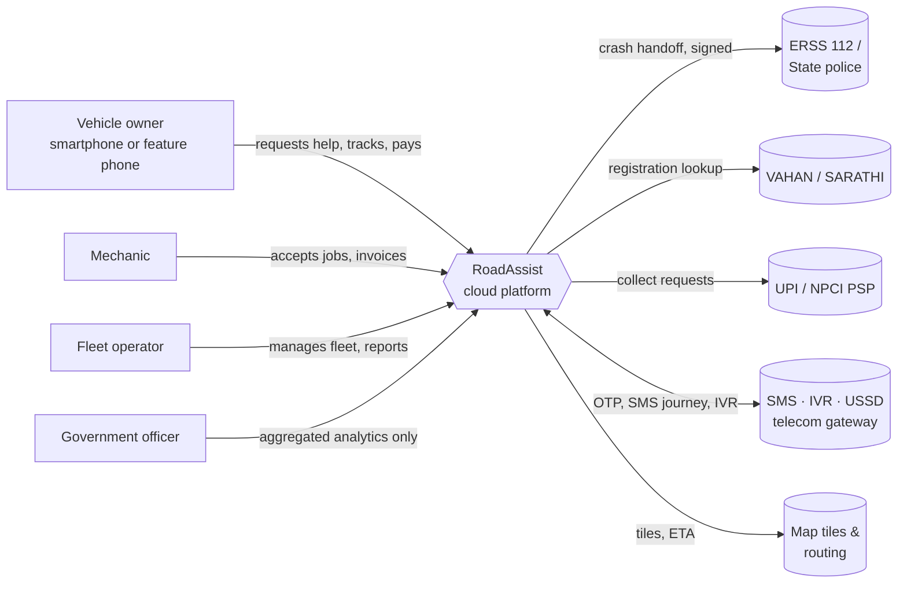
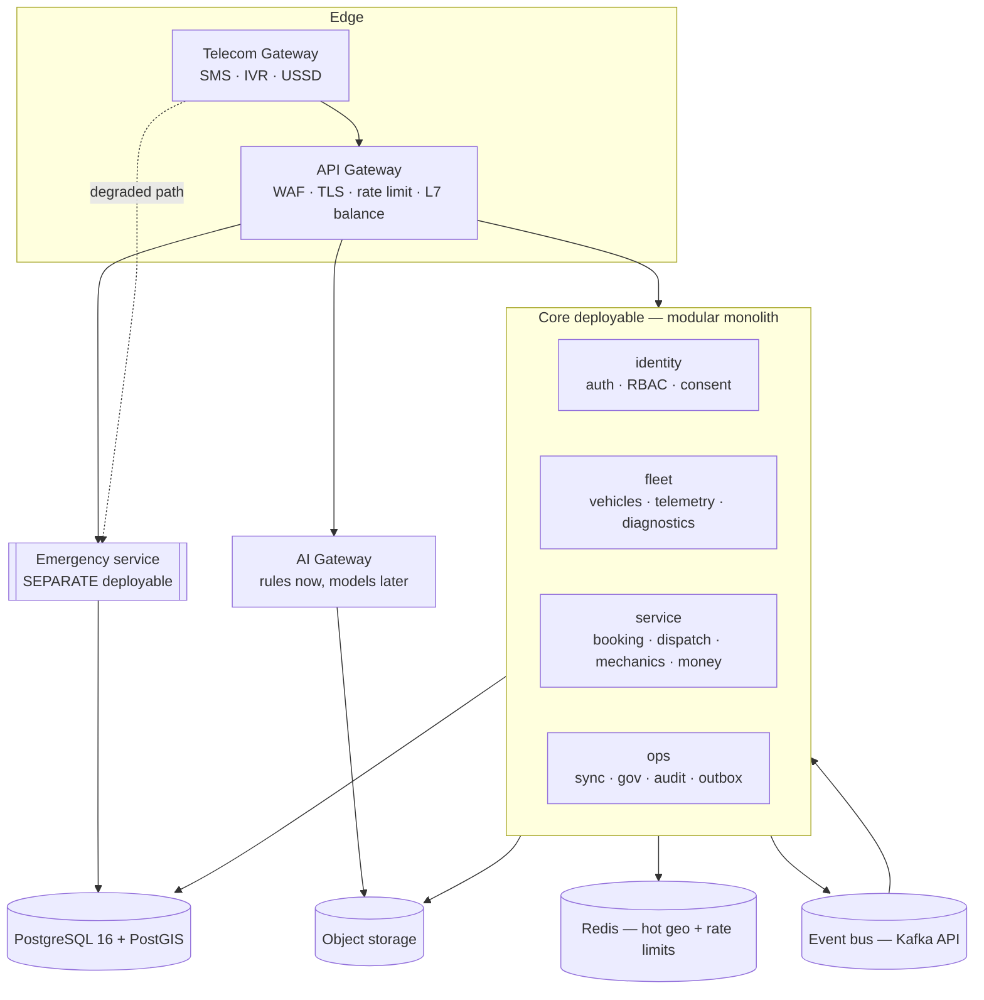
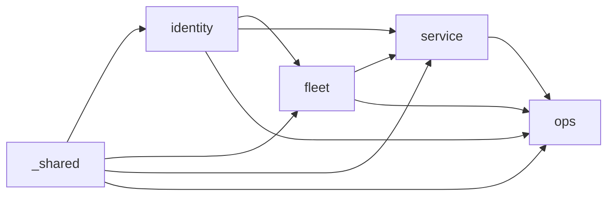

# RoadAssist — System Architecture (Phase 2)

**Status:** Phase 2 complete · Owner: P1 (Saatwik) · Reviewed by P2, P3, P4
Course mapping: this document is the Module 1–5 evidence for Review 1.

---

## 1. C4 Level 1 — System Context

**Trust boundaries.** Our organisational boundary ends at the virtual network. Our
*trust* boundary extends into every managed service we call — which is why the 112
handoff is signed and the PSP never returns card data to us.

---

## 2. C4 Level 2 — Containers

The dotted line is the point of ADR-0005: with the core scaled to zero, SMS still
reaches Emergency.

---

## 3. C4 Level 3 — Module dependencies (enforced in CI)

Acyclic, one direction, checked by `scripts/check-boundaries.mjs`. A pull request
that adds an edge here fails the build until `ALLOWED` is updated deliberately.

---

## 4. Event catalogue

Published through a transactional outbox (`outbox_events`) so an event is never
emitted for a transaction that rolled back.

| Topic | Emitted when | Key | Consumers |
|---|---|---|---|
| `booking.requested` | Booking enters `REQUESTED` | bookingId | dispatch, analytics |
| `booking.assigned` | A mechanic accepts an offer | bookingId | notification, analytics |
| `booking.status_changed` | Any guarded transition | bookingId | notification, audit, analytics |
| `booking.completed` | Work finished | bookingId | billing, analytics, ML labels |
| `dispatch.offer_sent` | Offer issued to a mechanic | mechanicId | notification |
| `dispatch.no_supply` | Offer ladder exhausted | bookingId | ops alerting, analytics |
| `incident.raised` | Crash signal or manual SOS | incidentId | emergency, notification |
| `incident.confirmed` | Human or two-signal confirmation | incidentId | emergency, 112 adapter |
| `vehicle.telemetry_ingested` | Telemetry batch stored | vehicleId | predictive maintenance |
| `sync.operation_applied` | Queued client op replayed | userId | analytics |
| `sync.conflict_resolved` | A conflict rule fired | entityId | audit, ops review |
| `consent.withdrawn` | DPDP withdrawal | userId | **every module** — must stop processing |

Schema rule: events are **additive only**. Removing or retyping a field requires a
new topic version (`booking.requested.v2`), never an in-place change.

---

## 5. Degraded-mode matrix

Every container has a written answer to "what still works if this is down".

| Component down | User-visible behaviour | Still works |
|---|---|---|
| AI Gateway | Diagnosis falls back to the rules engine; no error shown | Everything |
| Dispatch module | "Finding a mechanic" state persists; retried on recovery | Booking creation, tracking, SOS |
| Payment module | Job completes, invoice queued, cash accepted | Everything else |
| Redis | Slower geo queries (PostGIS path) | Everything |
| Event bus | Outbox accumulates; drains on recovery | All synchronous paths |
| Object storage | Photo upload deferred, queued on device | Diagnosis by symptom, all bookings |
| **Core deployable** | Main app unavailable | **SOS via SMS → Emergency (degraded path)** |
| Telecom gateway | App users unaffected; feature phones cannot reach us | App and web journeys |
| Primary database | Read-only mode, writes rejected with retry guidance | Tracking from replicas |

---

## 6. API style guide (v1)

**Envelope.** Every response is `{ data, meta }` on success, `{ error }` on failure
(RFC 7807 problem details in `error`). No bare arrays — a top-level array cannot be
extended without breaking clients.

**Versioning.** `/v1` in the path. Additive changes only within a version;
breaking changes require `/v2` and a deprecation window.

**Pagination.** Cursor-based, never offset. `?cursor=&limit=` with `limit` capped
server-side at 100. Offset pagination degrades and skips rows under concurrent writes.

**Idempotency.** Every write accepts `Idempotency-Key`. The key plus endpoint is
stored in `idempotency_keys` with the original response, so a retry on a flaky 2G
connection returns the first result rather than creating a second booking. This is
not optional on this product — retries are the normal case, not the exception.

**Concurrency.** `If-Match` with the row's `version` column on updates; a mismatch
returns `409` rather than silently overwriting.

**Errors.** Machine-readable `code`, human-readable `title`, and a `retryable`
boolean so the offline client knows whether to re-queue.

**Sparse fieldsets.** `?fields=` on list endpoints. On 2G, a payload the client does
not read is a cost the user pays for.

**Rate limits.** Per-tier: unauthenticated 20/min, authenticated 120/min,
mechanic feed 600/min, emergency endpoints generous but non-zero (a flood of fake
SOS calls is a real attack).

---

## 7. Non-functional targets (frozen at Phase 2)

| Journey | Target |
|---|---|
| Booking create | p95 < 300 ms |
| Nearest-mechanic query | p95 < 50 ms at 1M mechanics |
| SOS → responder notified | p95 < 10 s |
| Sync of 100 queued ops | p95 < 8 s on 3G |
| Core availability | 99.9% |
| Emergency availability | 99.99% |
| App cold start (2 GB device) | p95 < 2.5 s |

**Error budget policy.** When a service burns 50% of its budget, feature work on it
stops and reliability work starts. Automatic, not a discussion.

---

## 8. What Phase 2 does *not* cover

Stated explicitly so the review is honest about status:

- No API implementation yet — Phase 5.
- Migrations are written but **not applied**; the schema is a Phase 3 head start.
- No authentication implementation — Phase 4.
- No frontend — Phase 6.
- Docker Compose is defined and reviewed but the local stack has not been brought up
  on this machine (Docker Desktop was not running during Phase 2).
