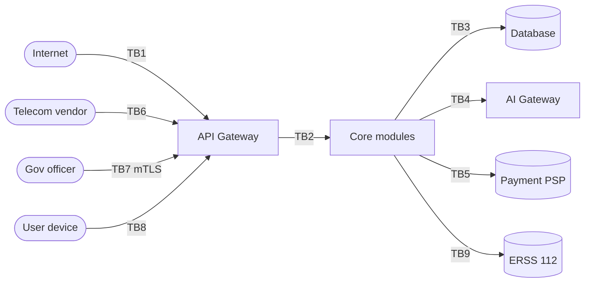

# Threat Model (STRIDE) — Phase 2

**Owner:** P4 (Parthavi) with P1 (Saatwik) · Module 6 evidence for Review 1

Each threat names the control **and the phase that implements it**, so nothing is
left as an intention.

## Trust boundaries

## STRIDE analysis

| # | Boundary | STRIDE | Threat | Control | Phase |
|---|---|---|---|---|---|
| 1 | TB1 | Spoofing | OTP brute force to take over a phone number | 5 attempts / 15 min per MSISDN **and** per IP, exponential backoff, constant-time compare | 4 |
| 2 | TB1 | Spoofing | SIM-swap takeover | Device binding + step-up auth for payment and emergency-contact changes + cooling period after MSISDN change | 4 |
| 3 | TB1 | DoS | Flood of unauthenticated requests | Edge rate limiting **before** the application, WAF, per-tier quotas | 4 |
| 4 | TB1 | DoS | Fake SOS flood exhausting responder capacity | Emergency endpoints rate-limited per device and per MSISDN; unconfirmed incidents never escalate | 11 |
| 5 | TB2 | Elevation | A verified mechanic reads another user's booking by changing an ID | Resource-scoped authorization — role **plus** ownership, checked at the resource not the route; 6 negative IDOR tests | 4 |
| 6 | TB2 | Tampering | Replayed refresh token | Rotating refresh with reuse detection — reuse revokes the entire token family and notifies the user | 4 |
| 7 | TB3 | Information disclosure | Application account can read tables it does not own | Least-privilege database role per module; app never connects as owner | 3 |
| 8 | TB3 | Tampering | Insider edits the audit trail | `audit_log` has DO INSTEAD NOTHING rules on UPDATE/DELETE plus a hash chain — tampering is detectable | 3 |
| 9 | TB4 | Tampering | Prompt injection through the free-text symptom field | User text is data, never instruction; the LLM only *explains* a structured result it did not choose; output validated against that result | 7 |
| 10 | TB4 | Information disclosure | PII leaves the platform inside a model request | PII scrubbing at the AI Gateway; prediction logs store an input **hash**, never the input | 7 |
| 11 | TB5 | Information disclosure | Card data entering PCI scope | PSP tokenization only — card data never touches our servers | 5 |
| 12 | TB6 | Spoofing | Forged inbound SMS webhook creating bookings | Vendor signature verification on every inbound webhook; SMS path limited to a reduced capability set (no payment, no profile change) | 8 |
| 13 | TB7 | Spoofing | Someone impersonating a government officer | Per-officer client certificates over mTLS + IP allowlist + 15-minute tokens; revocation tested | 12 |
| 14 | TB7 | Information disclosure | Re-identifying a citizen by differencing overlapping queries | k-anonymity ≥ 10 enforced **at the query layer**, per-officer query budget, every query logged with a purpose code | 12 |
| 15 | TB8 | Tampering | A tampered offline client asserting a booking state | Queued operations re-authorized server-side on replay; booking state is server-authoritative (ADR-0004) | 8 |
| 16 | TB8 | Information disclosure | Tokens readable on a rooted device | Tokens in Keychain/Keystore only, never plain storage; local DB encrypted; medical and payment data never persisted locally | 4, 8 |
| 17 | TB9 | Repudiation | Dispute over whether a 112 handoff occurred | Signed, replay-protected payload; handoff recorded in the append-only audit log | 11 |
| 18 | All | Information disclosure | PII in logs, traces or crash reports | Redaction in the logging library — not by convention; a CI test logs a fake token and asserts it is scrubbed | 5 |
| 19 | All | Elevation | Container escape onto the host | Minimal hardened images, non-root, read-only root filesystem, pod security standards, nodes replaced not patched | 15 |
| 20 | All | Repudiation | Break-glass read of medical data with no accountability | Actor, reason and time written to `break_glass_access`; the user is notified afterwards | 11 |

## Controls already present at Phase 2

- `audit_log` append-only rules and hash-chain columns — in the schema.
- `idempotency_keys` — replay safety designed into the contract.
- `sync_operations.op_id` unique — offline replay cannot double-apply.
- Secret scanning (gitleaks) and high-severity dependency audit gate every pull request.
- `.gitignore` excludes `.env`; only `.env.example` is committed.

## Open at Phase 2

- No implementation of any control above — Phase 2 delivers the design and the
  mapping. Implementation begins at Phase 3.
- No penetration test until Phase 14.
- DLT registration for SMS templates not yet submitted; it is the longest lead item
  and blocks OTP delivery (see risk register).
