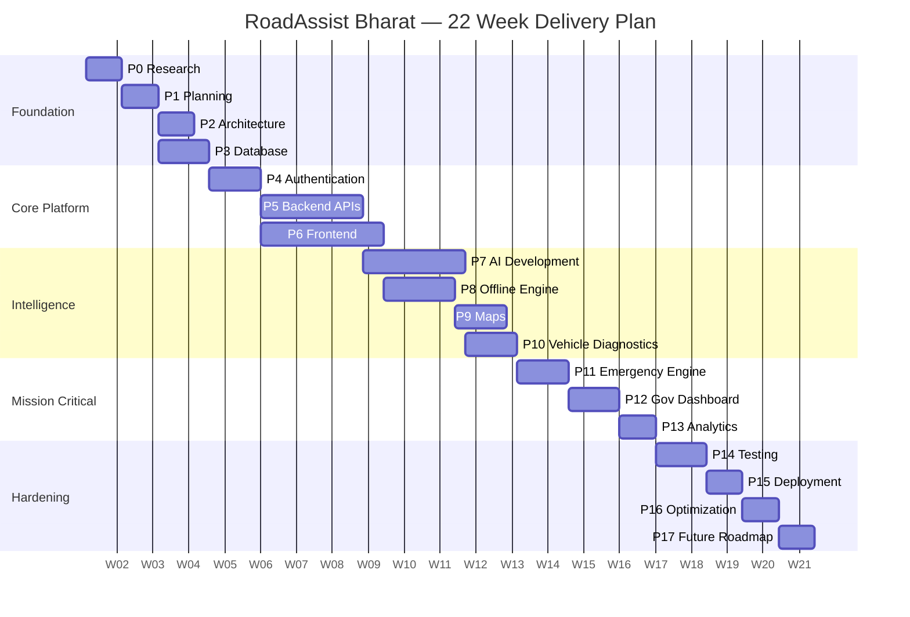
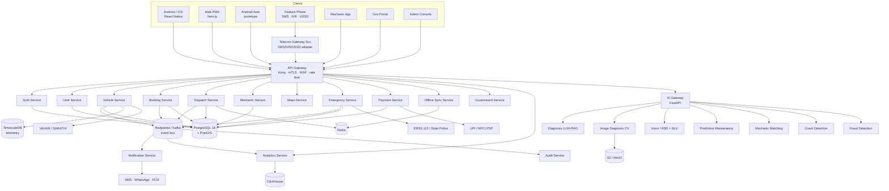

# RoadAssist Bharat — Master Roadmap (Phases 0–17)

Cross-team view. Each person's day-by-day work lives in their own roadmap file:
[D1 Backend](02-backend-lead-roadmap.md) · [D2 Frontend](03-frontend-lead-roadmap.md) · [D3 AI](04-ai-lead-roadmap.md) · [D4 DevOps/QA](05-devops-qa-lead-roadmap.md)

---

## Phase → Sprint → Owner Map

| Phase | Sprint | Primary | Support | Exit gate |
|-------|--------|---------|---------|-----------|
| P0 Research | S0 | **All** | — | Research dossier signed off by CTO |
| P1 Planning | S0 | **CTO + all** | — | PRD + backlog + estimates frozen |
| P2 System Architecture | S1 | **D1** | D3, D4 | ADR-001..015 accepted; C4 diagrams merged |
| P3 Database Design | S1 | **D1** | D3 | Migrations run clean up + down on empty DB |
| P4 Authentication | S2 | **D1** | D2, D4 | OTP→JWT→RBAC works on mobile + web + SMS |
| P5 Backend APIs | S2–S3 | **D1** | D3 | 100% of v1 OpenAPI implemented + contract-tested |
| P6 Frontend | S3–S4 | **D2** | D1 | Full booking journey on Android/iOS/Web |
| P7 AI Development | S4–S5 | **D3** | D1 | 5 models served, each beating its baseline |
| P8 Offline Engine | S5 | **D2** | D1, D4 | Airplane-mode journey completes and syncs |
| P9 Maps | S6 | **D2** | D1 | Offline tiles + routing + live tracking |
| P10 Vehicle Diagnostics | S6 | **D3** | D2 | OBD-II + photo + symptom triage all live |
| P11 Emergency Engine | S7 | **D1** | D3, D4 | Crash → SOS → responder handoff, <10 s |
| P12 Government Dashboard | S7 | **D2** | D3 | Live incident map + 6 statutory reports |
| P13 Analytics | S8 | **D3** | D1 | ClickHouse pipeline + 4 dashboards |
| P14 Testing | S8 | **D4** | All | All quality gates green |
| P15 Deployment | S9 | **D4** | D1 | Prod multi-AZ, blue/green, DR drill passed |
| P16 Optimization | S9 | **D4** | All | p95 <300 ms, APK <28 MB, cost/user modelled |
| P17 Future Roadmap | S10 | **CTO + all** | — | 18-month roadmap + pitch deck + pilot MoU |

---

## Target Architecture

### Why each service exists

| Service | Exists because | Would break without it |
|---------|----------------|------------------------|
| **API Gateway** | Single ingress for auth, rate limiting, WAF, request signing, protocol translation. Clients on 2G need one TLS handshake, not twelve. | Every service re-implements auth; mobile battery and latency suffer |
| **Auth Service** | Identity is the one thing that must never be duplicated. Owns OTP, JWT issuance, refresh rotation, device binding, RBAC claims. | Inconsistent session semantics; token replay attacks |
| **User Service** | Profiles, consent ledger, KYC state, preferences, language. Split from Auth so PII has a separate blast radius and its own encryption keys. | PII sprawl across every service; DPDP non-compliance |
| **Vehicle Service** | The domain is vehicle-centric, not user-centric: one user, many vehicles; one vehicle, many owners over time. Owns VAHAN sync, OBD telemetry ingest, service history. | Can't model fleets, resale, or per-vehicle prediction |
| **Booking Service** | Owns the booking state machine and money-adjacent invariants. Deliberately boring, heavily tested, no AI in the critical path. | Double-booking, lost requests, payment disputes |
| **Dispatch Service** | Real-time matching is a fundamentally different workload (geospatial, low-latency, in-memory, high churn) than transactional booking. Separated so it can scale and fail independently. | Dispatch load takes down bookings |
| **Mechanic Service** | Supply-side lifecycle: onboarding, verification, skills, inventory, payouts, ratings, availability. Different actors, different SLAs. | Supply and demand logic tangle; can't onboard partners independently |
| **Maps Service** | Centralizes tiles, geocoding, routing, ETA, geofencing, and offline map-pack generation so vendor choice is one swap, not thirty. | Vendor lock-in; per-client licence costs; inconsistent ETAs |
| **Emergency Service** | Life-safety has a different reliability class: separate deploy, separate quota, degraded-mode path that survives a full platform outage. | An unrelated bug in bookings can kill an SOS |
| **Notification Service** | Fan-out across FCM/APNs/SMS/WhatsApp/IVR with per-channel retry, DLT template compliance, quiet hours, and dedup. | Duplicate/ spam notifications; TRAI violations |
| **Offline Sync Service** | Server-side half of the offline engine: change feed, vector clocks, conflict resolution, tombstones, batch replay. | Data corruption the moment a user goes offline |
| **AI Gateway** | One boundary for model routing, versioning, A/B, confidence thresholds, fallback, cost control, and PII scrubbing. Python stays isolated from the Node core. | Models leak into business logic; no way to roll back a model |
| **Analytics Service** | OLAP separated from OLTP. Also the compliance boundary for aggregate/anonymized data shared with government. | Analytics queries take down production |
| **Government Service** | Different tenancy, different auth (mTLS + IP allowlist), different data contract (aggregated, anonymized), different audit rules. | Accidental PII exposure to a third party |
| **Payment Service** | PCI/RBI scope containment. Isolating it keeps the rest of the platform out of audit scope. | Entire platform enters PCI scope |
| **Audit Service** | Append-only, tamper-evident log required for DPDP, insurance disputes, and government audits. | No defensible record when it matters |

---

## Phase Detail

Each phase below gives **Objectives · Tasks · Dependencies · Deliverables · Acceptance Criteria**. Per-person breakdowns (folder structure, tables, APIs, screens, models, libraries, risks, security, testing, docs, branches, time, demo) are in the four individual roadmaps.

---

### Phase 0 — Research · S0 W1 · All hands

**Objectives** — Replace assumptions with evidence before a line of product code is written.

**Tasks**
- Field research: 20 vehicle owners (5 car, 5 two-wheeler, 4 auto, 3 truck, 3 tractor), 10 mechanics, 2 fleet managers, 1 RTO/traffic official. Structured interview guide, recorded, transcribed.
- Competitive teardown: Bosch RoadSide, ReadyAssist, Allianz/Europ Assistance India, Tata Capital RSA, OEM apps (MyTVS, Maruti Suzuki), plus Uber/Ola dispatch mechanics as a technical reference.
- Regulatory scan: DPDP Act 2023, TRAI DLT/UCC, MoRTH AIS-140, ERSS 112 integration norms, VAHAN/SARATHI API access, RBI PA/PG guidelines, insurance IRDAI motor-claim workflows.
- Technical feasibility spikes (timeboxed 1 day each): OBD-II BLE dongle read on a low-end Android; offline vector tiles size for one district; USSD session flow with a gateway sandbox; crash detection from raw accelerometer traces.
- Connectivity reality study: measure real 2G/3G latency and packet loss on 3 highway corridors; catalogue device mix from India Android distribution data.

**Dependencies** — None. This phase gates everything.

**Deliverables** — Research dossier (findings + verbatim quotes), 6 personas, journey maps for 4 scenarios (highway breakdown, city no-start, night-time accident, fleet truck failure), competitor matrix, regulatory obligation register, 4 spike reports with go/no-go.

**Acceptance criteria**
- Every product assumption in the pitch is either evidenced or explicitly flagged as an open bet.
- Each spike ends with a written go/no-go and a named fallback.
- Regulatory register lists every obligation with owner and phase where it's satisfied.

---

### Phase 1 — Planning · S0 W2 · CTO + all

**Objectives** — Convert research into a scoped, estimated, sequenced plan with a frozen v1 boundary.

**Tasks** — Write the PRD (problem, users, jobs-to-be-done, scope, explicit non-goals). Define success metrics and SLOs. Cut the v1/v2/v3 line. Build the epic → story backlog with acceptance criteria. Estimate in ideal days, per person. Assemble the risk register. Choose the stack and record it as ADRs. Set up the repo, project board, CI skeleton, and coding standards. Draft the business model canvas.

**Dependencies** — P0.

**Deliverables** — PRD v1, SLO document, prioritized backlog (~180 stories), estimate sheet, risk register, ADR-000 (stack selection), monorepo scaffold, project board, this Team Charter.

**Acceptance criteria**
- Every S1–S4 story is Ready (has AC, ≤3 ideal days, no unresolved dependency).
- Total estimate fits 22 weeks × 32 ideal days/sprint with ≥20% buffer, or scope is cut until it does.
- Non-goals are written down explicitly. "Not in v1" is a documented decision, not a silence.

**SLO targets (frozen here)**

| Journey | SLO |
|---------|-----|
| App cold start (low-end device) | p95 < 2.5 s |
| Booking create API | p95 < 300 ms |
| Mechanic match returned | p95 < 4 s |
| SOS → responder notified | p95 < 10 s |
| Sync of 100 queued ops | p95 < 8 s on 3G |
| Core API availability | 99.9% (99.99% for Emergency) |
| Crash-free session rate | ≥ 99.5% |

---

### Phase 2 — System Architecture · S1 · Owner D1

**Objectives** — Define service boundaries, contracts, event model, and non-functional strategy so four people can build in parallel without collisions.

**Tasks** — C4 diagrams (context/container/component). Service decomposition with explicit boundaries and ownership. Event catalogue and schema registry (Avro). Sync/async decision per interaction. API style guide (REST + JSON:API-ish envelope; gRPC internal; WebSocket for live tracking). Idempotency, pagination, versioning, and error-envelope standards. Multi-tenancy model for fleets and government. Caching strategy per layer. Rate-limit tiers. Failure-mode analysis per service with degraded-mode definition. Threat model (STRIDE) with D4.

**Dependencies** — P1.

**Deliverables** — 15 ADRs, C4 diagram set, event catalogue, API style guide, OpenAPI v0 skeleton, threat model, degraded-mode matrix.

**Acceptance criteria**
- Every service has one owner, one database schema, and no shared tables.
- Every cross-service call is classified sync or async with a documented reason.
- Every service has a written degraded-mode behaviour ("what still works if this is down").
- Two engineers can independently implement against the contract without talking.

---

### Phase 3 — Database Design · S1 · Owner D1

**Objectives** — An enterprise PostgreSQL schema that survives 10M users, regulatory audit, and five years of change.

**Tasks** — Full ER model. Normalize to 3NF, then document each deliberate denormalization with a reason. PostGIS geometry for locations/geofences. TimescaleDB hypertables for telemetry. Index plan derived from the actual query catalogue. Constraints (FK, CHECK, EXCLUDE for overlapping availability, partial unique). Audit log via triggers → append-only table. Soft delete convention + enforced read views. Optimistic-concurrency `version` columns. Partitioning strategy (booking by month, telemetry by time+vehicle). Migration tooling and expand/contract discipline. Seed and synthetic data generators.

**Dependencies** — P2.

**Deliverables** — ER diagram (Mermaid), ~60-table schema, migration set, index plan with EXPLAIN evidence, audit/soft-delete/versioning conventions doc, seed generator producing 100k realistic rows.

**Acceptance criteria**
- Migrations apply and roll back cleanly on an empty DB, twice in a row.
- Every table has: PK, `created_at`, `updated_at`, `deleted_at`, `version`, and an owner service.
- Every FK has a supporting index. Zero sequential scans on the top-20 query catalogue at 100k rows.
- Audit trigger proven to capture INSERT/UPDATE/DELETE with before/after payloads.

---

### Phase 4 — Authentication · S2 · Owner D1 (+D2 clients, +D4 secrets)

**Objectives** — One identity system spanning smartphones, browsers, feature phones, mechanics, fleets, and government — with real RBAC.

**Tasks** — Phone-OTP primary flow with rate limits and lockout. JWT access (10 min) + rotating refresh (30 days) with reuse detection. Device binding and multi-device session list. RBAC: roles (citizen, mechanic, fleet_admin, fleet_driver, gov_officer, support, admin) × permissions, resource-scoped. Feature-phone auth via SIM-bound MSISDN + PIN. Government mTLS + IP allowlist + short-lived tokens. Optional DigiLocker/eKYC linkage for mechanic verification. Consent ledger (DPDP): purpose-scoped, versioned, withdrawable. Session revocation, step-up auth for high-risk actions.

**Dependencies** — P3.

**Deliverables** — Auth service, RBAC policy engine + policy tests, consent ledger, client SDK (TS) with silent refresh, IVR/SMS auth path, admin session management screen.

**Acceptance criteria**
- OTP brute force blocked (5 attempts / 15 min / MSISDN + IP).
- Refresh token reuse detected → entire family revoked → user notified.
- 20 RBAC policy tests pass, including 6 negative IDOR cases.
- Auth works end-to-end on mobile, web, mechanic app, gov portal (mTLS), and SMS.
- Consent withdrawal propagates to all services within 60 s.

---

### Phase 5 — Backend APIs · S2–S3 · Owner D1 (+D3 AI endpoints)

**Objectives** — Implement the full v1 surface: the platform's actual product logic.

**Tasks** — Booking state machine (REQUESTED → MATCHING → ASSIGNED → EN_ROUTE → ON_SITE → IN_PROGRESS → COMPLETED, with CANCELLED/FAILED/ESCALATED branches) with guarded transitions and idempotent commands. Dispatch: geospatial candidate query → scoring → offer → accept/timeout/reoffer ladder. Vehicle CRUD + VAHAN lookup + service history. Mechanic onboarding, verification, availability, inventory. Pricing engine (base + distance + parts + surge, with a transparency breakdown). Payments: UPI intent, card, cash, corporate credit, wallet, refunds. Notification fan-out. Fleet APIs (bulk vehicles, drivers, policies, cost centres). Reviews/ratings with fraud hooks. Support/ticketing. Full webhook system for partners.

**Dependencies** — P4.

**Deliverables** — 12 services, ~140 endpoints, OpenAPI 3.1 spec, generated TS client, Postman collection, contract tests (Pact), seeded demo scenarios.

**Acceptance criteria**
- 100% of the v1 OpenAPI implemented; spec is generated from code, never hand-written.
- All write endpoints idempotent under `Idempotency-Key`; proven by a replay test.
- State machine rejects every illegal transition (exhaustive test over the transition matrix).
- Contract tests pass against the frontend's consumer expectations.
- p95 < 300 ms for the top 10 endpoints at 1k RPS locally.

---

### Phase 6 — Frontend · S3–S4 · Owner D2

**Objectives** — Ship the real product surface across 7 clients, designed for low-end devices and bad networks first.

**Tasks** — Design system (tokens, 40+ components, dark/light, 8 languages incl. Hindi/Tamil/Telugu/Bengali/Marathi, RTL-ready). React Native app: onboarding, garage, request-help flow, live tracking, chat/call, payment, history, profile. Mechanic app: job feed, accept, navigation, checklist, parts, invoice, earnings. Web PWA parity for core flows. Admin console. Fleet dashboard. Android Auto prototype (media/navigation templates). Motion system, skeletons, optimistic UI, error/empty/offline states everywhere. Accessibility pass.

**Dependencies** — P4 (auth), P5 partial (contracts can be mocked via MSW from day one).

**Deliverables** — Design system package, RN app (Android+iOS), 4 web apps, Android Auto prototype, Storybook, screenshot/visual regression suite.

**Acceptance criteria**
- Full booking journey works on Android 10 / 2 GB RAM / throttled 3G.
- Every screen has designed loading, empty, error, and offline states — verified in review.
- WCAG 2.1 AA: contrast, focus order, screen-reader labels, 44 dp targets.
- Cold start p95 < 2.5 s on the reference device; initial web route ≤ 180 KB gz.
- 8 languages render without truncation or layout break.

---

### Phase 7 — AI Development · S4–S5 · Owner D3

**Objectives** — Nine AI subsystems that are genuinely useful, measurably better than a baseline, and safe to fail.

**Tasks** — See [D3's roadmap](04-ai-lead-roadmap.md) for full model specs. Summary: symptom→diagnosis triage (retrieval + classifier + LLM explanation), image damage/part diagnosis (CV), voice assistant (ASR for Indian languages + intent NLU + TTS), predictive maintenance (survival + gradient boosting on telemetry), mechanic matching (learning-to-rank), crash detection (on-device sensor model), fraud detection (graph + anomaly), government analytics (spatiotemporal forecasting), offline AI (quantized on-device bundle).

**Dependencies** — P3 (feature store schema), P5 (data flowing), P10 shares the diagnostics work.

**Deliverables** — 9 model pipelines, AI Gateway, model registry (MLflow), feature store, 9 model cards, eval harness with held-out sets, on-device bundle ≤ 15 MB.

**Acceptance criteria**
- Every model beats its documented baseline on a held-out set (baselines defined *before* training).
- Every model has a confidence threshold and a defined fallback when it isn't met.
- Crash detection: recall ≥ 0.95 on labelled crash traces, false-positive rate ≤ 1 per 1,000 driving hours, and it never auto-dispatches without human confirmation.
- On-device inference ≤ 120 ms p95 on the reference device.
- Model card exists and is reviewed for bias before any model reaches production.

---

### Phase 8 — Offline Engine · S5 · Owner D2 (client) + D1 (server)

**Objectives** — Make the product work where it's needed most: no signal, on a highway, at night.

**Tasks** — Local DB (WatermelonDB/SQLite) mirroring the domain. Write-ahead operation queue with priority (SOS > booking > telemetry > analytics). Sync protocol: cursor-based change feed, per-field last-write-wins with server-authoritative state machine override, tombstones, batched compressed deltas. Conflict resolution rules per entity, with a user-visible resolution UI where the machine can't decide. Offline map packs. SMS fallback protocol: compact encoded messages for request/status/cancel. IVR menu tree and USSD session flow. Bluetooth relay (phone-to-phone hop when one device has signal). Background sync scheduling that respects battery and metered data.

**Dependencies** — P6, P5, P9 (map packs).

**Deliverables** — Offline client library, sync service, conflict matrix doc, SMS/IVR/USSD flows live on a sandbox gateway, Bluetooth relay prototype, offline test harness (network chaos).

**Acceptance criteria**
- Complete a help request in airplane mode; it syncs correctly on reconnect with no data loss.
- Conflict test suite (30 scenarios) passes; no scenario produces a corrupt or ambiguous state.
- Feature-phone user can request help, receive mechanic details, and cancel — entirely over SMS.
- Sync of 100 queued operations completes p95 < 8 s on simulated 3G.
- Queue survives app kill, device reboot, and OS storage pressure.

---

### Phase 9 — Maps · S6 · Owner D2 + D1

**Objectives** — Maps that work offline, cost nothing per-tile at national scale, and are accurate enough to dispatch on.

**Tasks** — MapLibre GL rendering (native + web). Self-hosted OSM vector tiles + Valhalla routing/ETA. District-level offline map pack generation, download manager, and delta updates. Geocoding + reverse geocoding with Indian address quirks (landmarks, no house numbers). Geofencing (service zones, toll plazas, accident blackspots, gov jurisdictions). Live location tracking over WebSocket with adaptive sampling and battery-aware throttling. Highway kilometre-marker resolution ("NH-48, KM 212") — critical for rural dispatch. Snap-to-road, trip replay.

**Dependencies** — P6, P5.

**Deliverables** — Maps service, tile infrastructure, offline pack builder, map component library, geofence admin UI, tracking channel.

**Acceptance criteria**
- Navigation and search work with the device fully offline for a downloaded district.
- ETA within ±20% of ground truth on 20 sampled routes.
- Location tracking costs ≤ 4% battery/hour with the screen off.
- A user can be located by highway KM marker with no street address available.
- Map pack for a typical district ≤ 60 MB.

---

### Phase 10 — Vehicle Diagnostics · S6 · Owner D3 + D2

**Objectives** — Tell the user what's wrong before the mechanic arrives — from a dongle, a photo, a sound, or a sentence.

**Tasks** — OBD-II BLE dongle integration (ELM327 profile): DTC read, live PIDs, freeze frames; DTC → plain-language mapping in 8 languages. Photo diagnosis (damage type, severity, part identification). Sound-based diagnosis (engine/brake noise classification) as a v1.5 spike. Symptom triage conversation. Two-wheeler and tractor-specific rule packs (most Indian two-wheelers have no OBD — rule + symptom based). EV-specific diagnostics (SoC, cell balance, thermal, charge faults). Truck telematics (AIS-140/FMS where available). Severity → "can I drive it?" recommendation with an explicit safety-conservative bias. Parts prediction feeding mechanic inventory.

**Dependencies** — P7, P6.

**Deliverables** — Diagnostics service, BLE module, DTC knowledge base (~5k codes), diagnosis UI flow, per-vehicle-class rule packs, mechanic pre-brief (mechanic sees the diagnosis before arriving).

**Acceptance criteria**
- OBD read works on ≥3 dongle models and ≥5 vehicle makes.
- Photo diagnosis top-3 accuracy ≥ 85% on the held-out set.
- Non-OBD vehicles (bike, auto, tractor) get a useful symptom-based triage — verified by 5 mechanics rating outputs.
- Safety recommendation errs conservative: measured false "safe to drive" rate = 0 on the eval set.
- Mechanic receives the diagnosis and predicted parts list before departure.

---

### Phase 11 — Emergency Engine · S7 · Owner D1 + D3 + D4

**Objectives** — The feature that justifies the platform. Must work when everything else is broken.

**Tasks** — Crash detection pipeline: on-device sensor model → 30 s user-cancellable countdown → confirmed incident. Manual SOS (in-app, hardware button pattern, voice, SMS keyword). Automatic escalation ladder: emergency contacts → nearest responder → ambulance → ERSS 112 handoff (with the state integration protocol). Medical profile (blood group, allergies, conditions) available to responders under break-glass access with full audit. Live incident room: location stream, audio capture consent, responder ETA. Nearest hospital/ambulance/police routing. Insurance FNOL auto-trigger. Degraded mode: SOS over raw SMS works even with the entire application platform down. Drill mode for testing without touching real services.

**Dependencies** — P7 (crash model), P9 (routing), P5.

**Deliverables** — Emergency service (independently deployed, own quota, own alerting), SOS UI across all clients, 112 handoff adapter, break-glass audit, degraded SMS path, drill runbook.

**Acceptance criteria**
- Crash → contacts + responders notified, p95 < 10 s.
- 30 s cancel window works and is impossible to miss (audio + haptic + full-screen).
- Emergency path passes a chaos test with every other service down.
- Break-glass access to medical data logs actor, reason, and time; alerts the user afterwards.
- No auto-dispatch to public emergency services without either user confirmation or a two-signal confirmation policy documented and approved.
- Runs as a monthly drill with a written report.

---

### Phase 12 — Government Dashboard · S7 · Owner D2 + D3

**Objectives** — Give NHAI/state transport/traffic police a live operational picture, without handing them citizens' personal data.

**Tasks** — Multi-tenant gov portal (national → state → district → jurisdiction hierarchy). Live incident map with clustering and severity layers. Accident blackspot analysis and heatmaps. Breakdown-density analysis for infrastructure planning. Response-time analytics per corridor. Statutory report generation (6 formats, exportable). Anonymization/aggregation layer with k-anonymity enforcement (no cell below k=10 is ever shown). Alerting for corridor incidents. Read-only API for state integration. Full audit trail of every officer's query.

**Dependencies** — P11, P13 partial.

**Deliverables** — Gov portal, anonymization service, 6 report templates, gov API, officer audit log, data-sharing agreement template.

**Acceptance criteria**
- No individual citizen is identifiable in any view or export — verified by a re-identification test.
- k-anonymity ≥ 10 enforced at query time, not just in the UI.
- Live map handles 10k concurrent incidents without client jank.
- Every officer query is audited with purpose code.
- Reports match the statutory format samples collected in P0.

---

### Phase 13 — Analytics · S8 · Owner D3 + D1

**Objectives** — Instrument the business so decisions are made on data, and give fleets/mechanics their own numbers.

**Tasks** — Event taxonomy and tracking plan (one canonical event schema, no ad-hoc events). CDC pipeline Postgres → Kafka → ClickHouse. Core dashboards: operations (demand, supply, match rate, cancellations), reliability (SLOs), business (revenue, CAC/LTV, cohort retention), safety (incidents, response times). Fleet analytics (cost per km, downtime, driver behaviour). Mechanic analytics (earnings, utilization, ratings, acceptance). Funnel and cohort analysis. Anomaly alerting on business metrics. Self-serve query layer for the team.

**Dependencies** — P5, P12.

**Deliverables** — Event taxonomy doc, CDC pipeline, ClickHouse schema, 4 dashboard suites, fleet + mechanic analytics screens, metric definitions dictionary.

**Acceptance criteria**
- Every metric has exactly one definition in the dictionary; no two dashboards disagree.
- Pipeline lag p95 < 60 s from event to dashboard.
- Dashboards load < 2 s at 100M events.
- Anomaly alerts fire on injected synthetic anomalies during testing.

---

### Phase 14 — Testing · S8 · Owner D4, all contribute

**Objectives** — Prove the thing works, including on the paths nobody wants to think about.

**Tasks** — Unit tests to 80% branch coverage on new code. Integration tests with testcontainers (real Postgres/Redis/Kafka). API contract tests (Pact) both directions. E2E: Detox (mobile), Playwright (web) across the 12 critical journeys. Security testing: OWASP ASVS L2 checklist, ZAP DAST, Semgrep/CodeQL SAST, dependency + container scanning, secrets scanning, plus an authenticated pentest pass. Load testing (k6): 10k RPS steady, 50k spike, 100k concurrent WebSocket tracking sessions. Soak test 24 h. Chaos: kill pods, partition network, saturate DB connections, expire certs. Offline test matrix (airplane mode, flaky 2G, mid-sync kill, clock skew, storage full). Device farm across 12 real Android devices + 4 iOS. Accessibility audit. Localization QA across 8 languages. Emergency-path drill.

**Dependencies** — P5–P13.

**Deliverables** — Full test suites in CI, test strategy doc, load test report, security test report, chaos experiment log, device compatibility matrix, bug triage and burn-down to zero P0/P1.

**Acceptance criteria**
- All quality gates in Charter §11 green.
- Zero open P0/P1 bugs at sprint exit.
- Load: p95 < 300 ms at 10k RPS; graceful degradation (not collapse) at 50k spike.
- Chaos: every experiment ends with the documented degraded behaviour, not an outage.
- Emergency drill passes with the platform artificially degraded.

---

### Phase 15 — Deployment · S9 · Owner D4

**Objectives** — Production infrastructure that a 4-person team can actually operate.

**Tasks** — Terraform for all infra (India regions only). Kubernetes with per-service HPA, PDBs, resource limits, and node pools sized by workload class. GitOps with ArgoCD. Blue/green for stateless, expand-contract for schema. Progressive delivery: canary 5% → 25% → 100% with automated rollback on SLO breach. Secrets in Vault/KMS with rotation. Multi-AZ; documented multi-region DR. Backups: PITR for Postgres, tested restores, cross-region encrypted copies. Observability: Prometheus + Grafana + Loki + Tempo + Sentry, RED/USE dashboards per service, SLO burn-rate alerts. On-call rotation with runbooks. Cost monitoring and budget alerts. Store submission (Play/App Store) with staged rollout.

**Dependencies** — P14.

**Deliverables** — Terraform modules, K8s manifests/Helm charts, ArgoCD apps, CI/CD pipelines, observability stack, 25+ runbooks, DR plan, on-call schedule, published apps.

**Acceptance criteria**
- A commit to `main` reaches production through the full pipeline with zero manual steps beyond one approval.
- Rollback of any service completes < 5 min, proven by drill.
- DR drill: restore from backup into a clean region, RTO < 4 h, RPO < 5 min — proven, not asserted.
- Every alert has a runbook; a new on-call can resolve a simulated incident using only the runbook.
- All data at rest and in transit encrypted; no plaintext secret anywhere in the pipeline.

---

### Phase 16 — Optimization · S9 · Owner D4, all contribute

**Objectives** — Make it fast, small, and cheap enough to serve millions on cheap phones and cheap data.

**Tasks** — Backend: query tuning from `pg_stat_statements`, index refinement, connection pooling (PgBouncer), targeted caching, payload trimming, response compression. Mobile: APK size (Proguard/R8, resource shrinking, dynamic feature modules), startup profiling, memory leak hunt, jank elimination at 60 fps, battery profiling, data-usage reduction (protobuf on hot paths, delta sync, image transcoding to AVIF/WebP). Web: route-level code splitting, edge caching, image optimization, critical CSS. AI: quantization, distillation, batching, model caching. Infra: right-sizing, spot instances for batch, autoscaling tuning, cost-per-active-user model. Database: partition pruning, vacuum tuning, read replicas.

**Dependencies** — P15.

**Deliverables** — Performance report (before/after), optimization ADRs, cost model per 100k MAU, performance budgets wired into CI.

**Acceptance criteria**
- p95 API < 300 ms; p99 < 800 ms at production load.
- APK ≤ 28 MB; cold start p95 ≤ 2.0 s on the reference device (improved from 2.5 s).
- Monthly data usage for a typical user ≤ 30 MB.
- Infra cost per 100k MAU modelled and within target; regressions alert in CI.
- Performance budgets fail the build when exceeded — no silent regression.

---

### Phase 17 — Future Roadmap · S10 · CTO + all

**Objectives** — Define what's next and package the story for pilots, partners, and investors.

**Tasks** — 18-month product roadmap (Now/Next/Later). Technical debt register with a repayment plan. Scaling plan to 10M users with the specific bottlenecks named. Expansion: EV charging assistance network, insurance-embedded RSA, OEM white-label, ADAS/dashcam integration, V2X readiness, drone-delivered parts (research), predictive road-condition mapping. Business: revenue model, subscription tiers, government licensing, insurance and fleet partnerships, mechanic network economics, unit economics, BMC, market sizing, competitor analysis, SWOT. Pitch deck. Pilot MoU draft for one city + one highway corridor.

**Dependencies** — P16.

**Deliverables** — 18-month roadmap, tech debt register, scaling plan, business model canvas, pitch deck (12 slides), market/competitor/SWOT analysis, pilot proposal.

**Acceptance criteria**
- Roadmap items are sequenced with dependencies and rough sizing, not a wish list.
- Unit economics show a path to contribution-margin-positive with stated assumptions.
- Pitch deck survives a hostile Q&A dry run with the team playing judges.
- Pilot proposal is concrete enough to hand to a government or fleet counterpart.

---

## Business Model Summary (detail in P17 deliverables)

| Stream | Who pays | Model | Notes |
|--------|----------|-------|-------|
| B2C subscription | Vehicle owners | ₹299/₹699/₹1,499 per year (Basic/Plus/Pro) | Unlimited assistance calls at Pro; per-use pricing below |
| Pay-per-use | Non-subscribers | ₹399–₹1,999 per incident + parts | Entry point that converts to subscription |
| B2B fleet | Fleet operators | ₹99–₹249/vehicle/month | Volume tiers, SLA-backed, analytics included |
| Government licensing | State transport / NHAI | Annual platform licence + per-district | Dashboard, analytics, corridor monitoring |
| Insurance partnership | Insurers | Per-policy bundling + FNOL data | RSA as a policy rider; crash data reduces claim fraud |
| OEM white-label | Vehicle manufacturers | Licence + revenue share | Branded RSA inside the OEM's own app |
| Mechanic network | Mechanics | 12–18% take rate on jobs | Plus paid tooling: inventory, invoicing, credit |
| Data products | Insurers, planners | Aggregated, anonymized road-risk data | Strictly k-anonymized; never personal data |
