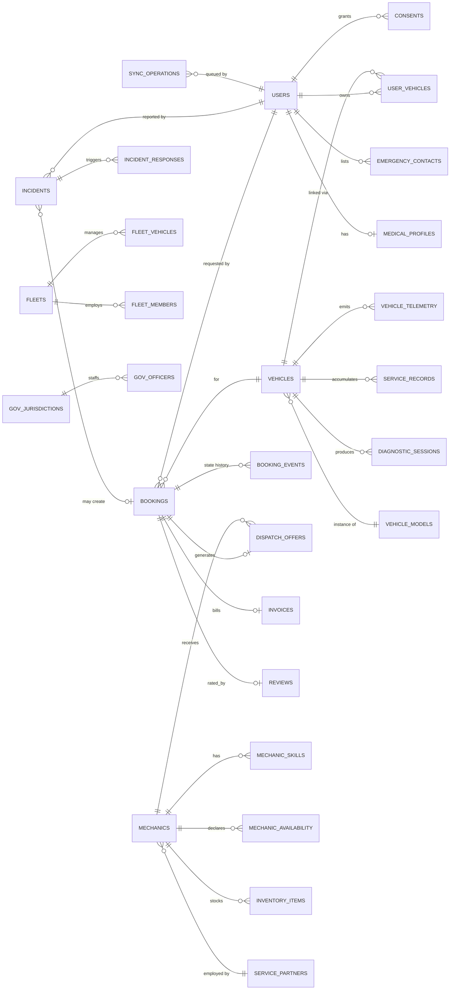
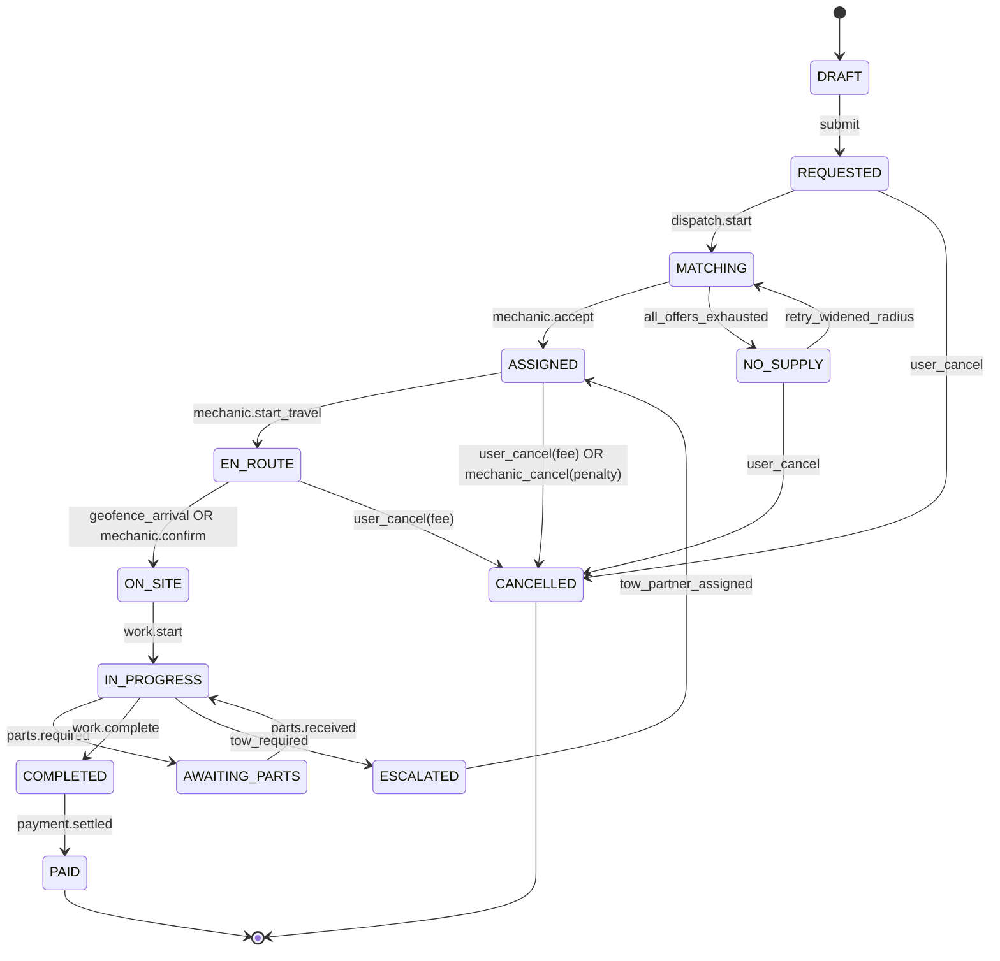
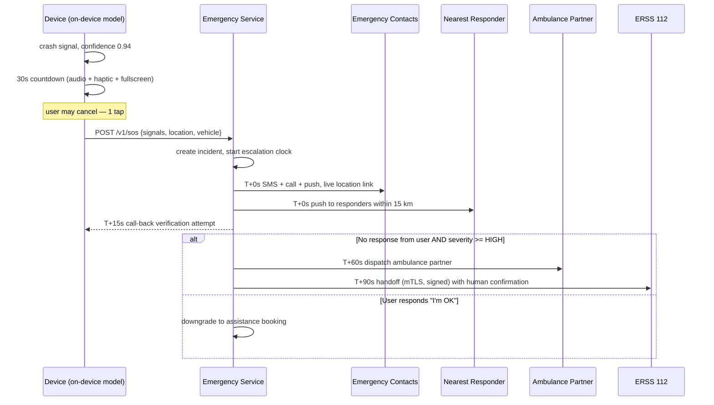

# D1 — Backend & Data Lead · Individual Roadmap

> **A four-person team** for SWE4004 — Cloud Computing and Applications:
>
> | Member | Reg. no. | Workstream |
> |---|---|---|
> | V. Saatwik Sairaam | 24MIC7131 | Backend & cloud database (D1) |
> | P. Sai Nirisha Chowdary | 24MIC7122 | Frontend & mobile (D2) |
> | T. V. S. Jignesh | 24MIC7190 | AI & data services (D3) |
> | G. Parthavi | 24MIC7145 | DevOps, QA & cloud security (D4) |
>
> The D1–D4 roles below are the same four workstreams, in that order. The
> repository is pushed from one account, so `git log` shows a single committer;
> that is how the code was submitted, not how the work was divided.

**Owns:** all backend services, PostgreSQL/PostGIS schema, event bus, API contracts, auth, booking/dispatch, emergency core, payments.
**Backs up:** D3 on the AI gateway and analytics service.
**Total allocation:** 22 weeks · ~176 ideal days.

**Standing responsibilities (every sprint, not phase-specific):**
- The OpenAPI spec is the single source of truth. It is generated from code and published on every merge to `main`.
- No other engineer is ever blocked waiting on a contract from you — mock-first, spec before implementation.
- Every migration you write is reviewed by a second person and has a tested rollback.
- You are the final word on data modelling. Push back on schema shortcuts, including your own.

---

## Phase 0 — Research · S0 W1 · 4 days

| | |
|---|---|
| **Goal** | Establish whether the intended backend architecture survives contact with Indian mobility reality — connectivity, regulation, and integration partners. |
| **Deliverables** | Integration feasibility report (VAHAN/SARATHI, FASTag, ERSS 112, UPI/PSP); data-model research notes from 10 mechanic + 2 fleet interviews; event-model draft; ADR-000 stack proposal. |
| **Expected output** | A written go/no-go per external integration, with fallback if the API is unavailable or the approval timeline exceeds the project. |
| **Folder structure** | `docs/research/backend/` `docs/adr/` |
| **Database tables** | None yet — but produce a *candidate entity list* (~55 entities) with cardinalities from interview evidence. |
| **APIs** | None. Draft the API style guide instead. |
| **UI screens** | None. |
| **Components** | None. |
| **AI models** | None — but define with D3 which backend events the models will need as features. |
| **Libraries** | Evaluation only: NestJS vs Fastify-standalone, Prisma vs Drizzle vs TypeORM, Kafka vs Redpanda vs NATS, BullMQ. |
| **Risks** | VAHAN API access requires a government MoU that may take months → design a manual-entry + OCR fallback for RC books from day one. |
| **Security** | Map every external integration to its data-sharing obligation; flag anything that would push us into PCI or RBI PA/PG scope. |
| **Testing** | N/A — but write the *testability* requirements into the style guide (every service must run fully offline in tests via testcontainers). |
| **Documentation** | Integration feasibility report; candidate ER sketch; API style guide v0. |
| **Git branches** | `docs/p00-d1-integration-research`, `docs/p00-d1-adr-000-stack` |
| **Time** | 4 ideal days |
| **Demo** | 10-min walkthrough: "here is what we can integrate with, here is what we must fake, and here is the fallback for each." |

---

## Phase 1 — Planning · S0 W2 · 4 days

| | |
|---|---|
| **Goal** | Convert the backend surface into an estimated, sequenced backlog with a frozen v1 contract boundary. |
| **Deliverables** | Backend epic breakdown (~70 stories with AC), estimates, service inventory with owners, repo scaffold + CI skeleton for backend packages. |
| **Expected output** | Every backend story for S1–S4 is Ready; D2 and D3 can see exactly which contracts land in which sprint. |
| **Folder structure** | `apps/` `libs/` `tools/` Nx monorepo scaffold; `libs/shared-contracts/` created and wired into CI. |
| **Database tables** | Entity list frozen; naming conventions decided (snake_case, singular table names, `_id` FKs, `uuid v7` PKs). |
| **APIs** | Publish the *contract delivery calendar* — which endpoints exist as mocks in which sprint. |
| **UI screens** | None. |
| **Components** | Shared libs: `logger`, `errors`, `validation`, `idempotency`, `pagination`, `auth-guard`, `event-bus`. |
| **AI models** | Agree the AI Gateway contract shape with D3 (request/response envelope, confidence, model version, fallback flag). |
| **Libraries** | Locked: NestJS 11, Fastify adapter, Drizzle ORM, Zod, Redpanda + `kafkajs`, BullMQ, `ioredis`, `@nestjs/terminus`, Pino, OpenTelemetry SDK. |
| **Risks** | Over-decomposition into microservices with a 4-person team → decision: **modular monolith deployed as 5 process groups**, with clean module boundaries that can be split later. Record as ADR-002. |
| **Security** | Threat model kickoff with D4; decide the trust boundaries that shape the service split. |
| **Testing** | Test pyramid targets per layer; testcontainers harness scaffolded. |
| **Documentation** | ADR-001 (modular monolith), ADR-002 (Drizzle), ADR-003 (Redpanda), ADR-004 (error envelope), contract calendar. |
| **Git branches** | `chore/p01-d1-monorepo-scaffold`, `docs/p01-d1-adrs` |
| **Time** | 4 ideal days |
| **Demo** | `npx nx run-many -t test` passes on an empty scaffold in CI; contract calendar walked through with D2/D3. |

---

## Phase 2 — System Architecture · S1 W3 · 5 days · **You own this phase**

| | |
|---|---|
| **Goal** | Define boundaries, contracts, and failure semantics precisely enough that four people build in parallel for 20 weeks without collisions. |
| **Deliverables** | C4 diagrams (context/container/component), 15 ADRs, event catalogue with Avro schemas, API style guide v1, degraded-mode matrix, OpenAPI v0 skeleton generating a TS client. |
| **Expected output** | D2 codes against a generated client on day 1 of S2. D3 codes against a fixed AI Gateway envelope. Nobody waits. |
| **Folder structure** | ```apps/{gateway,auth,core-api,dispatch,emergency,worker}/ libs/{contracts,domain,db,events,auth,observability,testing}/ infra/ docs/{adr,api,runbooks}/``` |
| **Database tables** | Schema-per-module decided (`auth.*`, `user.*`, `vehicle.*`, `booking.*`, `dispatch.*`, `mech.*`, `emg.*`, `pay.*`, `audit.*`). No cross-schema FKs except to `user.users`. |
| **APIs** | Style guide: REST + envelope `{data, meta, error}`; cursor pagination; `Idempotency-Key` on all writes; `If-Match` for optimistic concurrency; RFC 7807 problem details; `/v1` URI versioning; gRPC internal; WebSocket for tracking. |
| **UI screens** | None. |
| **Components** | `libs/contracts` (Zod schemas → OpenAPI → TS client), `libs/events` (typed publisher/consumer, schema registry client), `libs/observability` (trace/log/metric conventions). |
| **AI models** | AI Gateway contract finalized: `POST /ai/v1/{capability}` with `{input, context, requestId}` → `{result, confidence, modelVersion, fallbackUsed, latencyMs}`. |
| **Libraries** | `@asyncapi/generator`, `avsc`, `zod-to-openapi`, `nestjs-otel`, `@grpc/grpc-js`. |
| **Risks** | Contract churn later breaks the frontend → mitigation: contracts are versioned and additive-only after S3; breaking changes require a new version path and a deprecation window. |
| **Security** | STRIDE threat model with D4 across all trust boundaries; output is a control list mapped to phases. Decide: mTLS between process groups, gateway-only ingress, no service reachable from the internet directly. |
| **Testing** | Contract testing strategy (Pact) agreed with D2. Architecture fitness functions defined (dependency-cruiser rules that fail CI on illegal module imports). |
| **Documentation** | 15 ADRs, C4 set, event catalogue, style guide, degraded-mode matrix. |
| **Git branches** | `docs/p02-d1-c4-architecture`, `feat/p02-d1-contracts-lib`, `feat/p02-d1-event-bus-lib` |
| **Time** | 5 ideal days |
| **Demo** | Walk the C4 diagrams; show a Zod schema producing OpenAPI producing a typed TS client that D2 imports; show CI failing on an illegal cross-module import. |

---

## Phase 3 — Database Design · S1 W4 · 6 days · **You own this phase**

| | |
|---|---|
| **Goal** | A schema that survives 10M users, five years of change, and a regulatory audit. |
| **Deliverables** | Full ER model, ~60 tables, migration set, index plan with EXPLAIN evidence, audit/soft-delete/versioning conventions, seed generator (100k rows). |
| **Expected output** | `pnpm db:migrate && pnpm db:seed` produces a realistic database in under 2 minutes. |
| **Folder structure** | `libs/db/{schema,migrations,seeds,queries}/`, `docs/db/er.md` |
| **Database tables** | See the table catalogue below. |
| **APIs** | None — but publish the **query catalogue**: the top 40 queries the API layer will run, used to derive indexes. |
| **UI screens** | None. |
| **Components** | `libs/db` repository layer, transaction manager, soft-delete read views, audit trigger generator, migration lint. |
| **AI models** | Feature-store table design with D3: `ml.feature_vehicle_daily`, `ml.feature_user_behaviour`, `ml.training_snapshot`. |
| **Libraries** | `drizzle-orm`, `drizzle-kit`, `postgis`, `timescaledb`, `pgcrypto`, `pg_stat_statements`, `@faker-js/faker`, `pgbouncer`. |
| **Risks** | (a) PostGIS query performance on national-scale geography → GiST + KNN operators, benchmarked at 1M mechanic rows. (b) Telemetry volume → TimescaleDB hypertable + compression + retention policy, decided now not later. |
| **Security** | Column-level encryption (`pgcrypto`) for Aadhaar-adjacent IDs, medical profile, and payment tokens. Row-level security for fleet and government tenancy. Separate DB roles per module with least privilege — the app never connects as owner. |
| **Testing** | Migration up/down idempotency test in CI. Constraint tests (attempt every illegal insert, assert rejection). Index effectiveness test asserting zero seq-scans on the query catalogue at 100k rows. |
| **Documentation** | `docs/db/er.md` (Mermaid), normalization notes with justified denormalizations, index plan, partitioning strategy, migration playbook (expand→migrate→contract). |
| **Git branches** | `feat/p03-d1-schema-core`, `feat/p03-d1-audit-softdelete`, `feat/p03-d1-seed-generator` |
| **Time** | 6 ideal days |
| **Demo** | Live: run migrations from empty → seed 100k rows → run 5 geospatial dispatch queries showing sub-50 ms with index, sub-second without, and show the audit table capturing an update. |

### Table catalogue (abridged)



| Module | Tables |
|--------|--------|
| `auth` | `otp_challenges`, `sessions`, `refresh_tokens`, `devices`, `roles`, `permissions`, `role_permissions`, `user_roles` |
| `user` | `users`, `user_profiles`, `consents`, `consent_purposes`, `emergency_contacts`, `medical_profiles`, `addresses`, `preferences`, `notification_channels` |
| `vehicle` | `vehicle_models`, `vehicles`, `user_vehicles`, `vehicle_documents`, `service_records`, `vehicle_telemetry` (hypertable), `dtc_codes`, `diagnostic_sessions`, `diagnostic_findings` |
| `booking` | `bookings` (partitioned monthly), `booking_events`, `booking_items`, `service_types`, `pricing_rules`, `quotes`, `cancellations` |
| `dispatch` | `dispatch_requests`, `dispatch_offers`, `dispatch_scores`, `service_zones` (PostGIS), `mechanic_locations` (PostGIS, Redis-backed hot path) |
| `mech` | `service_partners`, `mechanics`, `mechanic_skills`, `mechanic_verification`, `mechanic_availability`, `inventory_items`, `payouts`, `reviews` |
| `emg` | `incidents`, `incident_signals`, `incident_responses`, `responder_units`, `escalation_policies`, `break_glass_access` |
| `pay` | `invoices`, `payments`, `refunds`, `payment_methods` (tokenized), `subscriptions`, `subscription_plans`, `wallet_ledger` |
| `fleet` | `fleets`, `fleet_vehicles`, `fleet_members`, `cost_centres`, `fleet_policies` |
| `gov` | `gov_jurisdictions`, `gov_officers`, `gov_queries` (audit), `gov_reports` |
| `sync` | `sync_operations`, `sync_cursors`, `tombstones`, `conflict_log` |
| `audit` | `audit_log` (append-only, partitioned), `data_access_log` |
| `ml` | `feature_vehicle_daily`, `feature_user_behaviour`, `model_predictions`, `training_snapshots` |

**Universal columns on every table:** `id uuid PK default uuidv7()`, `created_at timestamptz`, `updated_at timestamptz`, `deleted_at timestamptz NULL`, `version int` (optimistic lock), `created_by uuid NULL`.

---

## Phase 4 — Authentication · S2 W5 · 6 days · **You own this phase**

| | |
|---|---|
| **Goal** | One identity system across smartphones, browsers, feature phones, mechanics, fleets, and government — with resource-level RBAC. |
| **Deliverables** | Auth service, RBAC policy engine, consent ledger, TS auth SDK with silent refresh, SMS/IVR auth path, session management API. |
| **Expected output** | A user logs in by OTP on a smartphone, a mechanic on the mechanic app, an officer via mTLS, and a feature-phone user by MSISDN+PIN — all producing correctly-scoped tokens. |
| **Folder structure** | `apps/auth/src/{otp,token,rbac,consent,device,session}/`, `libs/auth/` (guards, decorators, policy DSL) |
| **Database tables** | `otp_challenges`, `sessions`, `refresh_tokens`, `devices`, `roles`, `permissions`, `role_permissions`, `user_roles`, `consents`, `consent_purposes` |
| **APIs** | `POST /v1/auth/otp/request` · `POST /v1/auth/otp/verify` · `POST /v1/auth/refresh` · `POST /v1/auth/logout` · `GET /v1/auth/sessions` · `DELETE /v1/auth/sessions/:id` · `POST /v1/auth/step-up` · `GET/POST/DELETE /v1/consents` · `POST /v1/auth/gov/token` (mTLS) · `POST /v1/auth/sms/verify` (internal, from telecom gateway) |
| **UI screens** | Contracts for D2's: OTP entry, session list, consent centre. You build none. |
| **Components** | `@Roles()` / `@Permissions()` decorators, `ResourceGuard` (resolves ownership, prevents IDOR), policy DSL, token rotation service, reuse-detection family revocation. |
| **AI models** | None. Emit auth events for D3's fraud model: `auth.otp_failed`, `auth.device_new`, `auth.refresh_reuse_detected`. |
| **Libraries** | `jose` (JWT, EdDSA), `argon2`, `otplib`, `@casl/ability` or custom policy DSL, `ioredis` (OTP + rate limit), `zod`. |
| **Risks** | (a) OTP delivery failure/cost → fallback ladder SMS → WhatsApp → voice call, and never block on the SMS vendor. (b) SIM swap fraud → device binding + step-up auth for payment/emergency-contact changes + cooling period on MSISDN change. |
| **Security** | Access token 10 min, EdDSA-signed, no PII in claims. Refresh token 30 d, rotated on every use, hashed at rest, reuse ⇒ revoke the whole family + notify. Rate limits: 5 OTP/15 min/MSISDN, 20/hr/IP, exponential backoff. Constant-time OTP comparison. Consent is purpose-scoped, versioned, and withdrawable (DPDP §6). Government tokens are 15 min, mTLS-bound, IP-allowlisted. |
| **Testing** | 20 RBAC policy tests including 6 negative IDOR cases; OTP brute-force test; refresh reuse-detection test; token expiry/clock-skew test; consent withdrawal propagation test (<60 s). |
| **Documentation** | Auth flow sequence diagrams (5 flows), RBAC matrix (7 roles × ~45 permissions), token lifecycle doc, ADR-016 (EdDSA + rotating refresh). |
| **Git branches** | `feat/p04-d1-otp-flow`, `feat/p04-d1-token-rotation`, `feat/p04-d1-rbac-engine`, `feat/p04-d1-consent-ledger` |
| **Time** | 6 ideal days |
| **Demo** | Live: OTP login on the app; show refresh rotation in the network tab; steal a refresh token and replay it — watch the family get revoked and the user get a notification; attempt an IDOR against another user's vehicle and get a 403; withdraw a consent and watch a downstream service stop processing. |

---

## Phase 5 — Backend APIs · S2 W6 – S3 W8 · 15 days · **You own this phase**

| | |
|---|---|
| **Goal** | Implement the entire v1 product surface. This is the largest single block of work in the project. |
| **Deliverables** | 12 service modules, ~140 endpoints, generated OpenAPI 3.1, typed TS client, Postman collection, Pact contract tests, seeded demo scenarios. |
| **Expected output** | A complete booking journey runs end-to-end via API calls alone, with money, notifications, and events flowing. |
| **Folder structure** | `apps/core-api/src/modules/{user,vehicle,booking,mechanic,pricing,payment,notification,fleet,review,support,webhook}/` · `apps/dispatch/src/` · `apps/worker/src/jobs/` |
| **Database tables** | All from P3 now exercised; add `webhooks`, `webhook_deliveries`, `support_tickets`, `idempotency_keys`. |
| **APIs** | Grouped below. |
| **UI screens** | None — but you maintain the MSW mock handlers D2 develops against, generated from the same contracts. |
| **Components** | Booking state machine (XState-modelled, guarded transitions), dispatch scoring pipeline, pricing engine with a transparent breakdown, outbox pattern for reliable event publishing, saga for booking↔payment consistency, webhook delivery with exponential backoff + DLQ. |
| **AI models** | Integrate D3's endpoints: mechanic ranking (`/ai/v1/match`), diagnosis triage (`/ai/v1/diagnose`), fraud scoring (`/ai/v1/fraud`). **Every one has a deterministic fallback** — dispatch falls back to distance+rating sort, diagnosis to a rules engine, fraud to threshold rules. AI is never on the critical path for correctness. |
| **Libraries** | `@nestjs/*`, `xstate`, `drizzle-orm`, `bullmq`, `kafkajs`, `nestjs-zod`, `@golevelup/nestjs-rabbitmq` (n/a), `decimal.js` (money — never floats), `date-fns-tz`, `p-retry`. |
| **Risks** | (a) Scope: 140 endpoints in 15 days is tight → strict prioritization, feature-flag the non-critical 30%, and cut ruthlessly rather than shipping half-tested. (b) Distributed consistency between booking and payment → outbox + saga, with an explicit reconciliation job, not distributed transactions. |
| **Security** | Every endpoint has an explicit authorization policy — no route defaults to permitted. Input validated by Zod at the boundary. Output DTOs are allowlists, never entity spread. Money handled in integer paise with `decimal.js`, never floats. Payment card data never touches our servers (PSP tokenization only). Rate-limit tiers per endpoint class. Idempotency enforced on all writes. |
| **Testing** | Unit ≥80% branch. Integration with testcontainers (real Postgres/Redis/Redpanda). Exhaustive state-machine transition matrix test. Idempotency replay test on every write endpoint. Pact contract tests against D2's consumer expectations. Load smoke: 1k RPS on the top 10 endpoints. |
| **Documentation** | Generated OpenAPI + rendered reference site, booking state machine diagram, pricing rules doc, event catalogue updated, webhook partner guide. |
| **Git branches** | `feat/p05-d1-booking-state-machine`, `feat/p05-d1-dispatch-engine`, `feat/p05-d1-vehicle-service`, `feat/p05-d1-mechanic-lifecycle`, `feat/p05-d1-pricing-engine`, `feat/p05-d1-payments-upi`, `feat/p05-d1-notification-fanout`, `feat/p05-d1-fleet-apis`, `feat/p05-d1-webhooks` |
| **Time** | 15 ideal days |
| **Demo** | Scripted end-to-end via API: user requests help → dispatch offers to 3 mechanics → one accepts → status transitions to completion → invoice generated → UPI payment → review submitted → webhook fires to a partner endpoint. Then break it: cancel mid-flight, timeout a mechanic, fail a payment — show every path handled. |

### Booking state machine



### Endpoint groups

| Group | Count | Key endpoints |
|-------|-------|---------------|
| Users & profiles | 12 | `GET/PATCH /v1/me`, `/v1/me/emergency-contacts`, `/v1/me/medical-profile`, `/v1/me/preferences` |
| Vehicles | 16 | `POST /v1/vehicles`, `GET /v1/vehicles/:id/health`, `POST /v1/vehicles/lookup-rc`, `/v1/vehicles/:id/service-records`, `/v1/vehicles/:id/telemetry` |
| Bookings | 22 | `POST /v1/bookings`, `POST /v1/bookings/:id/cancel`, `GET /v1/bookings/:id/track`, `POST /v1/bookings/:id/rate`, `/v1/bookings/:id/events` |
| Dispatch | 14 | `POST /internal/dispatch/start`, `POST /v1/offers/:id/accept`, `POST /v1/offers/:id/decline`, `GET /v1/mechanic/feed` (WS) |
| Mechanics | 20 | onboarding, verification, availability, skills, inventory, earnings, payouts |
| Pricing & quotes | 8 | `POST /v1/quotes`, `GET /v1/pricing/breakdown/:bookingId` |
| Payments | 16 | `POST /v1/payments/intent`, UPI collect, webhook receiver, `/v1/refunds`, `/v1/subscriptions` |
| Notifications | 6 | preferences, device registration, template send (internal) |
| Fleet | 14 | bulk vehicle import, drivers, policies, cost centres, fleet bookings, fleet reports |
| Reviews & support | 8 | reviews CRUD, ticket create/reply/close |
| Webhooks | 6 | partner registration, secret rotation, delivery log, replay |
| Sync (P8) | 4 | `GET /v1/sync/changes`, `POST /v1/sync/operations`, `GET /v1/sync/cursor`, `POST /v1/sync/resolve` |

---

## Phase 6 — Frontend · S3 W7 – S4 W10 · 3 days (support role)

| | |
|---|---|
| **Goal** | Unblock D2 completely. Your job this phase is to be a zero-latency dependency. |
| **Deliverables** | Generated TS client kept current, MSW mock handlers, realistic demo seed data, BFF aggregation endpoints where D2 would otherwise make 5 round-trips on 2G. |
| **Expected output** | D2 never waits more than 4 hours for a contract fix. |
| **Folder structure** | `libs/api-client/` (generated, committed), `libs/mocks/` (MSW handlers generated from contracts) |
| **Database tables** | None new; tune indexes for the queries the real UI actually generates (often different from the ones you predicted). |
| **APIs** | Add BFF composites: `GET /v1/home` (one call for the entire home screen), `GET /v1/bookings/:id/full` (booking + mechanic + vehicle + invoice + tracking in one payload). This matters enormously on 2G. |
| **UI screens** | None. |
| **Components** | Response shaping for low bandwidth: sparse fieldsets (`?fields=`), ETags, `304` support, gzip/brotli. |
| **AI models** | None. |
| **Libraries** | `openapi-typescript`, `msw`, `@faker-js/faker`. |
| **Risks** | Contract churn breaking D2 mid-sprint → all contract changes after S3 must be additive; breaking changes need a deprecation window and a migration note in the PR. |
| **Security** | Verify no BFF composite over-fetches: the aggregate must respect the same field-level authorization as the individual endpoints. Easy place to leak data — test it explicitly. |
| **Testing** | Pact provider verification runs in your CI on every merge. |
| **Documentation** | Client SDK usage guide, mock data catalogue. |
| **Git branches** | `feat/p06-d1-bff-composites`, `chore/p06-d1-client-regen` |
| **Time** | 3 ideal days |
| **Demo** | Show the home screen loading in one request instead of six, and the payload size difference on a throttled connection. |

---

## Phase 7 — AI Development · S4 W9 – S5 W12 · 3 days (support role)

| | |
|---|---|
| **Goal** | Give D3 clean data and a safe integration surface. |
| **Deliverables** | Feature pipeline from OLTP → feature store, AI Gateway integration with circuit breakers, model prediction logging. |
| **Expected output** | Every AI call is observable, timeout-bounded, circuit-broken, and has a working fallback that is exercised in tests. |
| **Folder structure** | `apps/worker/src/jobs/feature-*`, `libs/ai-client/` |
| **Database tables** | `ml.feature_vehicle_daily`, `ml.feature_user_behaviour`, `ml.model_predictions` (every prediction logged with model version, input hash, confidence, and whether fallback was used). |
| **APIs** | `libs/ai-client` wrapping the AI Gateway with: 800 ms timeout, circuit breaker (5 failures / 30 s → open), fallback invocation, and prediction logging. |
| **UI screens** | None. |
| **Components** | Circuit breaker, fallback registry (each capability registers its deterministic fallback), prediction audit logger. |
| **AI models** | None owned — you own the *plumbing and the fallbacks*. |
| **Libraries** | `opossum` (circuit breaker), `p-timeout`. |
| **Risks** | AI latency degrading the core UX → hard timeout budget: 800 ms for dispatch ranking, 3 s for diagnosis, 200 ms for on-device paths. Exceed it and the fallback runs, silently and correctly. |
| **Security** | PII scrubbing before anything leaves for a model. Prediction logs store an input *hash*, not the input. Model outputs are validated against a schema before use — never trust a model's output shape. |
| **Testing** | Chaos test: AI Gateway returns 500 / times out / returns garbage — assert the fallback produces a correct, complete result every time. |
| **Documentation** | Fallback registry doc: for each AI capability, exactly what happens when it is unavailable. |
| **Git branches** | `feat/p07-d1-ai-client-circuit-breaker`, `feat/p07-d1-feature-pipeline` |
| **Time** | 3 ideal days |
| **Demo** | Kill the AI service entirely, then run a full booking. Everything still works, using fallbacks. Show the logs proving fallbacks fired. |

---

## Phase 8 — Offline Engine (server side) · S5 W11–12 · 6 days

| | |
|---|---|
| **Goal** | The server half of offline-first: a correct, resumable, conflict-resolving sync protocol. |
| **Deliverables** | Sync service, change feed, conflict resolution engine, tombstone lifecycle, batch operation replay, SMS command protocol handler. |
| **Expected output** | 100 queued operations from an offline device replay correctly, in order, idempotently, with conflicts resolved by documented rules. |
| **Folder structure** | `apps/core-api/src/modules/sync/{feed,replay,conflict,tombstone}/`, `apps/telecom-gateway/` |
| **Database tables** | `sync_operations`, `sync_cursors`, `tombstones`, `conflict_log`; add `updated_by_device`, `client_updated_at` to synced tables. |
| **APIs** | `GET /v1/sync/changes?cursor=&limit=` (cursor-based change feed) · `POST /v1/sync/operations` (batch, idempotent, ordered) · `POST /v1/sync/resolve` (user's conflict decision) · `GET /v1/sync/manifest` (what the client should hold locally) |
| **UI screens** | None — contract for D2's sync status and conflict resolution UI. |
| **Components** | Change feed built on the transactional outbox (not polling). Per-field last-write-wins using `client_updated_at` with server clock-skew correction. **Server-authoritative override**: booking state transitions are always decided server-side regardless of client claims — a client can never force an illegal state. Tombstones with a 90-day retention. |
| **AI models** | None. |
| **Libraries** | `@msgpack/msgpack` (compact wire format), `zlib` brotli, `hlc` (hybrid logical clocks). |
| **Risks** | **This is R1, the project's top technical risk.** Mitigations: (a) the conflict matrix is written and reviewed *before* implementation; (b) 30 named conflict scenarios become an executable test suite; (c) any unresolvable conflict is surfaced to the user rather than silently guessed; (d) `conflict_log` records every resolution for post-hoc audit. |
| **Security** | Replayed operations are re-authorized server-side — an offline device's claim of identity or permission is never trusted. Operation batches are signed with the device key. Replay protection via operation IDs with a dedup window. |
| **Testing** | 30-scenario conflict suite. Clock-skew tests (±24 h). Out-of-order delivery test. Duplicate batch test. Partial-failure test (op 47 of 100 fails — the other 99 must still apply, and 47 must be reported). Kill-mid-sync test. |
| **Documentation** | **Conflict resolution matrix** (per entity, per field: LWW / server-wins / client-wins / user-decides), sync protocol spec, SMS command grammar. |
| **Git branches** | `feat/p08-d1-sync-change-feed`, `feat/p08-d1-conflict-resolution`, `feat/p08-d1-operation-replay`, `feat/p08-d1-sms-command-handler` |
| **Time** | 6 ideal days |
| **Demo** | Two devices, both offline, both edit the same booking and the same vehicle profile. Reconnect both. Show the conflict matrix applied: field-level merge where safe, server-authoritative on booking state, user prompt where genuinely ambiguous. Then show a feature phone doing the whole thing over SMS. |

### Conflict resolution matrix (extract)

| Entity | Field class | Rule | Rationale |
|--------|-------------|------|-----------|
| `booking` | `status` | **Server wins, always** | State machine integrity is non-negotiable |
| `booking` | `notes`, `photos` | Merge (union) | Additive, no reason to lose either |
| `booking` | `scheduled_at` | Last-write-wins by HLC | Simple, and the user sees the result |
| `vehicle` | profile fields | Per-field LWW | Independent fields shouldn't clobber each other |
| `vehicle` | `odometer` | **Max wins** | Odometers only go up; max is always correct |
| `user` | `emergency_contacts` | **User decides** | Too important to guess |
| `incident` | anything | **Server wins** | Life-safety; the server has the fullest picture |
| `sync_operation` | — | Idempotent by op ID | Replay safety |

---

## Phase 9 — Maps · S6 W13 · 3 days (support role)

| | |
|---|---|
| **Goal** | Server-side geospatial: zones, geofences, tracking ingestion, KM-marker resolution. |
| **Deliverables** | Geofence engine, live tracking ingestion channel, highway KM-marker resolver, service zone admin API. |
| **Folder structure** | `apps/core-api/src/modules/geo/`, `apps/dispatch/src/tracking/` |
| **Database tables** | `service_zones` (PostGIS polygon), `geofences`, `highway_markers`, `mechanic_locations` (Redis GEO hot path, Postgres cold) |
| **APIs** | `POST /v1/geo/resolve` (lat/lng → address + nearest KM marker + district + jurisdiction) · `WS /v1/track/:bookingId` · `POST /internal/geo/geofence-check` · zone CRUD |
| **Components** | Redis GEO for the sub-50 ms nearest-mechanic query; PostGIS for polygons and analytics. Adaptive location sampling — the server tells the client how often to report based on booking state (1/30 s idle, 1/5 s en-route). |
| **Libraries** | `postgis`, `ioredis` GEO commands, `@turf/turf`, `ws`. |
| **Risks** | WebSocket scale (100k concurrent) → sticky sessions via Redis pub/sub fan-out, tested in P14 load testing. |
| **Security** | Location is the most sensitive data we hold. Retention: precise traces 30 days, then aggregated. Access to another user's live location requires an active booking relationship — enforced and tested. |
| **Testing** | Geofence accuracy tests against known polygons; KM-marker resolution against 50 surveyed points; WebSocket reconnection/backpressure tests. |
| **Documentation** | Geo data model, location retention policy, tracking protocol. |
| **Git branches** | `feat/p09-d1-geofence-engine`, `feat/p09-d1-tracking-channel`, `feat/p09-d1-km-marker-resolver` |
| **Time** | 3 ideal days |
| **Demo** | Drop a pin on a highway with no address; the API returns "NH-48, KM 212, near Manesar, Gurugram district, Haryana Highway Patrol jurisdiction." Then show live tracking with adaptive sampling reducing update rate when the mechanic is stationary. |

---

## Phase 10 — Vehicle Diagnostics · S6 W14 · 3 days (support role)

| | |
|---|---|
| **Goal** | Persist, serve, and act on diagnostics; make the mechanic arrive already knowing the problem. |
| **Deliverables** | Diagnostics service, DTC knowledge base (~5k codes × 8 languages), mechanic pre-brief, parts prediction → inventory check. |
| **Folder structure** | `apps/core-api/src/modules/diagnostics/` |
| **Database tables** | `dtc_codes`, `dtc_translations`, `diagnostic_sessions`, `diagnostic_findings`, `parts_catalogue`, `predicted_parts` |
| **APIs** | `POST /v1/diagnostics/sessions` · `POST /v1/diagnostics/sessions/:id/obd` · `POST /v1/diagnostics/sessions/:id/photo` · `POST /v1/diagnostics/sessions/:id/symptoms` · `GET /v1/diagnostics/sessions/:id/report` · `GET /v1/mechanic/jobs/:id/prebrief` |
| **Components** | Rules engine (deterministic fallback and the primary path for non-OBD vehicles), severity → drivability recommendation, parts prediction feeding a live inventory check against nearby mechanics. |
| **AI models** | Consume D3's diagnosis endpoints; own the rules-engine fallback. |
| **Risks** | A wrong "safe to drive" verdict is a safety failure → the rules engine biases conservative and **overrides** the model whenever the model says "safe" but any rule says "unsafe." Model can only downgrade safety, never upgrade it. |
| **Security** | Diagnostic photos may contain number plates and faces → stored encrypted, access limited to the assigned mechanic and the owner, auto-deleted after 180 days. |
| **Testing** | Rules-engine test over all severity combinations; assert the false-"safe" rate is exactly zero on the eval set. |
| **Documentation** | DTC knowledge base sourcing/licensing note, drivability rules table, pre-brief contract. |
| **Git branches** | `feat/p10-d1-diagnostics-service`, `feat/p10-d1-dtc-knowledge-base`, `feat/p10-d1-mechanic-prebrief` |
| **Time** | 3 ideal days |
| **Demo** | Plug a dongle into a car with a seeded fault; the app shows a plain-Hindi explanation; the mechanic's phone shows the diagnosis, the two likely parts, and whether they have them in stock — before they've left. |

---

## Phase 11 — Emergency Engine · S7 W15 · 6 days · **You own this phase**

| | |
|---|---|
| **Goal** | Build the one feature that must work when everything else has failed. |
| **Deliverables** | Emergency service (independently deployed, own quota, own alerting), escalation ladder, 112 handoff adapter, break-glass medical access with audit, degraded SMS-only path, drill mode. |
| **Expected output** | Crash detected → contacts and responders notified in under 10 seconds — and the same works with the rest of the platform switched off. |
| **Folder structure** | `apps/emergency/src/{intake,escalation,responder,handoff,degraded,drill}/` — a **separate deployable**, separate DB connection pool, separate alert channel. |
| **Database tables** | `incidents`, `incident_signals`, `incident_responses`, `responder_units`, `escalation_policies`, `break_glass_access`, `drill_runs` |
| **APIs** | `POST /v1/sos` (highest priority, minimal deps) · `POST /v1/sos/:id/cancel` · `GET /v1/incidents/:id` · `WS /v1/incidents/:id/room` · `POST /internal/emergency/crash-signal` · `POST /v1/emergency/break-glass` · `POST /internal/emergency/112-handoff` · `POST /v1/emergency/drill` |
| **UI screens** | Contract for D2's SOS button, countdown, incident room. |
| **Components** | Two-stage confirmation (sensor signal + 30 s cancellable countdown). Escalation ladder with per-step timeouts. Responder routing using P9. Break-glass access: any responder can read the medical profile, but it logs actor, reason, and time, and notifies the user afterwards. Degraded mode: a standalone SMS path that shares no runtime dependency with the main platform. |
| **AI models** | Consume D3's crash detection. **The model never auto-dispatches.** It can only *raise* an incident that a human confirms or that a second independent signal corroborates. This is written into the code, not just the policy. |
| **Libraries** | Minimal by design — fewer dependencies means fewer failure modes. Direct pg driver, direct SMS vendor SDK, no ORM in the degraded path. |
| **Risks** | (a) False positives dispatching real emergency units (R3) → two-stage confirm, 30 s window, call-back verification before any 112 handoff. (b) The emergency service itself failing (R9) → separate deploy, separate AZ spread, dedicated quota, degraded path with zero shared dependencies, monthly drill. |
| **Security** | Break-glass access is fully audited and irrevocably logged. Medical data encrypted at column level with a separate key. 112 handoff over mTLS with a signed payload. Location during an incident is shared only with confirmed responders, and the sharing ends when the incident closes. |
| **Testing** | Chaos test with every other service down — SOS must still work. Latency test asserting p95 < 10 s. Cancel-window test. False-positive suppression test. Break-glass audit completeness test. Monthly drill with a written report. |
| **Documentation** | Emergency runbook (highest-priority runbook in the repo), escalation policy doc, 112 integration spec, break-glass policy, drill procedure. |
| **Git branches** | `feat/p11-d1-emergency-service`, `feat/p11-d1-escalation-ladder`, `feat/p11-d1-112-handoff`, `feat/p11-d1-degraded-sms-path`, `feat/p11-d1-break-glass-audit` |
| **Time** | 6 ideal days |
| **Demo** | Simulate a crash on a real device. Watch the countdown. Let it complete. Contacts get an SMS with a live location link, the nearest responder is notified, the incident room opens. **Then** scale the entire rest of the platform to zero replicas and do it again — it still works over the degraded SMS path. |

### Escalation ladder



---

## Phase 12 — Government Dashboard · S7 W16 · 3 days (support role)

| | |
|---|---|
| **Goal** | Serve government data that is genuinely useful and genuinely impossible to de-anonymize. |
| **Deliverables** | Gov service, anonymization/aggregation layer with query-time k-anonymity, gov read-only API, officer query audit. |
| **Folder structure** | `apps/core-api/src/modules/gov/{tenancy,anonymize,reports,audit}/` |
| **Database tables** | `gov_jurisdictions`, `gov_officers`, `gov_queries`, `gov_reports`, materialized views per aggregation grain |
| **APIs** | `GET /v1/gov/incidents` (aggregated) · `GET /v1/gov/blackspots` · `GET /v1/gov/response-times` · `POST /v1/gov/reports/:template` · `GET /v1/gov/corridors/:id/health` |
| **Components** | **k-anonymity enforced at the query layer**, not the UI: any result cell with fewer than 10 underlying records is suppressed, and the suppression is visible ("suppressed: below reporting threshold") rather than silently zeroed. Jurisdiction-scoped row-level security. Differential-privacy noise on the most sensitive aggregates. |
| **Risks** | Re-identification via query differencing (repeatedly querying overlapping slices to isolate an individual) → query budget per officer per period, plus logging that makes the attack detectable. |
| **Security** | Gov officers authenticate by mTLS + IP allowlist + short-lived tokens. Every query is logged with a purpose code. No endpoint returns a personal identifier under any parameter combination — proven by a dedicated re-identification test. |
| **Testing** | Re-identification test suite: attempt to isolate a single known individual through 20 query strategies; all must fail. k-anonymity boundary tests. |
| **Documentation** | Data-sharing agreement template, anonymization methodology, officer audit policy. |
| **Git branches** | `feat/p12-d1-gov-tenancy`, `feat/p12-d1-anonymization-layer`, `feat/p12-d1-gov-audit` |
| **Time** | 3 ideal days |
| **Demo** | Play attacker: try to identify a specific person through the government API. Show every attempt failing, and show the audit log that would have flagged you. |

---

## Phase 13 — Analytics · S8 W17 · 3 days (support role)

| | |
|---|---|
| **Goal** | Get data out of Postgres and into ClickHouse without touching production performance. |
| **Deliverables** | CDC pipeline (Debezium → Redpanda → ClickHouse), event taxonomy implementation, metric definition dictionary. |
| **Folder structure** | `apps/worker/src/analytics/`, `infra/cdc/` |
| **Database tables** | ClickHouse: `events`, `bookings_fact`, `incidents_fact`, `mechanic_daily`, `vehicle_daily` |
| **APIs** | `POST /v1/events/batch` (client telemetry ingest, sampled and rate-limited) |
| **Components** | Debezium CDC connectors, event schema validation at ingest (reject unknown events rather than accumulating garbage), PII stripping before anything lands in ClickHouse. |
| **Risks** | CDC lag or replication slot growth taking down Postgres → monitor slot lag as a first-class alert with a documented kill switch. |
| **Security** | No PII in ClickHouse. Ever. Enforced by a schema-level allowlist and a test that scans for identifier-shaped columns. |
| **Testing** | Pipeline lag test (<60 s p95), schema-rejection test, PII-leak scan in CI. |
| **Documentation** | Event taxonomy, metric dictionary (one definition per metric, no exceptions). |
| **Git branches** | `feat/p13-d1-cdc-pipeline`, `feat/p13-d1-event-taxonomy` |
| **Time** | 3 ideal days |
| **Demo** | Create a booking; watch it appear in ClickHouse in under a minute, with all PII columns absent. |

---

## Phase 14 — Testing · S8 W18 · 5 days

| | |
|---|---|
| **Goal** | Prove the backend is correct, including under failure. |
| **Deliverables** | Backend coverage ≥80% branch, full integration suite, Pact provider verification, load-test fixes, chaos-test fixes, zero P0/P1 bugs. |
| **Components** | Fix what D4's testing finds. This phase is mostly *your* debugging time, budgeted honestly rather than pretended away. |
| **Risks** | Load testing revealing an architectural problem too late → mitigate by running a load smoke test from S3 onward, not only in P14. |
| **Security** | Remediate every finding from D4's pentest and SAST/DAST runs. Nothing high or critical survives this phase. |
| **Testing** | Property-based tests for the state machine and pricing engine (`fast-check`). Mutation testing (Stryker) on the booking and pricing modules — coverage percentage means little if the tests don't actually assert anything. |
| **Documentation** | Test strategy contribution, known-limitations register. |
| **Git branches** | `test/p14-d1-property-tests`, `fix/p14-d1-load-findings`, `fix/p14-d1-security-findings` |
| **Time** | 5 ideal days |
| **Demo** | Mutation testing score on the pricing engine; a property-based test finding a real edge case live. |

---

## Phase 15 — Deployment · S9 W19 · 3 days (support role)

| | |
|---|---|
| **Goal** | Make the backend deployable, observable, and operable by someone who isn't you. |
| **Deliverables** | Health/readiness/liveness probes, graceful shutdown, migration-on-deploy strategy, service runbooks, SLO instrumentation. |
| **Components** | Expand→migrate→contract deploy discipline; connection draining; PgBouncer sizing; per-service RED metrics; SLO burn-rate alerts. |
| **Risks** | Migrations blocking a deploy at scale → all migrations must be online (`CREATE INDEX CONCURRENTLY`, no blocking `ALTER`s on large tables); migration lint enforces this in CI. |
| **Security** | No secret in any image or manifest — everything from Vault at runtime. Verified by D4's scan. |
| **Testing** | Rollback drill for every service. Migration rollback drill on a production-sized dataset copy. |
| **Documentation** | One runbook per backend service; migration playbook. |
| **Git branches** | `feat/p15-d1-health-probes`, `docs/p15-d1-service-runbooks` |
| **Time** | 3 ideal days |
| **Demo** | Deploy a schema change to a table with 10M rows with zero downtime and zero locking, live. |

---

## Phase 16 — Optimization · S9 W20 · 4 days

| | |
|---|---|
| **Goal** | p95 < 300 ms at production load, and a payload small enough for 2G. |
| **Deliverables** | Query optimization pass, caching layer, payload reduction, connection pool tuning, before/after performance report. |
| **Components** | `pg_stat_statements`-driven top-50 query tuning; index refinement (and index *removal* — unused indexes cost writes); Redis caching with explicit invalidation; protobuf on the tracking hot path; sparse fieldsets; read replicas for analytics-adjacent reads. |
| **Risks** | Cache invalidation bugs producing stale data in a safety context → nothing on the emergency or diagnostics path is cached. Caching is for catalogues and profiles, not decisions. |
| **Testing** | Performance budgets enforced in CI — a PR that regresses p95 on a tracked endpoint fails. |
| **Documentation** | Performance report with before/after numbers and the reasoning for each change. |
| **Git branches** | `perf/p16-d1-query-optimization`, `perf/p16-d1-caching-layer`, `perf/p16-d1-payload-reduction` |
| **Time** | 4 ideal days |
| **Demo** | Side-by-side load test: before and after. Numbers, not adjectives. |

---

## Phase 17 — Future Roadmap · S10 W21–22 · 3 days

| | |
|---|---|
| **Goal** | Say honestly what we built, what we owe, and what it takes to reach 10M users. |
| **Deliverables** | Technical debt register with repayment sequencing, scaling plan to 10M users with named bottlenecks, backend section of the 18-month roadmap. |
| **Components** | Scaling analysis: where the modular monolith must split first (dispatch, then emergency), when Postgres needs sharding (and by what key — `user_id` hash, decided now), when Redis needs clustering, what breaks at 100k concurrent WebSockets. |
| **Risks** | Debt register becoming a graveyard → each item gets a size, an impact, and a "pay by" phase. Anything unpaid after two phases is either done or formally accepted. |
| **Documentation** | Tech debt register, scaling plan, ADR-supersession review (which of our early decisions are now wrong?). |
| **Git branches** | `docs/p17-d1-scaling-plan`, `docs/p17-d1-tech-debt-register` |
| **Time** | 3 ideal days |
| **Demo** | Present the scaling plan with the specific number at which each component breaks, and what it costs to fix. |

---

## D1 Effort Summary

| Phase | Days | Phase | Days |
|-------|------|-------|------|
| P0 Research | 4 | P9 Maps | 3 |
| P1 Planning | 4 | P10 Diagnostics | 3 |
| P2 Architecture | 5 | P11 Emergency | 6 |
| P3 Database | 6 | P12 Gov | 3 |
| P4 Auth | 6 | P13 Analytics | 3 |
| P5 Backend APIs | 15 | P14 Testing | 5 |
| P6 Frontend support | 3 | P15 Deployment | 3 |
| P7 AI support | 3 | P16 Optimization | 4 |
| P8 Offline (server) | 6 | P17 Roadmap | 3 |
| | | **Total** | **85 ideal days** |

Remaining ~91 days across 22 weeks cover code review, incident response, unplanned work, meetings, and the rotating hats. This is deliberate: a plan with 100% allocation is a plan that fails in week 3.
