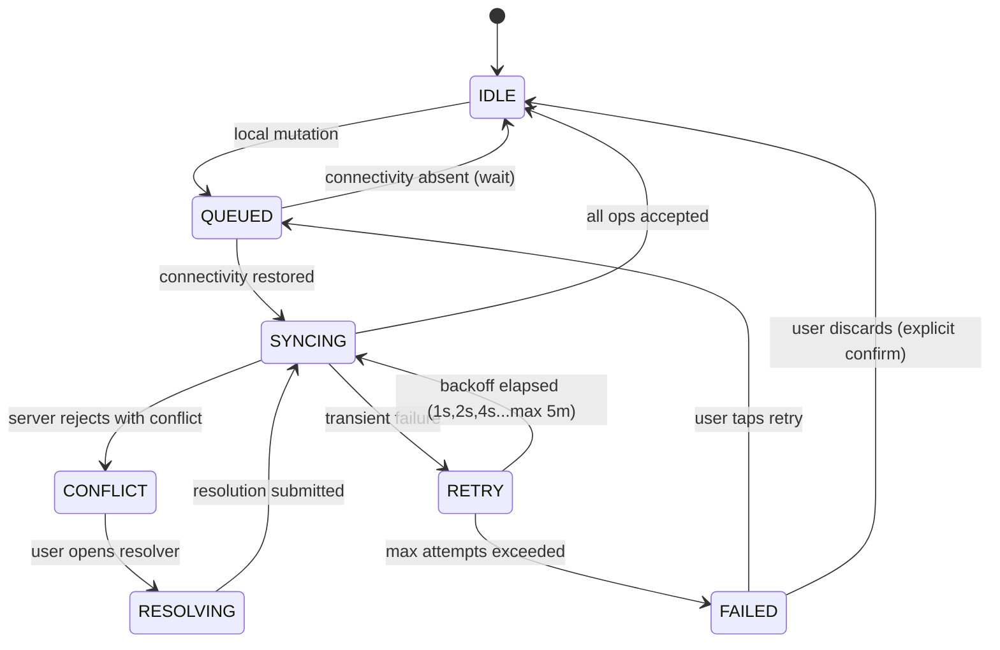

# D2 — Frontend & Mobile Lead · Individual Roadmap

> **A four-person team**, as presented at Review 1 for SWE4004 — Cloud Computing
> and Applications:
>
> | Member | Workstream |
> |---|---|
> | V. Saatwik Sairaam | Backend · APIs · Database |
> | P. Nirisha Chowdary | Auth · Security · Real-time |
> | T. V. S. Jignesh | Frontend · Customer app |
> | G. Parthavi | Mechanic & admin surfaces · Cloud DevOps |
>
> The D1–D4 roles below are the same four workstreams, in that order. The
> repository is pushed from one account, so `git log` shows a single committer;
> that is how the code was submitted, not how the work was divided.

**Owns:** React Native app, Next.js portals (Gov / Mechanic / Admin / Fleet), design system, offline client, maps UI, Android Auto prototype, accessibility, localization.
**Backs up:** D4 on E2E test authoring.
**Total allocation:** 22 weeks · ~176 ideal days.

**Standing responsibilities:**
- The **reference device** is the source of truth: Android 10, 2 GB RAM, throttled 3G. If it doesn't work there, it doesn't work.
- Every screen ships with four states designed and built: loading, empty, error, offline. A screen with only a happy path is not done.
- No hardcoded user-facing strings. Ever. Eight languages from day one.
- You own perceived performance. A 300 ms API is irrelevant if the UI feels slow.

---

## Phase 0 — Research · S0 W1 · 4 days

| | |
|---|---|
| **Goal** | Understand who actually uses this — their phones, their thumbs, their languages, their signal. |
| **Deliverables** | Device & connectivity report; 20 user interview contributions with UX focus; competitor UX teardown; accessibility & literacy findings; Android Auto + feature-phone UX feasibility spikes. |
| **Expected output** | A design constraint list that is evidence-based, not aesthetic preference. |
| **Folder structure** | `docs/research/ux/`, `design/research/` |
| **Database tables** | None. |
| **APIs** | None. |
| **UI screens** | None — produce **journey maps** for 4 scenarios instead (highway breakdown, city no-start, night accident, fleet truck failure). |
| **Components** | None. |
| **AI models** | With D3: decide where AI is *visible* to the user and where it must be invisible. Users don't want "AI"; they want to know if the car will start. |
| **Libraries** | Evaluate: React Native (bare) vs Expo, Next.js 15, Tamagui vs Nativewind vs Restyle, Reanimated 3, WatermelonDB vs op-sqlite. |
| **Risks** | Designing for a flagship phone and discovering in P14 that it's unusable on a real device → mitigation: procure 3 low-end devices in week 1 and use them for *all* development testing, not just QA. |
| **Security** | Research secure input patterns for OTP and payment on shared/borrowed phones — a very common Indian usage pattern that most apps ignore. |
| **Testing** | None yet. |
| **Documentation** | Device matrix, connectivity report, 6 personas (with D1/D3), 4 journey maps, accessibility findings (literacy levels, vision, one-handed use, gloves, rain). |
| **Git branches** | `docs/p00-d2-ux-research`, `spike/p00-d2-android-auto` |
| **Time** | 4 ideal days |
| **Demo** | Present the reference device physically. Show a competitor's app failing on it. That's the brief. |

### Design constraints (output of P0 — these are non-negotiable)

| Constraint | Why |
|-----------|-----|
| Works one-handed, in the rain, at night, on a highway shoulder | The actual usage context |
| Primary action reachable by thumb on a 6.5" screen | Users are standing next to a broken vehicle |
| Readable at arm's length in direct sunlight | Contrast ≥ 7:1 on primary actions |
| Comprehensible at low literacy | Icons + colour + voice, never text alone for critical actions |
| Every critical action has a voice alternative | Hands may be occupied or dirty |
| Never a blank screen while loading | Skeletons, always |
| Never a silent failure | Every failure has a visible, actionable state |
| ≤ 28 MB APK | Users on 32 GB phones with 40 apps |
| ≤ 30 MB/month data | Data cost is a real adoption barrier |

---

## Phase 1 — Planning · S0 W2 · 4 days

| | |
|---|---|
| **Goal** | Turn the research into a frontend backlog, an information architecture, and a design direction. |
| **Deliverables** | Frontend epic breakdown (~65 stories with AC), estimates, information architecture, navigation map, low-fi wireframes for the 12 critical screens, design direction (3 options → 1 chosen). |
| **Folder structure** | `apps/mobile/` `apps/web/` `apps/mechanic/` `apps/gov/` `apps/admin/` `packages/ui/` `packages/design-tokens/` scaffolded. |
| **APIs** | Review D1's contract calendar; flag anything that would force a bad UX (e.g. an endpoint that needs 3 round-trips before the user sees anything). |
| **UI screens** | Wireframes: splash, onboarding, home/garage, request-help, diagnosis, matching, tracking, mechanic-detail, payment, history, SOS, profile. |
| **Components** | Component inventory derived from wireframes (~42 components). |
| **Libraries** | Locked: React Native 0.79 (bare), Expo modules, Next.js 15, TypeScript strict, Zustand + TanStack Query, Reanimated 3, MapLibre GL Native/JS, WatermelonDB, i18next, Tamagui. |
| **Risks** | Building 5 apps with 1 person → mitigation: a shared `packages/ui` with platform adapters means one component library serves all 5; the gov/admin/fleet portals share a single Next.js app with role-based routing rather than being three codebases. |
| **Security** | Decide the secure-storage strategy (Keychain/Keystore via `react-native-keychain`), and that no token ever touches AsyncStorage. |
| **Testing** | Test strategy: Jest + RNTL unit, Storybook + Chromatic visual, Detox E2E mobile, Playwright E2E web. |
| **Documentation** | IA diagram, navigation map, wireframes, design direction rationale, component inventory. |
| **Git branches** | `chore/p01-d2-app-scaffolds`, `docs/p01-d2-ia-wireframes` |
| **Time** | 4 ideal days |
| **Demo** | Click-through wireframe prototype of the full breakdown journey. |

---

## Phase 2 — System Architecture · S1 W3 · 3 days (support role)

| | |
|---|---|
| **Goal** | Ensure the API contract serves the UI, not the database. |
| **Deliverables** | Frontend architecture ADRs, state management strategy, consumer contract expectations (Pact) handed to D1. |
| **Folder structure** | `packages/{ui,design-tokens,api-client,offline,i18n,analytics}/` |
| **APIs** | **Consumer-driven contracts**: you specify what the UI needs; D1 implements it. Push hard for composite/BFF endpoints — on 2G, six round-trips is a broken product. |
| **Components** | Architecture: feature-sliced folders, container/presentational split, a `useOfflineQuery` hook wrapping TanStack Query + local DB as the single data access pattern. |
| **AI models** | Define the UI contract for AI results: every AI-derived value in the UI must carry a confidence indication and a "this is an estimate" affordance. Never present a model output as certain fact. |
| **Libraries** | `@pact-foundation/pact`, `openapi-typescript`. |
| **Risks** | State management sprawl → one rule: server state in TanStack Query, local UI state in component state, cross-screen client state in Zustand. Nothing else. Enforced in review. |
| **Security** | ADR: token storage, certificate pinning, screenshot prevention on payment/medical screens, deep-link validation. |
| **Testing** | Pact consumer contracts written for the 20 most important interactions. |
| **Documentation** | Frontend ADRs 1–6, state management guide, offline data access pattern. |
| **Git branches** | `docs/p02-d2-frontend-adrs`, `feat/p02-d2-pact-consumer-contracts` |
| **Time** | 3 ideal days |
| **Demo** | Show a Pact contract failing D1's build when a field is removed. That's the safety net for the next 18 weeks. |

---

## Phase 3 — Database Design · S1 W4 · 2 days (support role)

| | |
|---|---|
| **Goal** | Design the **local** database — the client's schema is not the server's schema. |
| **Deliverables** | Local schema design (WatermelonDB), the sync manifest (what a client holds locally), local storage budget. |
| **Database tables (local)** | `vehicles`, `bookings`, `booking_events`, `mechanics_cache`, `diagnostic_sessions`, `sync_queue`, `map_packs`, `dtc_cache`, `user_profile`, `emergency_contacts` |
| **Components** | Storage budget: ≤ 120 MB total (excluding map packs, which the user opts into per district). LRU eviction on caches. |
| **Risks** | Unbounded local growth filling a cheap phone's storage → hard caps per table, eviction policy, and a visible storage screen the user controls. |
| **Security** | Local DB encrypted (SQLCipher). Medical and payment data are never persisted locally at all. |
| **Testing** | Storage-cap test; eviction correctness test. |
| **Documentation** | Local schema, sync manifest, storage budget. |
| **Git branches** | `docs/p03-d2-local-schema` |
| **Time** | 2 ideal days |
| **Demo** | Fill the local DB past the cap; show eviction keeping the app healthy instead of crashing. |

---

## Phase 4 — Authentication (clients) · S2 W5 · 4 days

| | |
|---|---|
| **Goal** | A login that works for a 22-year-old with a flagship and a 55-year-old truck driver with a cracked screen. |
| **Deliverables** | Auth flow on mobile + web + mechanic app, secure token storage, silent refresh, session management UI, consent centre. |
| **Folder structure** | `apps/mobile/src/features/auth/`, `packages/api-client/src/auth/` |
| **APIs** | Consumes D1's `/v1/auth/*` and `/v1/consents`. |
| **UI screens** | Splash · Language select (before login — critical) · Phone entry · OTP entry (with auto-read on Android via SMS Retriever) · Profile setup · Consent centre · Session list · Biometric unlock setup |
| **Components** | `<OTPInput>` (auto-advance, paste, auto-read), `<PhoneInput>` (country code, validation), `<ConsentToggle>` (plain-language purpose description — no legalese), `<SessionCard>`, `<BiometricGate>`, auth interceptor with silent refresh + request queue during refresh. |
| **AI models** | None. |
| **Libraries** | `react-native-keychain`, `@react-native-firebase/auth` (SMS Retriever only), `react-native-biometrics`, `libphonenumber-js`. |
| **Risks** | (a) OTP auto-read failing → always keep manual entry equally prominent, never hide it. (b) Users on borrowed phones → explicit "this is a shared phone" mode that skips biometric setup and shortens the session. |
| **Security** | Tokens in Keychain/Keystore only, never AsyncStorage. Certificate pinning on auth and payment endpoints. Screenshot blocked on OTP and payment screens. No token in logs, ever — enforced by a lint rule. Silent refresh queues concurrent requests instead of firing N refreshes. Biometric gate for re-entry. |
| **Testing** | OTP flow E2E (Detox); token expiry mid-request test; refresh race-condition test (10 concurrent 401s → exactly 1 refresh); logout clears everything test. |
| **Documentation** | Auth flow UX doc, consent copy (reviewed for plain language in 8 languages). |
| **Git branches** | `feat/p04-d2-otp-flow`, `feat/p04-d2-secure-token-storage`, `feat/p04-d2-consent-centre` |
| **Time** | 4 ideal days |
| **Demo** | Log in on the reference device on throttled 3G, in Hindi, with SMS auto-read. Then kill the app mid-refresh and show it recovering cleanly. |

---

## Phase 5 — Backend APIs · S2–S3 · 2 days (support role)

| | |
|---|---|
| **Goal** | Keep the contract honest from the consumer side. |
| **Deliverables** | Pact consumer contracts kept current, API feedback to D1, mock-based development harness. |
| **Components** | MSW-based dev harness so the entire app is developable with zero backend running — this is what lets you and D1 work fully in parallel. |
| **Risks** | Developing against mocks that diverge from reality → Pact verification in D1's CI catches divergence within one merge cycle. |
| **Testing** | Pact consumer tests for 20 interactions. |
| **Git branches** | `test/p05-d2-pact-contracts` |
| **Time** | 2 ideal days |
| **Demo** | Run the entire app offline from the backend, on mocks. |

---

## Phase 6 — Frontend · S3 W7 – S4 W10 · 18 days · **You own this phase**

| | |
|---|---|
| **Goal** | Build the actual product. This is your largest block. |
| **Deliverables** | Design system package, React Native app (Android + iOS), web PWA, mechanic app, admin console, fleet dashboard, Android Auto prototype, Storybook, visual regression suite. |
| **Expected output** | A user can complete the full breakdown journey on a real low-end phone, in Hindi, on 3G. |
| **Folder structure** | See below. |
| **Database tables** | Local schema from P3 implemented. |
| **APIs** | Consumes essentially all of D1's v1 surface. |
| **UI screens** | See screen inventory below. |
| **Components** | ~42 in `packages/ui`. See component inventory below. |
| **AI models** | Consumes D3's endpoints via D1's gateway. UI rule: every AI output shows confidence and offers "not right? tell us" feedback that flows back to D3's training loop. |
| **Libraries** | `react-native`, `@react-navigation/native`, `@tanstack/react-query`, `zustand`, `react-native-reanimated`, `react-native-gesture-handler`, `@shopify/flash-list` (never FlatList for long lists on low-end devices), `react-native-svg`, `i18next`, `react-native-mmkv`, `nativewind`, `next`, `@radix-ui/*`, `framer-motion`, `recharts`. |
| **Risks** | (a) 5 apps, 1 person, 18 days → the shared `packages/ui` and a single Next.js app for all three portals is what makes this possible; the Android Auto build is explicitly a *prototype* and is the first thing cut if the sprint slips. (b) Jank on low-end devices → Reanimated on the UI thread for all animation, FlashList everywhere, memoization discipline, and a profiling pass at the end of each sprint rather than at the end of the phase. |
| **Security** | Screenshot prevention on payment/medical screens. Deep links validated and never used to bypass auth. No PII in analytics events. Clipboard cleared after copying sensitive values. WebView usage minimized and sandboxed. |
| **Testing** | Unit (Jest + RNTL) ≥80% on logic; Storybook stories for every component; visual regression (Chromatic) on the design system; Detox E2E for 8 critical journeys; manual pass on the reference device every sprint. |
| **Documentation** | Storybook as living documentation, design token reference, component API docs, contribution guide, localization guide. |
| **Git branches** | `feat/p06-d2-design-system`, `feat/p06-d2-onboarding`, `feat/p06-d2-garage`, `feat/p06-d2-request-help-flow`, `feat/p06-d2-live-tracking`, `feat/p06-d2-payment-flow`, `feat/p06-d2-mechanic-app`, `feat/p06-d2-web-pwa`, `feat/p06-d2-admin-console`, `feat/p06-d2-android-auto` |
| **Time** | 18 ideal days |
| **Demo** | The full journey on a real ₹8,000 Android phone, throttled to 3G, in Hindi, one-handed, with the screen brightness at maximum to simulate sunlight. No simulator. |

### Folder structure

```
apps/
├── mobile/                        # React Native (bare) — citizen + mechanic in one binary, role-switched
│   └── src/
│       ├── features/
│       │   ├── auth/  garage/  request/  diagnose/  tracking/
│       │   ├── payment/  history/  profile/  sos/  mechanic/
│       ├── navigation/
│       ├── offline/               # sync client, queue, conflict UI
│       ├── services/              # api, location, ble, notifications
│       └── app.tsx
├── web/                           # Next.js 15 — citizen PWA
├── portals/                       # Next.js 15 — gov + admin + fleet, role-routed
│   └── src/app/(gov)/ (admin)/ (fleet)/
└── auto/                          # Android Auto prototype

packages/
├── ui/                            # design system, platform-adaptive
│   ├── primitives/  patterns/  motion/  icons/
├── design-tokens/                 # source of truth, exports to RN + CSS + Figma
├── api-client/                    # generated from OpenAPI + auth interceptor
├── offline/                       # WatermelonDB models, sync engine, queue
├── maps/                          # MapLibre wrappers, offline pack manager
├── i18n/                          # 8 locales
└── analytics/                     # typed event emitter matching D3's taxonomy
```

### Screen inventory (48 screens)

| Area | Screens |
|------|---------|
| **Onboarding** (6) | Splash, Language select, Phone entry, OTP, Profile setup, Permissions primer |
| **Garage** (7) | Home/garage, Add vehicle, Vehicle detail, Vehicle health, Service history, Documents, Scan RC |
| **Request help** (9) | Problem picker, Symptom chat, Photo capture, OBD scan, Diagnosis result, Location confirm, Service selection, Quote review, Confirm |
| **Live** (6) | Matching, Mechanic assigned, Live tracking, Chat, On-site, Work in progress |
| **Payment** (5) | Invoice, Payment method, UPI flow, Success, Receipt |
| **Emergency** (4) | SOS button (persistent), Countdown, Incident room, Emergency contacts |
| **Account** (6) | Profile, Sessions, Consent centre, Subscription, Language & accessibility, Storage & offline |
| **Mechanic** (8) | Job feed, Job detail + pre-brief, Navigation, Checklist, Parts, Invoice builder, Earnings, Availability |
| **History** (3) | Booking list, Booking detail, Reviews |
| **Offline** (2) | Sync status, Conflict resolution |
| **Portals** | Gov (P12), Admin (12 screens), Fleet (9 screens) |

### Component inventory (42 core components)

| Category | Components |
|----------|-----------|
| **Primitives** | `Button` (5 variants, 3 sizes, loading + disabled), `Input`, `OTPInput`, `PhoneInput`, `Select`, `Checkbox`, `Radio`, `Switch`, `Slider`, `Text`, `Icon`, `Avatar`, `Badge`, `Divider`, `Spinner`, `Skeleton` |
| **Layout** | `Screen` (safe area + scroll + refresh + offline banner), `Card`, `Sheet`, `Modal`, `Tabs`, `Accordion`, `List`, `EmptyState`, `ErrorState`, `OfflineState` |
| **Domain** | `VehicleCard`, `MechanicCard`, `BookingStatusTimeline`, `PriceBreakdown`, `DiagnosisResult` (with confidence), `SOSButton`, `LiveMap`, `TrackingBottomSheet`, `RatingInput`, `PartsList`, `ChecklistItem` |
| **Feedback** | `Toast`, `Banner`, `ProgressBar`, `ConfidenceIndicator`, `SyncStatusPill` |

### Design system foundations

| Token group | Decision |
|-------------|----------|
| Colour | Semantic tokens only (`bg.primary`, `text.danger`), never raw hex in components. Light + dark. Primary action contrast ≥ 7:1 (AAA) because of sunlight. |
| Type | System font stack (no custom font download — saves ~400 KB and renders 8 scripts correctly). Scale 12/14/16/18/22/28/34. Line height 1.5 minimum for Devanagari/Tamil ascenders. |
| Spacing | 4 pt base. 4/8/12/16/24/32/48/64. |
| Radius | 4/8/12/16/full. |
| Elevation | 4 levels; on Android use elevation, on iOS use shadow — abstracted in the token layer. |
| Motion | Durations 120/200/320 ms. Easing: standard, decelerate, accelerate, spring for gestures. **All animation respects `prefers-reduced-motion`** and is disabled automatically on low-end devices detected at runtime. |
| Touch targets | Minimum 44×44 dp. Primary actions 56 dp. |
| Iconography | One 24 dp grid set, outline + filled. Every icon paired with text or an accessible label — never icon-only for a critical action. |

---

## Phase 7 — AI Development · S4–S5 · 2 days (support role)

| | |
|---|---|
| **Goal** | Present AI honestly in the UI, and build the feedback loop that improves it. |
| **Deliverables** | `<ConfidenceIndicator>`, AI result presentation patterns, user feedback capture flowing to D3, voice assistant UI shell. |
| **Components** | Confidence bands (high/medium/low) rendered as plain language ("we're fairly sure" / "this is a guess — a mechanic will confirm"), never as a raw percentage. Feedback: thumbs + free text + "what was it actually?" — which is the highest-value training signal we can collect. |
| **AI models** | Consumes diagnosis, matching, voice. |
| **Risks** | Users over-trusting a confident-looking wrong answer → design rule: any AI output that affects a safety decision is presented as *advisory*, with the conservative rule-based verdict shown alongside it and given visual primacy. |
| **Security** | Voice recordings require explicit per-session consent and are never retained beyond the session unless the user opts in. |
| **Testing** | Test that low-confidence outputs render the correct hedging language in all 8 locales. |
| **Documentation** | AI presentation guidelines. |
| **Git branches** | `feat/p07-d2-confidence-ui`, `feat/p07-d2-ai-feedback-loop` |
| **Time** | 2 ideal days |
| **Demo** | Show the same diagnosis at 0.95 and 0.45 confidence. The UI says genuinely different things. |

---

## Phase 8 — Offline Engine (client) · S5 W11–12 · 10 days · **You own this phase**

| | |
|---|---|
| **Goal** | Make the app fully usable with no connectivity. This is the feature that differentiates the product. |
| **Deliverables** | Offline client library, operation queue, sync engine, conflict resolution UI, offline map pack manager, background sync, sync status UX. |
| **Expected output** | A user in airplane mode completes a help request, sees honest offline state, and everything syncs correctly on reconnect. |
| **Folder structure** | `packages/offline/src/{db,queue,sync,conflict,network}/` |
| **Database tables (local)** | As designed in P3, now implemented with migrations. |
| **APIs** | Consumes D1's `/v1/sync/*`. |
| **UI screens** | Sync status screen, conflict resolution screen, offline banner (persistent, non-dismissible while offline), storage management screen, map pack downloader. |
| **Components** | `useOfflineQuery` / `useOfflineMutation` (the *only* data access pattern in the app — this is what makes offline uniform rather than per-screen). `<SyncStatusPill>`, `<OfflineBanner>`, `<ConflictResolver>`, `<QueuedOperationList>`. |
| **AI models** | Integrate D3's on-device models so diagnosis works fully offline. |
| **Libraries** | `@nozbe/watermelondb`, `react-native-mmkv`, `@react-native-community/netinfo`, `react-native-background-fetch`, `@msgpack/msgpack`. |
| **Risks** | (a) Optimistic UI showing success for something that later fails to sync → every optimistic write is visibly marked "pending" until confirmed; a failed sync surfaces as an actionable notification, never a silent revert. (b) Battery drain from background sync → sync only on unmetered + charging for non-urgent, immediate for urgent, with an explicit priority queue. |
| **Security** | Local DB encrypted with SQLCipher, key in Keychain. Queued operations signed with the device key. Nothing sensitive (medical, payment) is ever queued locally. |
| **Testing** | Offline test matrix: airplane mode, flaky 2G (10% packet loss), mid-sync app kill, device reboot with a full queue, clock skew ±24 h, storage full, sync of 100 ops. Detox tests that toggle connectivity mid-journey. |
| **Documentation** | Offline architecture doc, sync status state chart, conflict UX guidelines. |
| **Git branches** | `feat/p08-d2-local-db`, `feat/p08-d2-operation-queue`, `feat/p08-d2-sync-engine`, `feat/p08-d2-conflict-ui`, `feat/p08-d2-offline-ux` |
| **Time** | 10 ideal days |
| **Demo** | Put the phone in airplane mode. Add a vehicle, run a diagnosis (on-device model), create a help request, view an offline map, cancel and re-create. Turn connectivity back on. Everything syncs; one deliberate conflict is raised and resolved by the user in a screen that makes the choice obvious. |

### Sync state machine (client)



---

## Phase 9 — Maps · S6 W13 · 7 days · **You own this phase**

| | |
|---|---|
| **Goal** | Maps that work with the device fully offline, at a cost of zero per tile. |
| **Deliverables** | MapLibre component library, offline map pack downloader + delta updates, live tracking UI, geofence visualization, navigation handoff. |
| **Folder structure** | `packages/maps/src/{native,web,packs,tracking}/` |
| **UI screens** | Map pack manager (browse by state → district, size shown, download progress, delete), full-screen map, tracking view, location picker with landmark search. |
| **Components** | `<Map>` (platform-adaptive MapLibre wrapper), `<MapMarker>`, `<RouteLine>`, `<TrackingSheet>`, `<LocationPicker>` (with "I'm near a landmark" mode for addresses that don't exist), `<MapPackCard>`, `<KmMarkerDisplay>`. |
| **Libraries** | `@maplibre/maplibre-react-native`, `maplibre-gl` (web), `@turf/turf`, `react-native-blob-util` (pack download with resume). |
| **Risks** | (a) Map pack size making downloads impractical on limited data → target ≤60 MB/district, downloads resume, and only on unmetered by default. (b) Battery drain from continuous location → adaptive sampling driven by booking state, significant-change API when idle, and a visible "location sharing active" indicator so it's never covert. |
| **Security** | Location sharing is time-bounded and relationship-bounded; the UI always shows who can currently see your location and offers one-tap revocation. |
| **Testing** | Offline navigation test with the device in airplane mode; pack download resume-after-kill test; battery measurement over 1 hour of tracking. |
| **Documentation** | Maps integration guide, offline pack strategy, location privacy UX. |
| **Git branches** | `feat/p09-d2-maplibre-components`, `feat/p09-d2-offline-map-packs`, `feat/p09-d2-live-tracking-ui`, `feat/p09-d2-location-picker` |
| **Time** | 7 ideal days |
| **Demo** | Download the Gurugram district pack over WiFi. Airplane mode. Search for a landmark, get directions, watch the route render — entirely offline. Then show battery usage after an hour of live tracking. |

---

## Phase 10 — Vehicle Diagnostics · S6 W14 · 5 days

| | |
|---|---|
| **Goal** | Make diagnosis feel like talking to a knowledgeable friend, not filling in a form. |
| **Deliverables** | OBD-II BLE integration, diagnosis conversation UI, photo capture flow, diagnosis result presentation, mechanic pre-brief screen. |
| **Folder structure** | `apps/mobile/src/features/diagnose/`, `packages/ble/` |
| **UI screens** | Diagnosis entry (4 paths: describe / photo / listen / plug in), symptom conversation, OBD pairing + scan, photo capture with guidance overlay, diagnosis result, "can I drive it?" verdict, mechanic pre-brief. |
| **Components** | `<SymptomChat>` (chat UI with quick-reply chips — typing is hard on a highway), `<OBDPairing>`, `<GuidedPhotoCapture>` (overlay showing what to photograph, with real-time quality feedback), `<DiagnosisCard>`, `<DrivabilityVerdict>` (the most safety-critical component in the app), `<PartsList>`. |
| **AI models** | Consumes D3's photo diagnosis, symptom triage, and on-device fallback. |
| **Libraries** | `react-native-ble-plx`, `react-native-vision-camera`, `react-native-image-resizer`. |
| **Risks** | (a) BLE pairing UX is notoriously bad → a guided flow with an illustrated "find your OBD port" step per vehicle model, plus an explicit "skip, describe it instead" escape hatch that is always visible. (b) Poor-quality photos degrading model accuracy → real-time capture guidance (framing, focus, lighting) rather than rejecting after the fact. |
| **Security** | Photos may contain number plates and bystanders — the capture screen warns, and images are uploaded over TLS with pinning and deleted locally after successful upload. |
| **Testing** | BLE tests against 3 dongle models; photo capture quality tests; verdict rendering tests asserting the conservative verdict always wins visually. |
| **Documentation** | BLE integration guide, photo capture guidelines, drivability verdict design rationale. |
| **Git branches** | `feat/p10-d2-obd-ble`, `feat/p10-d2-symptom-chat`, `feat/p10-d2-guided-photo`, `feat/p10-d2-diagnosis-result` |
| **Time** | 5 ideal days |
| **Demo** | Photograph a real damaged part; get a diagnosis in Hindi with a confidence band, a parts list, and a clear "do not drive this" verdict. Then unplug everything and do the symptom-chat path offline. |

---

## Phase 11 — Emergency Engine (clients) · S7 W15 · 4 days

| | |
|---|---|
| **Goal** | An SOS that a panicking person can use, and that a person who is unconscious doesn't need to. |
| **Deliverables** | SOS UI across all clients, crash countdown, incident room, emergency contact management, degraded SMS UI. |
| **UI screens** | Persistent SOS affordance (reachable from every screen), crash countdown (full-screen, audio, haptic, unmissable), incident room (live location, responder ETA, contacts notified), emergency contacts setup, medical profile. |
| **Components** | `<SOSButton>` (long-press to prevent accidental triggering, with haptic progress), `<CrashCountdown>` (30 s, one enormous cancel button, screen-reader announcement, works over the lock screen), `<IncidentRoom>`, `<ResponderCard>`. |
| **AI models** | Consumes D3's on-device crash detection. |
| **Risks** | Accidental SOS triggering, which erodes trust and wastes responder capacity → long-press with haptic feedback, plus the 30 s countdown, plus a post-cancel "was that an accident?" prompt that feeds D3's false-positive dataset. |
| **Security** | The countdown screen must render over the lock screen and in Do Not Disturb. Medical data is displayed to responders only through the break-glass flow, and the user is told afterwards who accessed it. |
| **Testing** | Countdown accessibility test (screen reader, one-handed, gloves). Lock-screen render test. Accidental-trigger rate measured in dogfooding. Degraded-mode UI test with the backend down. |
| **Documentation** | Emergency UX rationale, accessibility notes for the countdown. |
| **Git branches** | `feat/p11-d2-sos-button`, `feat/p11-d2-crash-countdown`, `feat/p11-d2-incident-room` |
| **Time** | 4 ideal days |
| **Demo** | Trigger a simulated crash with the phone locked and in a pocket. The countdown takes over the screen, sounds an alarm, and vibrates. Cancel it. Then let it complete and watch the incident room open with contacts already notified. |

---

## Phase 12 — Government Dashboard · S7 W16 · 6 days · **You own this phase**

| | |
|---|---|
| **Goal** | A dashboard a District Transport Officer can actually use, on a government-issue desktop with an old browser. |
| **Deliverables** | Gov portal (Next.js), live incident map, blackspot analysis, response-time analytics, 6 statutory report generators, officer audit view. |
| **Folder structure** | `apps/portals/src/app/(gov)/` |
| **UI screens** | Login (mTLS + cert guidance), jurisdiction dashboard, live incident map, blackspot analysis, corridor health, response-time analytics, report builder, report archive, audit log, settings. |
| **Components** | `<IncidentMap>` (clustered, 10k markers, severity layers, no jank), `<HeatmapLayer>`, `<CorridorSelector>`, `<ReportBuilder>` (parameterized, previewable, exportable to PDF/XLSX/CSV), `<SuppressionNotice>` (shown wherever k-anonymity suppresses a cell — transparency about *why* data is missing builds trust), `<AuditTable>`. |
| **AI models** | Consumes D3's forecasting for predicted-demand and risk overlays. |
| **Libraries** | `next`, `maplibre-gl`, `deck.gl` (for 10k+ point rendering), `recharts`, `@tanstack/react-table`, `exceljs`, `@react-pdf/renderer`. |
| **Risks** | (a) Government desktops running old browsers → target baseline is Chrome 100 / Edge 100, no bleeding-edge APIs, and a graceful message rather than a blank page below baseline. (b) 10k markers killing the browser → deck.gl WebGL layer with clustering, tested at 50k. |
| **Security** | Client-side certificate flow documented for non-technical officers. Session timeout 30 min. No data cached in the browser beyond the session. Every export watermarked with the officer ID and timestamp. |
| **Testing** | Playwright E2E for report generation; performance test at 10k and 50k incidents; browser compatibility matrix; a11y audit (government accessibility standards apply). |
| **Documentation** | Officer user guide (written for a non-technical audience, in English + Hindi), report format specifications. |
| **Git branches** | `feat/p12-d2-gov-portal-shell`, `feat/p12-d2-incident-map`, `feat/p12-d2-blackspot-analysis`, `feat/p12-d2-report-builder` |
| **Time** | 6 ideal days |
| **Demo** | Log in as a district officer. See live incidents in your jurisdiction only. Identify a blackspot. Generate the statutory monthly report as a PDF. Then try to see individual citizen data and fail. |

---

## Phase 13 — Analytics (dashboards) · S8 W17 · 4 days

| | |
|---|---|
| **Goal** | Give fleets and mechanics numbers they'll act on, and give us numbers we'll act on. |
| **Deliverables** | Admin analytics dashboards, fleet analytics screens, mechanic earnings analytics, internal ops dashboard. |
| **UI screens** | Ops overview, demand/supply heatmap, funnel view, cohort retention, fleet cost dashboard, fleet vehicle health, driver behaviour, mechanic earnings, mechanic utilization. |
| **Components** | `<MetricCard>` (value + delta + sparkline + definition tooltip — every metric links to its dictionary definition), `<TimeSeriesChart>`, `<FunnelChart>`, `<CohortGrid>`, `<HeatmapCalendar>`, `<DrilldownTable>`. |
| **Libraries** | `recharts`, `@tanstack/react-table`, `date-fns`. |
| **Risks** | Dashboards nobody uses → each dashboard is built for a named person answering a named recurring question. If we can't name them, we don't build it. |
| **Security** | Fleet admins see only their fleet. Mechanics see only their own earnings. Row-level enforcement is server-side; the UI never filters for security. |
| **Testing** | Load test at 100M underlying events; chart rendering performance; permission boundary tests. |
| **Documentation** | Dashboard guide per audience. |
| **Git branches** | `feat/p13-d2-admin-analytics`, `feat/p13-d2-fleet-dashboard`, `feat/p13-d2-mechanic-earnings` |
| **Time** | 4 ideal days |
| **Demo** | Fleet manager view: cost per km by vehicle, downtime ranking, and the one truck that's costing them the most. That's a dashboard someone will open on a Monday. |

---

## Phase 14 — Testing · S8 W18 · 6 days

| | |
|---|---|
| **Goal** | Prove it works on real devices, in real languages, for real people. |
| **Deliverables** | Detox E2E for 12 journeys, Playwright E2E for portals, visual regression baseline, device farm results across 12 Android + 4 iOS, accessibility audit, localization QA across 8 languages, bug fixes to zero P0/P1. |
| **Components** | Fix what testing finds. Budget honestly — this phase is mostly debugging. |
| **Risks** | Localization breaking layouts (German-length problem, but for Tamil and Devanagari) → automated screenshot diffing across all 8 locales catches truncation and overflow before a human sees it. |
| **Security** | Verify no PII in analytics events, logs, or crash reports. Verify screenshot prevention actually works on both platforms. |
| **Testing** | Full matrix. Accessibility: TalkBack and VoiceOver walkthrough of every critical journey, not just an automated scan. |
| **Documentation** | Device compatibility matrix, accessibility audit report, localization QA report. |
| **Git branches** | `test/p14-d2-detox-journeys`, `test/p14-d2-visual-regression`, `fix/p14-d2-device-issues`, `fix/p14-d2-a11y-findings` |
| **Time** | 6 ideal days |
| **Demo** | The full journey driven entirely by TalkBack with the screen off. If a blind user can request roadside assistance, the app is well built. |

---

## Phase 15 — Deployment · S9 W19 · 3 days

| | |
|---|---|
| **Goal** | Ship to the stores and to the web, repeatably. |
| **Deliverables** | Play Store + App Store submissions with staged rollout, web deployment, CodePush/OTA update channel, crash reporting, store listing assets in 8 languages. |
| **Components** | Fastlane pipelines, signing key management (with D4), staged rollout (1% → 10% → 50% → 100% gated on crash-free rate), OTA for JS-only fixes. |
| **Risks** | Store review rejection delaying launch → submit a TestFlight/internal-track build in P14, not P15, so rejection reasons surface early. |
| **Security** | Signing keys in Vault, never on a laptop. Certificate pinning verified in the release build (it's easy to accidentally ship debug config). |
| **Testing** | Release-build smoke test on real devices — release builds behave differently from debug builds and this catches real bugs. |
| **Documentation** | Release process runbook, store listing copy. |
| **Git branches** | `chore/p15-d2-fastlane`, `chore/p15-d2-store-assets` |
| **Time** | 3 ideal days |
| **Demo** | Push a JS-only fix via OTA and watch it land on a device in under 2 minutes. |

---

## Phase 16 — Optimization · S9 W20 · 5 days

| | |
|---|---|
| **Goal** | 28 MB, 2 seconds, 30 MB/month, 60 fps. Numbers, not adjectives. |
| **Deliverables** | APK size reduction, startup optimization, jank elimination, memory leak fixes, data usage reduction, web bundle optimization, performance budgets in CI. |
| **Components** | R8/Proguard + resource shrinking + Hermes bytecode; dynamic feature modules for maps and diagnostics; startup profiling with Perfetto; Flipper-driven leak hunting; FlashList audit; image transcoding to AVIF with WebP fallback; delta sync; protobuf on the tracking channel; route-level code splitting and critical CSS on web. |
| **Risks** | Optimization breaking correctness → every optimization PR must keep the full E2E suite green; no exceptions for "it's just a size change." |
| **Testing** | Performance budgets wired into CI: APK size, bundle size, startup time, and frame drop rate all fail the build when exceeded. |
| **Documentation** | Performance report with before/after, and a note on what we chose *not* to optimize and why. |
| **Git branches** | `perf/p16-d2-apk-size`, `perf/p16-d2-startup`, `perf/p16-d2-jank`, `perf/p16-d2-data-usage` |
| **Time** | 5 ideal days |
| **Demo** | Two identical reference devices side by side, old build vs new. Cold start both simultaneously. |

---

## Phase 17 — Future Roadmap · S10 · 3 days

| | |
|---|---|
| **Goal** | Say what the frontend needs next and what it owes. |
| **Deliverables** | Frontend tech debt register, design system v2 plan, platform expansion analysis (Android Auto → production, CarPlay, wearables, KaiOS for feature phones), frontend section of the 18-month roadmap. |
| **Documentation** | Debt register, design system evolution plan, platform expansion analysis with effort estimates. |
| **Git branches** | `docs/p17-d2-frontend-roadmap` |
| **Time** | 3 ideal days |
| **Demo** | Present the Android Auto prototype and an honest assessment of what production readiness costs. |

---

## D2 Effort Summary

| Phase | Days | Phase | Days |
|-------|------|-------|------|
| P0 Research | 4 | P9 Maps | 7 |
| P1 Planning | 4 | P10 Diagnostics | 5 |
| P2 Architecture | 3 | P11 Emergency | 4 |
| P3 Local DB | 2 | P12 Gov Dashboard | 6 |
| P4 Auth clients | 4 | P13 Analytics UI | 4 |
| P5 API support | 2 | P14 Testing | 6 |
| P6 Frontend | 18 | P15 Deployment | 3 |
| P7 AI UI | 2 | P16 Optimization | 5 |
| P8 Offline client | 10 | P17 Roadmap | 3 |
| | | **Total** | **92 ideal days** |
