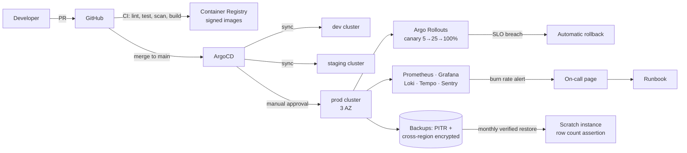

# D4 — DevOps, QA & Security Lead · Individual Roadmap

> **A four-person team**, as presented at Review 1 for SWE4004 — Cloud Computing
> and Applications:
>
> | Member | Workstream |
> |---|---|
> | V. Saatwik Sairaam | Backend · APIs · Database |
> | P. Nirisha Chowdary | Auth · Security · Real-time |
> | T. V. S. Jignesh | Frontend · Customer app |
> | G. Parthavi | Mechanic & admin surfaces · Cloud DevOps |
>
> The D1–D4 roles below are the same four workstreams, in that order. The
> repository is pushed from one account, so `git log` shows a single committer;
> that is how the code was submitted, not how the work was divided.

> **These are planning targets written before implementation, not
> measurements.** No availability figure in this document has been
> observed. For what was actually measured, see
> [`PERFORMANCE_FINAL_REPORT.md`](verification/PERFORMANCE_FINAL_REPORT.md).

**Owns:** Kubernetes, Terraform, CI/CD, observability, all testing disciplines, security, load and chaos engineering, SMS/IVR/USSD gateway operations, compliance evidence.
**Backs up:** D2 on portal builds.
**Total allocation:** 22 weeks · ~176 ideal days.

**Standing responsibilities:**
- CI is never red on `main` for more than 30 minutes. You own that number.
- You are the only person who says "this is not ready to ship." Use it.
- Every alert you create has a runbook before it is enabled. An alert without a runbook is noise that trains people to ignore alerts.
- Security findings are not suggestions. High and critical block the release.

---

## Phase 0 — Research · S0 W1 · 4 days

| | |
|---|---|
| **Goal** | Establish the operating environment: what we can host, where, under what regulations, and with which telecom partners. |
| **Deliverables** | Cloud provider evaluation (MeitY-empanelled), data localization analysis, telecom gateway evaluation (SMS/IVR/USSD), compliance obligation register, cost model v0, USSD feasibility spike. |
| **Expected output** | A decision on where this runs and what it costs, plus a started DLT registration — because that timeline is the longest lead item in the project. |
| **Folder structure** | `docs/research/infra/`, `docs/compliance/` |
| **Database tables** | None. |
| **APIs** | None — but evaluate telecom gateway APIs (Gupshup, Exotel, Kaleyra, Twilio-India) for SMS, voice/IVR, and USSD. |
| **UI screens** | None. |
| **Components** | None. |
| **AI models** | None. |
| **Libraries** | Evaluation: Terraform vs Pulumi, EKS vs AKS vs self-managed, ArgoCD vs Flux, Prometheus stack vs managed. |
| **Risks** | **R2, and the single longest lead time in the project: TRAI DLT registration for SMS templates takes weeks.** Start it in week 1. Register more templates than you think you need — adding one later is another multi-week wait. Also register with two gateway vendors, not one. |
| **Security** | Compliance register: DPDP Act 2023 (consent, localization, breach notification, data principal rights), TRAI UCC/DLT, MeitY cloud empanelment, RBI PA/PG (avoid scope by using a PSP), IRDAI if we touch insurance, AIS-140 for telematics. Each obligation mapped to the phase where it's satisfied and the evidence that proves it. |
| **Testing** | Define the test strategy skeleton and the tooling decisions. |
| **Documentation** | Cloud evaluation, compliance obligation register, telecom gateway comparison, cost model v0, USSD spike report. |
| **Git branches** | `docs/p00-d4-infra-research`, `docs/p00-d4-compliance-register`, `spike/p00-d4-ussd-feasibility` |
| **Time** | 4 ideal days |
| **Demo** | Present the compliance register and the DLT timeline. Make it visible that this is a hard dependency nobody can compress. |

---

## Phase 1 — Planning · S0 W2 · 4 days

| | |
|---|---|
| **Goal** | Stand up the engineering platform on day one so nobody is ever blocked on tooling. |
| **Deliverables** | CI/CD skeleton running, repo protections configured, environment strategy, test strategy doc, security policy, DLT registration submitted. |
| **Folder structure** | `.github/workflows/`, `infra/{terraform,k8s,scripts}/`, `tests/{load,security,e2e}/` |
| **APIs** | None. |
| **Components** | GitHub Actions: lint, typecheck, test, build, scan — running on every PR from the first commit. Branch protection with required checks. Dependabot/Renovate. Secret scanning. CODEOWNERS mapping each area to its lead. |
| **Libraries** | `actions/*`, `semgrep`, `trivy`, `osv-scanner`, `gitleaks`, `commitlint`, `k6`, `playwright`, `detox`. |
| **Risks** | Slow CI destroying the team's velocity → target: PR feedback in under 8 minutes. Aggressive caching, parallel jobs, affected-only testing via Nx. Measure CI duration as a tracked metric from week 2. |
| **Security** | Security policy: secret handling, dependency policy, disclosure process, incident response outline. Pre-commit hooks for secret scanning — catching a leaked key before the push is much better than rotating it after. |
| **Testing** | Test strategy document: what we test at which layer, coverage targets, tooling, environments, and who owns what. |
| **Documentation** | Test strategy, security policy, environment strategy, CI/CD guide, contribution guide. |
| **Git branches** | `chore/p01-d4-ci-skeleton`, `chore/p01-d4-repo-protections`, `docs/p01-d4-test-strategy` |
| **Time** | 4 ideal days |
| **Demo** | Open a PR with a lint error, a failing test, and a hardcoded secret. Watch CI block all three in under 8 minutes. |

### Environment strategy

| Env | Purpose | Data | Deploy trigger | Who can access |
|-----|---------|------|----------------|----------------|
| `local` | Development | Seeded synthetic | Manual | Everyone |
| `preview` | Per-PR ephemeral | Seeded synthetic | PR open | Everyone |
| `dev` | Integration | Seeded synthetic | Merge to `main` | Everyone |
| `staging` | Pre-production, prod-shaped | Anonymized prod-like | Merge to `main` | Everyone |
| `prod` | Production | Real | Manual approval on a tagged release | D4 + on-call, audited |

---

## Phase 2 — System Architecture · S1 W3 · 4 days (co-owner of the threat model)

| | |
|---|---|
| **Goal** | Ensure the architecture is operable and defensible, not just elegant. |
| **Deliverables** | STRIDE threat model, infrastructure architecture, network topology, observability strategy, SLO definitions with error budgets. |
| **Folder structure** | `infra/terraform/modules/`, `docs/security/threat-model.md` |
| **Components** | Network: private subnets for everything, one ingress, no service directly internet-reachable, mTLS between process groups, egress allowlisting. Observability strategy: OpenTelemetry everywhere, trace context propagated across every service boundary including into the AI gateway and the mobile client. |
| **Risks** | Architecture that's elegant but unoperable by one person → veto power on anything that adds operational surface without proportionate value. This is the phase to say no to Kafka Streams, service meshes, and three databases. |
| **Security** | Full STRIDE pass across every trust boundary with D1. Output: a control list mapped to the phase where each control is implemented and the test that proves it. Trust boundaries: internet↔gateway, gateway↔services, service↔service, service↔DB, platform↔AI, platform↔telecom, platform↔government, platform↔PSP, device↔platform. |
| **Testing** | Define the security testing plan: SAST, DAST, dependency, container, secrets, pentest scope and timing. |
| **Documentation** | Threat model, infra architecture, network topology, SLO document with error budgets, observability strategy. |
| **Git branches** | `docs/p02-d4-threat-model`, `docs/p02-d4-infra-architecture`, `docs/p02-d4-slos` |
| **Time** | 4 ideal days |
| **Demo** | Walk the threat model. For each of the top 10 threats: the control, the phase it lands in, and the test that will prove it works. |

### SLOs and error budgets

| Service | Availability SLO | Latency SLO | Error budget/28d |
|---------|-----------------|-------------|------------------|
| API Gateway | 99.9% | p95 < 300 ms | 40 min |
| Auth | 99.95% | p95 < 200 ms | 20 min |
| Booking | 99.9% | p95 < 300 ms | 40 min |
| Dispatch | 99.9% | p95 < 500 ms | 40 min |
| **Emergency** | **99.99%** | **p95 < 2 s end-to-end** | **4 min** |
| Maps | 99.5% | p95 < 400 ms | 3.4 h |
| AI Gateway | 99.5% | p95 < 800 ms | 3.4 h |
| Sync | 99.9% | p95 < 8 s for 100 ops | 40 min |

**Error budget policy:** when a service burns 50% of its budget, feature work on that service stops and reliability work starts. This is automatic, not a discussion.

---

## Phase 3 — Database Design · S1 W4 · 2 days (support role)

| | |
|---|---|
| **Goal** | Make the database operable: backed up, restorable, monitored, and secured. |
| **Deliverables** | Database infrastructure (Terraform), backup and PITR configuration, connection pooling, monitoring, encryption at rest. |
| **Components** | Managed Postgres with PITR, automated daily snapshots, cross-region encrypted copies, PgBouncer in transaction mode, `pg_stat_statements` enabled, replication lag and slot monitoring. |
| **Risks** | A backup that has never been restored is not a backup → restore drill scheduled in P15, and a scripted restore-to-scratch runs monthly from S2 onward, not just once at the end. |
| **Security** | Encryption at rest with a customer-managed key. Least-privilege DB roles per module (D1 defines them, you enforce them in Terraform). No human has standing production DB write access — break-glass only, time-limited, audited. |
| **Testing** | Automated restore verification: restore the latest backup into a scratch instance nightly and assert row counts. A backup nobody verifies is a backup nobody has. |
| **Documentation** | Database operations runbook, backup/restore procedure, access policy. |
| **Git branches** | `feat/p03-d4-database-infra`, `feat/p03-d4-backup-verification` |
| **Time** | 2 ideal days |
| **Demo** | Delete a table in a scratch environment. Restore it from PITR to 5 minutes before the deletion. |

---

## Phase 4 — Authentication · S2 W5 · 3 days (support role)

| | |
|---|---|
| **Goal** | Secrets, keys, and the SMS path that OTP depends on. |
| **Deliverables** | Secrets management (Vault/KMS), JWT signing key management with rotation, SMS gateway integration live, rate limiting at the edge, WAF rules. |
| **Components** | Vault with dynamic DB credentials and automatic rotation. JWT signing keys with a rotation schedule and an overlap window so rotation never invalidates live tokens. Edge rate limiting at the gateway (before the application, so a flood never reaches it). WAF with OWASP core rules plus custom rules for our endpoints. |
| **AI models** | None. |
| **Libraries** | `vault`, `external-secrets-operator`, `kong` / `envoy`, `coraza` or a managed WAF. |
| **Risks** | (a) SMS gateway being a single point of failure for all authentication → two vendors integrated with automatic failover, and the failover tested, not just configured. (b) DLT template rejection blocking OTP → templates submitted in P0, with variants pre-approved. |
| **Security** | Keys never leave the KMS/HSM boundary. Rotation automated with an overlap window. Rate limits: per-IP, per-MSISDN, per-endpoint, with distinct budgets. Bot detection on OTP request. Geo-anomaly detection feeding D3's fraud signals. |
| **Testing** | Rate limit tests; SMS failover test (kill vendor 1, assert delivery via vendor 2); key rotation test with live tokens; WAF rule tests against an attack corpus. |
| **Documentation** | Secrets management runbook, key rotation procedure, SMS gateway runbook, WAF rule documentation. |
| **Git branches** | `feat/p04-d4-vault-secrets`, `feat/p04-d4-sms-gateway`, `feat/p04-d4-edge-rate-limiting` |
| **Time** | 3 ideal days |
| **Demo** | Disable the primary SMS vendor mid-login. The OTP still arrives, via the secondary, within the same latency budget. |

---

## Phase 5 — Backend APIs · S2–S3 · 4 days (support role)

| | |
|---|---|
| **Goal** | Every service is observable and testable from its first commit, not retrofitted at the end. |
| **Deliverables** | Observability stack running, per-service dashboards, structured logging standard, distributed tracing, integration test infrastructure, preview environments. |
| **Components** | Prometheus + Grafana + Loki + Tempo + Sentry. RED dashboards auto-generated per service from a template — a new service gets a dashboard by existing, not by someone remembering. Testcontainers-based integration test infrastructure in CI. Ephemeral preview environments per PR. |
| **Risks** | Observability added at the end, which never works because the instrumentation has to be in the code → the shared `libs/observability` from P2 makes it automatic, and a service without metrics fails a CI fitness check. |
| **Security** | Log scrubbing: PII, tokens, and payment data redacted at the logging library level, not by convention. Verified by a CI test that logs a fake token and asserts it's redacted. |
| **Testing** | Integration test infra; contract test running in CI both directions; load smoke test on every merge to `main` (small, fast — a canary for performance regressions, not a full load test). |
| **Documentation** | Observability guide, logging standard, dashboard catalogue. |
| **Git branches** | `feat/p05-d4-observability-stack`, `feat/p05-d4-preview-environments`, `feat/p05-d4-integration-test-infra` |
| **Time** | 4 ideal days |
| **Demo** | Follow one request from the mobile app through the gateway, three services, the database, and the AI gateway — as a single distributed trace. Then show the log scrubbing test catching a leaked token. |

---

## Phase 6 — Frontend · S3–S4 · 3 days (support role)

| | |
|---|---|
| **Goal** | Mobile and web build pipelines that don't consume D2's time. |
| **Deliverables** | Mobile CI (Android + iOS builds, signing, distribution), web build/deploy pipeline, visual regression infrastructure, device farm access. |
| **Components** | Fastlane in CI with signing keys from Vault. Internal-track distribution on every merge to `main` so the team dogfoods continuously from S4 — this is how real bugs get found. Chromatic for visual regression. Device farm (BrowserStack or a physical rack of the 6 most common Indian Android models). |
| **Risks** | iOS build infrastructure being painful and expensive → macOS runners are budgeted explicitly; if cost is prohibitive, Android leads and iOS follows by one sprint, decided now rather than discovered in P15. |
| **Security** | Signing keys in Vault, never on a developer machine. Release builds verified to have certificate pinning enabled and debug flags off — this is a checklist item that catches real mistakes. |
| **Testing** | Visual regression baseline; build reproducibility check. |
| **Documentation** | Mobile release runbook, signing key procedure. |
| **Git branches** | `feat/p06-d4-mobile-ci`, `feat/p06-d4-visual-regression` |
| **Time** | 3 ideal days |
| **Demo** | Merge a PR; a signed build lands on everyone's phone via the internal track within 15 minutes. |

---

## Phase 7 — AI Development · S4–S5 · 3 days (support role)

| | |
|---|---|
| **Goal** | ML infrastructure that one person can operate. |
| **Deliverables** | MLflow deployment, model artefact storage, training compute provisioning, model serving infrastructure, GPU cost controls. |
| **Components** | MLflow with S3-backed artefact store. Training on spot instances with checkpointing — cheap, and the checkpointing makes preemption a non-event. Model serving on CPU nodes with ONNX Runtime; a small GPU pool only for the LLM path, scale-to-zero when idle. |
| **Risks** | GPU cost running away → hard budget alerts, scale-to-zero, and spot-only for training. A forgotten running GPU instance is a genuinely common and expensive mistake. |
| **Security** | Model artefacts signed and verified at load. Training data access audited. Model serving containers scanned like any other. |
| **Testing** | Model serving load test; artefact integrity verification. |
| **Documentation** | ML infrastructure runbook, GPU cost policy. |
| **Git branches** | `feat/p07-d4-ml-infrastructure`, `feat/p07-d4-model-serving-infra` |
| **Time** | 3 ideal days |
| **Demo** | Show the GPU pool scaling to zero and the resulting cost graph. |

---

## Phase 8 — Offline Engine · S5 W11–12 · 6 days · **You own the telecom half**

| | |
|---|---|
| **Goal** | Make feature phones genuine first-class clients — SMS, IVR, and USSD, in production. |
| **Deliverables** | Telecom gateway service, SMS command protocol live, IVR menu tree in 8 languages, USSD session flow, network chaos testing infrastructure. |
| **Folder structure** | `apps/telecom-gateway/src/{sms,ivr,ussd,session,templates}/` |
| **Database tables** | `telecom_sessions`, `sms_inbound`, `sms_outbound`, `ivr_calls`, `dlt_templates` |
| **APIs** | Webhook receivers per vendor; internal `POST /internal/telecom/send`; session state API. |
| **UI screens** | The IVR menu tree *is* a UI. Designed with the same rigour: max 4 options per level, max 3 levels deep, "press 0 for a human" always available, and every prompt under 8 seconds. |
| **Components** | SMS command grammar (compact, error-tolerant, works with typos — `HELP` `MADAD` `HELP CAR` all work). IVR with DTMF and speech input (using D3's ASR). USSD session state machine with a 180-second timeout. Vendor abstraction so a gateway swap is a config change. |
| **AI models** | D3's ASR and intent model on the IVR speech path, with DTMF always available as a fallback because ASR on a 2G voice call is genuinely hard. |
| **Libraries** | Vendor SDKs, `xstate` (USSD session state), `libphonenumber-js`. |
| **Risks** | (a) USSD requiring a telecom operator agreement per circle, which is slow and may not land → SMS and IVR are the guaranteed paths; USSD is a bonus, and the product does not depend on it. (b) DLT template rejection → templates submitted in P0 with variants. |
| **Security** | MSISDN-based auth is weaker than app auth — the SMS path is limited to a reduced capability set (request help, check status, cancel, SOS) and never exposes payment or profile changes. Inbound SMS is validated against the vendor's signature to prevent spoofing. |
| **Testing** | End-to-end tests against vendor sandboxes; full SMS command grammar test including malformed input; IVR flow test in all 8 languages; USSD session timeout and resume tests. Network chaos harness (`toxiproxy`) for D2's offline testing. |
| **Documentation** | SMS command reference (published for users), IVR flow diagram, telecom runbook, DLT template register. |
| **Git branches** | `feat/p08-d4-telecom-gateway`, `feat/p08-d4-sms-protocol`, `feat/p08-d4-ivr-flow`, `feat/p08-d4-ussd-session`, `feat/p08-d4-network-chaos` |
| **Time** | 6 ideal days |
| **Demo** | On an actual ₹1,200 feature phone: send `MADAD` by SMS, receive a reply, confirm the location, get the mechanic's name and number, and cancel. Then call the IVR number and do the same in Tamil. No smartphone anywhere in the demo. |

### SMS command grammar

| Command | Aliases | Effect |
|---------|---------|--------|
| `HELP` | `MADAD`, `SAHAYA`, `H` | Start an assistance request; replies asking for location confirmation |
| `HELP <type>` | `HELP CAR`, `HELP BIKE` | Start with the vehicle type pre-filled |
| `SOS` | `EMERGENCY`, `112` | Emergency — highest priority, immediate escalation |
| `STATUS` | `S` | Current booking status and mechanic ETA |
| `CANCEL` | `C` | Cancel the active booking (confirms first) |
| `LANG <code>` | `LANG HI` | Change the language for all future messages |
| `STOP` | | Opt out (TRAI requirement) |

Unrecognized input replies with the command list rather than an error — a user who mistypes should not be stuck.

---

## Phase 9 — Maps · S6 W13 · 3 days

| | |
|---|---|
| **Goal** | Host our own map infrastructure so tiles cost compute, not licence fees. |
| **Deliverables** | Self-hosted tile server, Valhalla routing service, map pack build pipeline, CDN configuration. |
| **Components** | OSM India extract → tile generation (Tilemaker/Planetiler) → object storage → CDN. Valhalla for routing/ETA with India tiles. Nightly pack build pipeline producing per-district offline packs with delta updates so a refresh downloads kilobytes, not 60 MB. |
| **Risks** | Tile generation for all of India being computationally heavy → build once, update weekly, serve from a CDN. This is a batch problem, not a serving problem, and it's cheap when treated as one. |
| **Security** | Tile CDN with referrer/token restrictions to prevent our tiles being hotlinked and becoming someone else's free map service. |
| **Testing** | Tile serving load test; routing accuracy spot-check against ground truth on 20 routes (with D2); pack integrity verification. |
| **Documentation** | Map infrastructure runbook, tile update procedure. |
| **Git branches** | `feat/p09-d4-tile-infrastructure`, `feat/p09-d4-valhalla-routing`, `feat/p09-d4-map-pack-pipeline` |
| **Time** | 3 ideal days |
| **Demo** | The cost comparison: our self-hosted tile serving cost per million requests versus the commercial alternative at national scale. It's a large number. |

---

## Phase 10 — Vehicle Diagnostics · S6 W14 · 2 days (support role)

| | |
|---|---|
| **Goal** | Secure handling of diagnostic media and infrastructure for photo processing. |
| **Deliverables** | Media storage pipeline (upload, virus scan, EXIF strip, transcode, lifecycle), BLE testing infrastructure. |
| **Components** | Direct-to-S3 presigned uploads (never proxying image bytes through the API). Async pipeline: virus scan → EXIF strip → transcode to AVIF/WebP → thumbnail → notify. Lifecycle: auto-delete at 180 days. |
| **Risks** | Malicious file upload → content-type validation, magic-byte verification, virus scanning, size limits, and rendering only from a separate origin so a malicious file can't execute in our context. |
| **Security** | EXIF stripped on ingest (location data in a photo is a privacy leak nobody thinks about). Presigned URLs are short-lived and scoped. Bucket is private with no public access, verified by a Terraform policy check. |
| **Testing** | Malicious upload test corpus (polyglot files, zip bombs, oversized images, wrong content types). |
| **Documentation** | Media pipeline runbook, retention policy. |
| **Git branches** | `feat/p10-d4-media-pipeline` |
| **Time** | 2 ideal days |
| **Demo** | Upload a photo with GPS EXIF data and an embedded payload. Show both stripped, and the payload quarantined. |

---

## Phase 11 — Emergency Engine · S7 W15 · 4 days

| | |
|---|---|
| **Goal** | Give the emergency service a reliability class the rest of the platform doesn't have. |
| **Deliverables** | Isolated emergency infrastructure, dedicated alerting, degraded-mode path verification, chaos testing of the emergency path, 112 integration security. |
| **Components** | Emergency service on its own node pool, its own database connection pool, its own SMS vendor quota, spread across 3 AZs, with a PodDisruptionBudget that keeps replicas available during any deploy. Dedicated alert channel with a 5-minute ack SLA. The degraded path deliberately shares **zero** runtime dependencies with the main platform — separate ingress, separate direct SMS vendor connection, separate minimal database. |
| **Risks** | R9 — the emergency service failing during a real emergency. This phase's entire purpose is to make that as close to impossible as one team can achieve. Chaos testing is the proof, not the architecture diagram. |
| **Security** | 112 handoff over mTLS with signed, replay-protected payloads. Break-glass medical access logged to an append-only store that even an admin cannot alter. Emergency endpoints rate-limited generously but not unlimited (a flood of fake SOS calls is a real attack). |
| **Testing** | **The most important chaos test in the project:** scale every non-emergency service to zero, sever the main database, and verify an SOS still reaches a responder. Latency test asserting p95 < 10 s under load. Monthly drill with a written report. |
| **Documentation** | Emergency runbook (the highest-priority document in the repo — printed and physically available, because "the runbook is in Confluence" is not a plan during an outage), drill procedure, 112 integration spec. |
| **Git branches** | `feat/p11-d4-emergency-isolation`, `feat/p11-d4-emergency-chaos-tests`, `docs/p11-d4-emergency-runbook` |
| **Time** | 4 ideal days |
| **Demo** | Scale the entire platform to zero replicas, live, in front of everyone. Then trigger an SOS from a phone. It works. |

---

## Phase 12 — Government Dashboard · S7 W16 · 3 days (support role)

| | |
|---|---|
| **Goal** | Government-grade access control and auditability. |
| **Deliverables** | mTLS infrastructure for gov clients, certificate lifecycle management, IP allowlisting, gov-specific WAF rules, audit log infrastructure. |
| **Components** | Internal CA for government client certificates, with issuance, renewal, and revocation procedures. Per-jurisdiction IP allowlists. Append-only audit log with hash chaining so tampering is detectable. |
| **Risks** | Certificate expiry locking out a government user with no easy recovery → expiry monitoring with 60/30/7-day alerts, and a documented emergency re-issuance procedure. |
| **Security** | Certificates are per-officer, not per-department, so audit trails identify individuals. Revocation is immediate and tested. Audit log is write-only from the application's perspective; no application role can delete or modify it. |
| **Testing** | Certificate lifecycle test (issue, use, revoke, verify rejection). Audit log tamper detection test. |
| **Documentation** | Certificate management runbook, government onboarding procedure. |
| **Git branches** | `feat/p12-d4-mtls-infrastructure`, `feat/p12-d4-audit-log-infra` |
| **Time** | 3 ideal days |
| **Demo** | Revoke an officer's certificate; their next request is rejected within seconds. Then attempt to alter the audit log and show the hash chain detecting it. |

---

## Phase 13 — Analytics · S8 W17 · 3 days (support role)

| | |
|---|---|
| **Goal** | Analytics infrastructure that cannot affect production. |
| **Deliverables** | ClickHouse cluster, CDC infrastructure, analytics network isolation, dashboard hosting. |
| **Components** | ClickHouse on separate nodes, reading from a read replica and the CDC stream — never from the primary. Debezium with replication slot lag monitoring and a documented kill switch, because an unmonitored replication slot can fill a disk and take down the primary database. |
| **Risks** | Replication slot growth taking down Postgres — a genuinely common production incident. Alert on slot lag as a P1, with an automated kill switch above a threshold. |
| **Security** | PII scan on the ClickHouse schema in CI. Analytics access role-restricted and audited. |
| **Testing** | Pipeline lag test; failure-recovery test (kill the CDC connector mid-stream and verify no data loss on restart). |
| **Documentation** | Analytics infrastructure runbook, CDC operations guide. |
| **Git branches** | `feat/p13-d4-clickhouse-cluster`, `feat/p13-d4-cdc-infrastructure` |
| **Time** | 3 ideal days |
| **Demo** | Kill the CDC connector for 10 minutes. Restart it. Show zero data loss and the backlog clearing. |

---

## Phase 14 — Testing · S8 W18 · 10 days · **You own this phase**

| | |
|---|---|
| **Goal** | Find the problems now, not in production, and prove the quality bar is met with evidence. |
| **Deliverables** | Load test report, security test report, chaos experiment log, device compatibility matrix, offline test matrix results, pentest findings, bug burn-down to zero P0/P1. |
| **Folder structure** | `tests/{load,security,chaos,e2e,offline}/` |
| **Components** | See the test plan below. |
| **AI models** | Test D3's models for robustness and adversarial inputs alongside D3. |
| **Libraries** | `k6`, `playwright`, `detox`, `owasp-zap`, `semgrep`, `trivy`, `toxiproxy`, `chaos-mesh`, `artillery` (WebSocket load). |
| **Risks** | Finding an architectural problem this late → mitigated by the load smoke test running since S3 and the chaos tests starting in P11 rather than all landing here. This phase should confirm, not discover. If it discovers something fundamental, that's a signal we got the earlier phases wrong. |
| **Security** | Full ASVS L2 checklist. External pentest if budget allows; otherwise a structured internal red-team pass with a written scope. |
| **Testing** | The full matrix below. |
| **Documentation** | Test reports (load, security, chaos, compatibility), known-limitations register, go/no-go recommendation for production. |
| **Git branches** | `test/p14-d4-load-tests`, `test/p14-d4-security-tests`, `test/p14-d4-chaos-experiments`, `test/p14-d4-offline-matrix` |
| **Time** | 10 ideal days |
| **Demo** | Present the go/no-go with evidence. Every claim backed by a number and a test run. Including the things that failed. |

### Load test plan (k6)

| Scenario | Profile | Pass criteria |
|----------|---------|---------------|
| Steady state | 10k RPS, 30 min | p95 < 300 ms, error rate < 0.1% |
| Peak spike | 10k → 50k in 60 s | Graceful degradation, no cascading failure, recovery < 3 min |
| Booking surge | 5k bookings/min, 10 min | All bookings persisted, no double-assignment |
| WebSocket tracking | 100k concurrent connections | Memory stable, message latency p95 < 500 ms |
| Sync storm | 50k devices reconnecting simultaneously (a real scenario after a network outage) | Queue drains, no data loss, backpressure holds |
| Emergency burst | 500 concurrent SOS | All notified p95 < 10 s |
| Soak | 2k RPS, 24 h | No memory growth, no connection leak, no disk fill |

### Chaos experiments

| Experiment | Expected behaviour |
|-----------|-------------------|
| Kill 1 of 3 API pods | No user-visible impact |
| Kill all AI gateway pods | Rules fallback serves everything; no errors surfaced to users |
| Kill the primary database | Failover < 60 s; in-flight requests fail cleanly with retry guidance |
| Network partition between gateway and dispatch | Bookings queue; users see honest "finding a mechanic" state, not an error |
| Saturate the DB connection pool | Requests queue then shed with 503 + Retry-After; no crash |
| Expire a TLS certificate | Alert fires 30 days before; simulated expiry is caught in staging |
| Fill the disk on a node | Pod evicted and rescheduled; alert fires |
| **Scale everything except Emergency to zero** | **SOS still works via the degraded path** |
| SMS vendor 1 total outage | Automatic failover to vendor 2, no user impact |
| Clock skew of 5 minutes on one node | Token validation still works within the skew tolerance |

### Offline test matrix

| Condition | Expected |
|-----------|----------|
| Full airplane mode | All local features work; queued ops visible; honest offline UI |
| 2G with 10% packet loss | Requests succeed with retry; no duplicate bookings |
| Connectivity lost mid-booking | Booking queued; syncs on reconnect; no duplicate on retry |
| App killed mid-sync | Queue intact on restart; sync resumes from the cursor |
| Device rebooted with 100 queued ops | All 100 replay correctly, in order |
| Clock skew ±24 h | Conflict resolution still correct (HLC, not wall clock) |
| Storage full | Graceful degradation; user prompted; no crash, no corruption |
| Two devices, same account, both offline, conflicting edits | Conflicts resolved per the matrix; ambiguous cases surfaced to the user |
| Sync interrupted at op 47 of 100 | 99 applied, op 47 reported, no partial-state corruption |

### Security test checklist (ASVS L2 extract)

| Area | Tests |
|------|-------|
| Authentication | Brute force, credential stuffing, session fixation, token replay, refresh reuse, OTP enumeration, SIM-swap scenario |
| Authorization | IDOR across every resource type, privilege escalation, tenant isolation (fleet + government), mass assignment |
| Input | SQLi, NoSQLi, command injection, path traversal, XXE, SSRF, prompt injection on AI paths |
| Output | XSS (stored, reflected, DOM), CSRF, clickjacking, open redirect |
| Crypto | TLS configuration, cert pinning verification, key storage, weak-algorithm scan |
| Data | PII in logs, PII in analytics, PII in error responses, backup encryption, EXIF leakage |
| Mobile | Root/jailbreak handling, reverse engineering resistance, local storage inspection, deep-link abuse, screenshot leakage |
| API | Rate limit bypass, mass enumeration, verbose errors, missing auth on any route (automated route-coverage scan) |
| Infra | Exposed ports, misconfigured buckets, container escape surface, secrets in images, over-permissive IAM |

---

## Phase 15 — Deployment · S9 W19 · 8 days · **You own this phase**

| | |
|---|---|
| **Goal** | Production infrastructure a four-person team can operate at 3 a.m. |
| **Deliverables** | Full Terraform for production, Kubernetes manifests, ArgoCD GitOps, progressive delivery, DR plan with a passed drill, 25+ runbooks, on-call rotation, cost monitoring. |
| **Folder structure** | `infra/terraform/{modules,envs}/`, `infra/k8s/{base,overlays}/`, `docs/runbooks/` |
| **Components** | Everything below. |
| **Libraries** | `terraform`, `helm`, `kustomize`, `argocd`, `argo-rollouts`, `cert-manager`, `external-secrets`, `prometheus-operator`. |
| **Risks** | (a) Infrastructure complexity exceeding what one person can operate → deliberate simplicity: managed services wherever available, no service mesh, one cluster per environment, boring choices everywhere. (b) A DR plan that has never been executed → the drill is a deliverable of this phase, with a written report, not a document that says we would be fine. |
| **Security** | Everything encrypted in transit and at rest. No standing production access — break-glass with time-limited, audited elevation. Network policies default-deny. Pod security standards enforced. Image signing and admission control. |
| **Testing** | Rollback drill per service. DR drill: restore into a clean region, measure RTO and RPO against targets. On-call readiness test: give a runbook to someone who didn't write it and have them resolve a simulated incident. |
| **Documentation** | 25+ runbooks (one per alert), DR plan, on-call handbook, production access policy, cost model. |
| **Git branches** | `feat/p15-d4-terraform-production`, `feat/p15-d4-argocd-gitops`, `feat/p15-d4-progressive-delivery`, `feat/p15-d4-dr-plan`, `docs/p15-d4-runbooks` |
| **Time** | 8 ideal days |
| **Demo** | Deploy a change through the full pipeline to production with one approval click. Then deliberately break the canary and watch it roll back automatically. Then run the DR drill and restore the platform into a clean region, timed, live. |

### Deployment architecture

### Runbook catalogue (25 minimum)

| Category | Runbooks |
|----------|----------|
| Availability | Service down · High error rate · Elevated latency · Pod crashloop · Node not ready |
| Database | Connection pool exhausted · Replication lag · Slot growth · Disk pressure · Slow query storm · Failover |
| Emergency | **SOS not delivering** · 112 handoff failing · Crash detection false-positive spike · Degraded mode activation |
| Telecom | SMS not delivering · Vendor failover · DLT template rejection · IVR call failures |
| Security | Suspected breach · Credential leak · Certificate expiry · WAF blocking legitimate traffic · Fraud spike |
| Data | Backup failure · Restore procedure · CDC lag · Data corruption suspected |
| Deployment | Rollback procedure · Failed migration · Stuck ArgoCD sync · Cost anomaly |

---

## Phase 16 — Optimization · S9 W20 · 5 days

| | |
|---|---|
| **Goal** | Right-size everything and make cost per user a tracked number. |
| **Deliverables** | Infrastructure right-sizing, autoscaling tuning, spot instance adoption, CDN optimization, cost model per 100k MAU, performance budgets in CI. |
| **Components** | Node right-sizing from actual usage data (almost always over-provisioned after an initial build). HPA tuning on the right metric — for dispatch that's queue depth, not CPU. Spot instances for batch and non-critical workloads with a documented interruption strategy. CDN caching rules. Cost allocation tags so we know what each service costs. |
| **Risks** | Over-optimizing for cost and hurting reliability → the emergency service is explicitly exempt from spot instances and aggressive downscaling. Some things should cost more. |
| **Testing** | Load test after right-sizing — confirm the SLOs still hold at the new capacity. Spot interruption simulation. |
| **Documentation** | Cost model per 100k MAU with a breakdown by service, optimization report, capacity planning guide. |
| **Git branches** | `perf/p16-d4-infra-rightsizing`, `perf/p16-d4-autoscaling-tuning`, `feat/p16-d4-cost-monitoring` |
| **Time** | 5 ideal days |
| **Demo** | The cost curve before and after, and the projected cost per user at 100k, 1M, and 10M MAU. This is the slide investors ask about. |

---

## Phase 17 — Future Roadmap · S10 · 3 days

| | |
|---|---|
| **Goal** | Define what operating this at national scale requires. |
| **Deliverables** | Infrastructure scaling plan, reliability roadmap, security roadmap, compliance certification plan, operations maturity assessment. |
| **Components** | Scaling plan: multi-region active-active, database sharding trigger points, CDN expansion, the specific point at which one cluster stops being enough. Compliance roadmap: ISO 27001 and SOC 2 timeline and cost, DPDP audit readiness, government empanelment requirements. Operations maturity: what a 4-person team can sustain versus what needs the 8th and 12th hires, and in which order. |
| **Documentation** | Scaling plan, reliability roadmap, security roadmap, compliance certification plan with cost and timeline, hiring recommendation for operations. |
| **Git branches** | `docs/p17-d4-infra-roadmap`, `docs/p17-d4-compliance-roadmap` |
| **Time** | 3 ideal days |
| **Demo** | Present the honest operational picture: what we can run today, where it breaks, and what the next hire should be. |

---

## D4 Effort Summary

| Phase | Days | Phase | Days |
|-------|------|-------|------|
| P0 Research | 4 | P9 Map infra | 3 |
| P1 Planning | 4 | P10 Media pipeline | 2 |
| P2 Threat model | 4 | P11 Emergency infra | 4 |
| P3 DB infra | 2 | P12 Gov mTLS | 3 |
| P4 Secrets + SMS | 3 | P13 Analytics infra | 3 |
| P5 Observability | 4 | P14 Testing | 10 |
| P6 Mobile CI | 3 | P15 Deployment | 8 |
| P7 ML infra | 3 | P16 Optimization | 5 |
| P8 Telecom gateway | 6 | P17 Roadmap | 3 |
| | | **Total** | **74 ideal days** |

The remainder covers on-call, CI maintenance (a continuous cost that plans routinely forget), incident response, security reviews on every PR touching auth or PII, and the compliance evidence-gathering that runs throughout rather than in a single phase.
