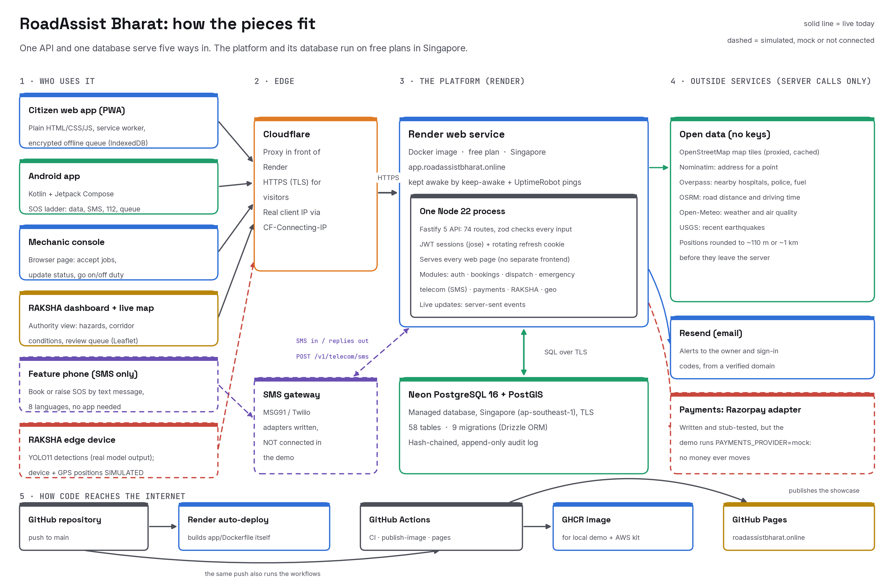

# RoadAssist Bharat: Tools and Software

**What we use, what each tool does in this project, and why we chose it**

SWE4004: Cloud Computing and Applications · VIT-AP University

| Member | Reg. no. | Workstream |
|---|---|---|
| V. Saatwik Sairaam | 24MIC7131 | Backend & cloud database |
| P. Sai Nirisha Chowdary | 24MIC7122 | Frontend & mobile |
| T. V. S. Jignesh | 24MIC7190 | AI & data services |
| G. Parthavi | 24MIC7145 | DevOps, QA & cloud security |

Names and workstreams are as listed in the repository [README](../README.md#team).

> **How to read this document.** Each section starts in plain language and then
> gives the technical detail. Every tool, version and number here comes from the
> repository: the package manifests and lock file, the Gradle and Python
> requirement files, the Dockerfile, `render.yaml`, the GitHub workflows, the
> project documents, and `app/docs/measured.json` for every count. The live setup
> is the one described in [DEPLOYMENT.md](../DEPLOYMENT.md). Nothing is estimated.
>
> Status labels used throughout:
> `IMPLEMENTED` built and running ·
> `SIMULATED` real software fed with made-up data, and labelled so on screen ·
> `MOCK` a stand-in for a paid service, so nothing real happens ·
> `PREPARED` written and tested, but not switched on in the live demo ·
> `FUTURE SCOPE` planned, not built.

## Contents

1. [The system on one page](#1-the-system-on-one-page)
2. [Languages and frameworks](#2-languages-and-frameworks)
3. [Cloud and hosting](#3-cloud-and-hosting)
4. [Third-party data services](#4-third-party-data-services)
5. [Developer tools](#5-developer-tools)
6. [Quality and security](#6-quality-and-security)
7. [Fonts, assets and licences](#7-fonts-assets-and-licences)
8. [Costs](#8-costs)
9. [Glossary](#9-glossary)

---

## 1. The system on one page

### In plain language

RoadAssist Bharat helps a driver who has broken down on an Indian road. The
driver describes the problem, the system works out the likely fault, finds the
nearest verified mechanic, offers the job, and tracks the mechanic to the driver.
If the driver is in danger, an SOS button raises an emergency. If there is no
mobile data, the emergency is stored on the phone and sent automatically when
the signal returns. A second part, **RAKSHA**, lets road authorities see road
damage (such as potholes) that a trained camera model has found.

Everything runs as **one program on one server, with one database**. People
reach it in five ways:

| Way in | Who uses it | What it is | Status |
|---|---|---|---|
| Citizen web app | Drivers | A web page that installs like an app (a PWA) and keeps working offline. `/app.html` | `IMPLEMENTED` |
| Android app | Drivers | A native app written in Kotlin. It talks to the same server. `mobile/` | `IMPLEMENTED` |
| Mechanic console | Mechanics | A web page for accepting jobs and updating their status. `/mechanic.html` | `IMPLEMENTED` |
| RAKSHA authority dashboard | Road-safety officers | A web dashboard of detected road damage, with a live map. `/raksha.html`, `/map.html` | `IMPLEMENTED` (detections are real model output; their positions are `SIMULATED`) |
| SMS from a feature phone | Anyone with a basic phone | A complete booking by text message, in eight languages, with no app. `POST /v1/telecom/sms` | `IMPLEMENTED` in the API. The live demo has **no SMS gateway connected**, so outgoing messages are printed to the server log instead of sent |

A sixth page, `/layers.html`, shows the architecture as a live 3D model that reads
real figures from the running platform.

Not built, and the project says so: iOS, Android Auto, IVR, USSD, satellite,
mesh networking, Kubernetes, Terraform, autoscaling and multi-zone hosting
(`FUTURE SCOPE`, from the README's "Deliberately not built").

### The architecture



*Solid lines are live today. Dashed lines are simulated, mocked or not connected
in the live demo.*

### The architecture in technical terms

- **A modular monolith** ([ADR-0001](../app/docs/adr/0001-modular-monolith.md)):
  one Fastify process holds every module (auth, bookings, dispatch, emergency,
  telecom, payments, RAKSHA, geo) and also serves every web page. Module
  boundaries are enforced by a script in CI, not by convention
  ([ADR-0002](../app/docs/adr/0002-boundaries-in-ci.md)).
- **One database**: PostgreSQL 16 with the PostGIS extension
  ([ADR-0003](../app/docs/adr/0003-postgres-postgis.md)). The schema has
  58 tables, 142 indexes and 9 migrations (`measured.json`).
- **74 routes**, 71 of them under `/v1`; the other three are `/tiles`, `/basemap`
  and `/health`.
- **Real-time updates** use server-sent events with a heartbeat, and polling
  underneath ([ADR-0010](../app/docs/adr/0010-realtime-and-concurrency.md)).
- **Off-Grid Mode is part of the design, not a fallback**
  ([ADR-0009](../app/docs/adr/0009-offgrid-mode.md)). The client tells apart
  `ONLINE`, `LIMITED` and `OFF-GRID`, keeps an encrypted on-device journal, and
  replays it without creating duplicates when the network returns.
- **A model is never allowed to dispatch**
  ([ADR-0005](../app/docs/adr/0005-emergency-isolation.md),
  [ADR-0011](../app/docs/adr/0011-unconfirmed-incident-review.md)). An
  automatic signal waits in `AWAITING_CONFIRMATION` until a person or a second
  signal confirms it.

The project records its design choices in 13 ADRs under `app/docs/adr/`.

---

## 2. Languages and frameworks

### In plain language

The server is written in **TypeScript** (JavaScript with types) and runs on
**Node.js**. The web pages are written in plain **HTML, CSS and JavaScript**,
with no build step. The Android app is written in **Kotlin**. The road-damage
detector is trained and run with **Python**. Data is stored in **PostgreSQL**, a
database, with **PostGIS**, which adds maps and distances to it.

Versions below are the ones the project actually installs: npm packages from
`app/package-lock.json`, Android libraries from `mobile/app/build.gradle.kts`
(the project has no `gradle/libs.versions.toml`; versions are written inline),
and Python packages from the pinned `ai/requirements*.txt` files.

### 2.1 Server (the API)

| Tool | Version | What it does here | Why it was chosen | Where |
|---|---|---|---|---|
| Node.js | 22 (`"node": ">=22"`; image `node:22-alpine`; CI `node-version: 22`) | Runs the API | One language across server and browser. Node 22 is needed because the browser test suite uses the built-in `WebSocket` | `app/package.json`, `app/Dockerfile` |
| TypeScript | 5.9.3 | Adds types to the server code; checked with `tsc -b` | Catches mistakes before the code runs | `app/tsconfig.json` |
| Fastify | 5.12.5 | The web framework: routes, hooks, logging | Fast, with a plugin model that suits a modular monolith | `app/apps/api/src/server.ts` |
| @fastify/static | 10.1.5 | Serves the web pages and demo media from the same process | No separate web host, so no second deploy and no CORS boundary | `server.ts` |
| @fastify/cors | 10.1.0 | Allows only the listed origins (the showcase and the platform) | An unset value would reflect any origin | `render.yaml` `CORS_ORIGINS` |
| zod | 3.25.76 | Validates the input of every route | One schema both checks and types the data | `apps/api/src/` |
| jose | 5.10.0 | Signs and verifies JWT access tokens | Standards-based; refuses `alg:none` and forged signatures | `apps/api/src/auth.ts` |
| Drizzle ORM | 0.45.3 | Typed database queries and the schema definition | SQL stays visible; schema lives in TypeScript | `app/packages/db/` |
| drizzle-kit | 0.31.11 (dev only) | Generates migration files from the schema | Pairs with Drizzle ORM; never shipped in the image | `packages/db/package.json` |
| postgres (postgres.js) | 3.4.9 | The PostgreSQL driver | Small, fast, no native build step | `packages/db/package.json` |
| @faker-js/faker | 10.6.0 (dev only) | Generates demo users, mechanics and bookings for seeding | Realistic test data; kept out of the production image on purpose | `packages/db/src/seed.ts` |
| tsx | 4.23.15 (dev only) | Runs TypeScript directly in development and tests | No compile step while developing | `npm run dev`, `npm test` |

The production image runs compiled JavaScript (`tsc` output in `dist/`) with
production dependencies only; the compiler, linter and drizzle-kit are left out
because each is attack surface (`app/Dockerfile` stage 3).

### 2.2 Database

| Tool | Version | What it does here | Why |
|---|---|---|---|
| PostgreSQL | 16 | Stores everything: users, bookings, incidents, payments, RAKSHA detections, audit log | Transactions and row locks settle races (for example two mechanics accepting one job) |
| PostGIS | 3.4 locally and in CI (image `postgis/postgis:16-3.4`); the PostGIS extension on Neon | Geometry columns, GiST spatial indexes, and `ST_DWithin` to rank the nearest mechanics | A hard requirement: the first migration runs `CREATE EXTENSION postgis`, which ruled out free hosts without it (DEPLOYMENT.md) |

Database facts from `measured.json`: 58 tables, 63 foreign keys, 142 indexes
(88 unique, 5 GiST), 9 migrations. The audit log is append-only: Postgres
`RULES` turn `UPDATE` and `DELETE` into no-ops, and each row is hash-chained to
the one before it.

### 2.3 Web surfaces (citizen app, mechanic console, RAKSHA, map, 3D layers)

| Tool | Version | What it does here | Where |
|---|---|---|---|
| Plain HTML, CSS, JavaScript | n/a | Every page. No framework and no bundler | `app/apps/web/` |
| Service worker | cache `ra-v24` | Keeps the app shell and map tiles available offline. API answers are never cached, because a stale booking status is worse than an honest failure ([ADR-0004](../app/docs/adr/0004-offline-conflict-rules.md)) | `app/apps/web/sw.js` |
| IndexedDB + Web Crypto (AES-GCM-256) | Browser built-ins | The offline SOS and sync journal. Payloads are encrypted under a **non-extractable** key generated on the device | `app/apps/web/offline-store.js`, `offline-engine.js` |
| Web app manifest | n/a | Lets the citizen app install to the home screen (`start_url` `/app.html`, standalone) | `app/apps/web/manifest.webmanifest` |
| Leaflet | 1.9.4 (vendored) | The maps on the live map and the RAKSHA dashboard | `vendor/leaflet.js`, used by `map.html` and `raksha.html` |
| Leaflet.markercluster | vendored; the file carries no version string | Groups nearby markers on the live map | `vendor/markercluster.js`, `map.html` |
| three.js | r169 (vendored, MIT) | Draws the 3D architecture model: OrbitControls, GLTF and Draco loaders, bloom post-processing | `vendor/three/`, `layers.html` |
| Server-sent events (`EventSource`) | Browser built-in | Live booking and dispatch updates | `apps/api/src/realtime.ts` |

Why no framework and no CDN: the pages are served by the API itself, so there
is one deployment, and every library and font is copied into `vendor/` so that no
page makes a visitor's browser contact a third party (enforced by
`npm run residency`, see section 6).

### 2.4 Android app

| Tool | Version | What it does here |
|---|---|---|
| Kotlin | 2.0.21 (`org.jetbrains.kotlin.android`, Compose compiler plugin 2.0.21) | The app's language |
| Android Gradle Plugin | 8.13.2 | Builds the app |
| Gradle (wrapper) | 8.13 | The build tool. Must run on **JDK 21**: Gradle 8.13 rejects JDK 25 (ENGINEERING-NOTES.md) |
| Java target | 17 (`sourceCompatibility`, `jvmTarget`) | Bytecode level of the app |
| Android SDK | `compileSdk` 36, `targetSdk` 36, `minSdk` 26 | Runs on Android 8.0 and newer; built and targeted for Android 16 |
| App version | `versionName` 1.0.5, `versionCode` 7 | The release published as `android-v1.0.5` on GitHub Releases |
| Jetpack Compose | BOM 2024.09.03; `ui`, `foundation`, `material3` | The user interface |
| androidx.activity:activity-compose | 1.9.2 | Hosts Compose in the activity |
| androidx.lifecycle:lifecycle-runtime-ktx | 2.8.6 | Lifecycle-aware coroutines |
| androidx.core:core-ktx | 1.13.1 | Status-bar and navigation-bar colours for the light/dark toggle |
| kotlinx-coroutines-android | 1.8.1 | Background work (network, SOS ladder) |
| androidx.profileinstaller | 1.4.1 | Installs a baseline profile so start-up and scrolling are compiled ahead of time |
| R8 (release build) | via AGP | Shrinks and optimises the release APK. The build notes record about 25% janky frames on a debug build against about 4% on the R8 build |
| JUnit | 4.13.2 (tests only) | Unit tests |
| org.json | 20240303 (tests only) | A real JSON library for JVM tests; the Android SDK's copy is a stub off-device |

**Why so few libraries:** networking uses the platform's own
`HttpURLConnection` and `org.json`, so the app has no third-party runtime
library at all ("zero third-party libraries, so the first build has the fewest
possible failure modes", `mobile/app/build.gradle.kts`). Release builds are
signed with the RoadAssist Bharat release key, which is held outside the
repository (`RA_SIGNING_PROPS`, or a folder beside the repository; neither the
keystore nor its properties file is committed). Its certificate SHA-256 is
`f602bb634f6e5dfc76752aec42ac36bf1a35c081a1f04b545e3ab107dcf84359`, and the
signed APKs are published as GitHub Releases tagged `android-vX.Y.Z` (latest
`android-v1.0.5`; install and verification steps in `release/INSTALL.md`). A
machine without the key, such as CI, still builds a release APK but signs it
with the debug key and prints a warning: that APK installs for a demo and can
never update, or stand in for, the published release. The app is not on a
store.

The SOS ladder's decisions (data, then SMS, then 112, then the on-device queue)
live in `SosLadder.kt` as pure functions so they can be tested off-device.

### 2.5 AI: RAKSHA road-damage detection (Python)

| Tool | Version | What it does here |
|---|---|---|
| Python | 3.12 (`ai/requirements.txt`, CI `python-version: '3.12'`) | Training, inference and the pipeline tests |
| Ultralytics (YOLO11) | 8.4.126 | Trains and runs the YOLO11 detector. Pulls in PyTorch, about 2 GB installed. **AGPL-3.0** (see section 7) |
| remotezip | 0.12.5 | Downloads only the needed byte ranges of the 13.26 GB RDD2022 archive |
| ONNX Runtime | 1.30.0 | Runs the exported `best.onnx` model in the serving path, without PyTorch or Ultralytics |
| NumPy | 2.5.3 | Pre- and post-processing for ONNX inference |
| Pillow | 12.3.0 | Image loading for inference |
| `unittest` (standard library) | n/a | The pipeline tests: class mapping, box maths, severity rule. No PyTorch needed, so they run on every push |

What was trained (from `ai/README.md`, measured on held-out validation data,
CPU-only training):

| Model | Classes | mAP50 | mAP50-95 | ONNX size |
|---|---|---|---|---|
| `yolo11n` baseline (India) | 2 | 0.443 | 0.183 | 10 MB |
| `yolo11s-multi-rich` (India, Czech, Japan, USA) | 4 | **0.472** | **0.226** | 37 MB |
| `yolo11n-multi-edge` | 2 | 0.293 | 0.117 | 10 MB |

The detections the live RAKSHA dashboard shows are real output of the YOLO11n
model (`yolo-rdd2022in-best`) on RDD2022 India images. Their positions on NH-48
are `SIMULATED`, because RDD2022 images carry no GPS. On the hosted demo, the
API registers a demo patrol device at start-up and posts the 34 detections from
`ai/cv-detections-full.json` through the real ingest route. Locally,
`npm run demo:raksha` posts 65 detections from `ai/cv-live-show.json`.

`ai/serve.py` puts the ONNX model behind `POST /detect` over HTTP. It runs on a
developer machine; it is not deployed to the cloud (`IMPLEMENTED` locally). A
physical edge device (the README names "Pi-class hardware" as the target) is
`FUTURE SCOPE`.

**The roadside fault diagnosis is not AI.** It is a deterministic rule table
that returns `rules-1.0.0`, and every screen that shows it says it is a rules
engine ([ADR-0006](../app/docs/adr/0006-ai-rules-first.md)). No language model
is used anywhere; `npm run no-llm` fails the build if one appears. The claim
"AI-powered" is recorded as `PARTIAL` in
[CLAIMS-AUDIT](../app/docs/CLAIMS-AUDIT.md).

### 2.6 What was planned but not used

The original setup guide (`setup-guide/tools-and-setup.md`) planned pnpm,
Node 20, Kubernetes (k3d), Terraform, k6, OWASP ZAP, Grafana, Sentry and Postman.
The project as built uses **npm workspaces** and **Node 22** instead, and does
not use the others. Telemetry SDKs such as Sentry are refused outright by the
data-residency gate, because they send identifiers abroad by default.

`app/docker-compose.yml` also starts **Redis 7** and **Redpanda v24.2.7** (a
Kafka-compatible event bus) as local stand-ins for managed services. The API does
not use either today: rate limits are kept in memory, and `ratelimit.ts` names
Redis as the fix for sharing them across several servers (`FUTURE SCOPE`).

---

## 3. Cloud and hosting

### In plain language

The platform lives on **Render**, a hosting company that runs our program in a
**Docker container** (a sealed box holding the program and everything it needs).
The data lives on **Neon**, a hosted PostgreSQL database. Both are in
**Singapore**, the closest region to India that their free plans offer.
Render serves the platform through **Cloudflare**, which sits in front and
handles secure (HTTPS) connections. A separate
public showcase page is hosted free on **GitHub Pages**. **GitHub Actions**
tests every change automatically.

### Addresses

| Address | What it is | Hosted on |
|---|---|---|
| <https://app.roadassistbharat.online> | The live platform: API and every web surface | Render, behind Cloudflare |
| <https://roadassistbharat.online> | The showcase page, which embeds the live platform | GitHub Pages (`pages/CNAME`) |

### Services

| Service | What it does here | Configuration | Status |
|---|---|---|---|
| **Render** | Runs the Docker image as one web service. Rebuilds and redeploys on every commit (`autoDeployTrigger: commit`). Health check `/health`, which answers 503 when the database is unreachable | `render.yaml`: `runtime: docker`, `plan: free`, `region: singapore`, `NODE_ENV=demo` | `IMPLEMENTED` (live) |
| **Neon** | Managed PostgreSQL 16 + PostGIS, Singapore (`ap-southeast-1`), TLS required. The direct (not pooled) connection string is used, because migrations and live streams need a real session | Set by hand as `DATABASE_URL` in Render; never committed | `IMPLEMENTED` (live) |
| **Least-privilege database role** | `roadassist_app` can read and write rows only: no `CREATE`, `TRUNCATE` or ownership, and only `SELECT`/`INSERT` on `audit_log`. Migrations run as the owner through `MIGRATION_DATABASE_URL`, which `docker-start.sh` uses for the migrate step and then removes | `app/packages/db/sql/least-privilege-role.sql`, DEPLOYMENT.md | `IMPLEMENTED` (live since 5 Oct 2026): Render's `DATABASE_URL` is the `roadassist_app` string, and the live database's `pg_stat_activity` shows the service connected as `roadassist_app` |
| **Cloudflare** | The edge in front of Render. It is Render's, not a separate account: `app` is a CNAME to Render, and Render serves custom domains through Cloudflare. Visitors' HTTPS ends here, and the API takes the caller's address from `CF-Connecting-IP`, which a caller cannot forge | `CLIENT_IP_HEADER=cf-connecting-ip`, `TRUST_PROXY=true` (`render.yaml`) | `IMPLEMENTED` (live) |
| **Hostinger** | Where the domain and its DNS are managed (Hostinger's nameservers). DEPLOYMENT.md §3 adds the `app` CNAME and the Resend DKIM/SPF records there, and switching to the AWS kit is an edit to that same `app` record | DNS records | `IMPLEMENTED` |
| **GitHub Pages** | Hosts the static showcase. Built and checked by `pages.yml`, which fails if the page loads anything from another origin | `.github/workflows/pages.yml`, `pages/` | `IMPLEMENTED` (live) |
| **GitHub Container Registry (GHCR)** | Stores the published image `ghcr.io/saatwik-1157/roadassist-bharat`, tagged by branch, version and commit SHA so a bad deploy can roll back to a known image | `.github/workflows/publish-image.yml` | `IMPLEMENTED` |
| **GitHub Actions** | Runs the checks and publishing (table below) | `.github/workflows/*.yml` | `IMPLEMENTED` |
| **UptimeRobot** | An uptime monitor that pings the platform. Its settings live in the UptimeRobot dashboard, not in the repository; `deploy/aws/README.md` is the only file that names it | UptimeRobot dashboard | `IMPLEMENTED` (configured outside the repo) |
| **Resend** | Sends operator alert emails and email sign-in codes from the verified domain `send.roadassistbharat.online` | `EMAIL_PROVIDER=http`, `EMAIL_BASE_URL=https://api.resend.com/emails` | `IMPLEMENTED` (live) |
| **Google Search Console** | Both sites are verified URL-prefix properties and both sitemaps are submitted (done 2026-09-30). The verification files `googlee923ee0decf8e5e0.html` must not be deleted | DEPLOYMENT.md, "Search engines" | `IMPLEMENTED` |
| **Fly.io** | A ready alternative to Render that runs the same image, region Mumbai (`bom`) | `fly.toml` | `PREPARED`, not live |
| **AWS (free plan)** | One EC2 `t3.micro` (Amazon Linux 2023, Singapore) running the same GHCR image with **Caddy 2** as the HTTPS origin, against the same Neon database. Switching is one DNS edit at Hostinger. The kit's Caddy uses its internal certificate and expects a Cloudflare proxy in SSL mode "Full" in front; the Cloudflare edge the live site has is Render's and does not follow the record to EC2, so that has to be provided first (see `deploy/aws/README.md`) | `deploy/aws/README.md`, `user-data.sh`, `env.example` | `PREPARED`, not live |

### GitHub Actions workflows

| Workflow | Runs on | What it does |
|---|---|---|
| `ci.yml` | Every push to `main` and every pull request | Five jobs. **verify**: install, typecheck, lint, unit tests, `gitleaks` secret scan, `npm audit --audit-level=high`. **integration**: a real PostGIS service, migrate, seed, start the API, then the end-to-end, gateway-security, concurrency, security-audit and browser suites; a chaos test that stops PostgreSQL under the running API; a backup-and-restore rehearsal that re-checks the audit log; and an offer-expiry run with a 2-second offer lifetime. **boundaries**: module boundaries, claims, citations, no-LLM and data-residency gates. **android**: lint, unit tests, debug APK and release APK on JDK 21 (Temurin). **ai**: syntax check, the Python pipeline tests, and a check that every requirement is pinned with `==` |
| `publish-image.yml` | Push to `main`, `v*` tags, manual | Builds the image, boots it against a real PostGIS, runs the end-to-end and security suites **against the running container**, checks every surface answers 200 and that `/media` will not serve an HTML page, then pushes to GHCR |
| `pages.yml` | Changes under `pages/`, screenshots, videos, deck visuals | Assembles the showcase, refuses any third-party subresource, checks every referenced asset exists, deploys to GitHub Pages |
| `keep-awake.yml` | Every 10 minutes (cron), manual | A plain GET of `/health` and the showcase, so the free Render service does not sleep. Sends no credentials |

Actions used: `actions/checkout@v5`, `actions/setup-node@v5`,
`actions/setup-java@v4`, `actions/setup-python@v5`,
`android-actions/setup-android@v3`, `gradle/actions/setup-gradle@v4`,
`gitleaks/gitleaks-action@v2`, `docker/setup-buildx-action@v3`,
`docker/build-push-action@v6`, `docker/login-action@v3`,
`docker/metadata-action@v5`, `actions/upload-artifact@v4`,
`actions/upload-pages-artifact@v3`, `actions/deploy-pages@v4`.

### The Docker image

`app/Dockerfile`, built from the repository root:

1. **deps**: `node:22-alpine`, `npm ci` from the manifests only, so this layer is
   cached until a dependency changes.
2. **build**: compiles `packages/db` and `apps/api` with TypeScript.
3. **prod-deps**: `npm ci --omit=dev`, so no compiler, linter or drizzle-kit ships.
4. **runtime**: runs as the unprivileged `node` user, uses `tini` as PID 1 so
   shutdown signals reach Node, and has a `HEALTHCHECK` on `/health`.

On start, `docker-start.sh` runs the idempotent migrations, optionally seeds the
demo fleet (24 mechanics marked "(simulated)") and the RAKSHA admin and corridor,
then starts the server.

### Why these hosts

- **PostGIS was the deciding requirement.** A managed Postgres that will not
  install the extension fails on the first migration.
- **The database is on Neon, not Render**, because Render allows one free
  PostgreSQL per account, and this account's was already in use.
- **Netlify, Vercel and other function-per-request hosts cannot run this API.**
  It holds open live-update streams, runs an offer-expiry timer and keeps a
  database pool, and all three need a long-lived process (DEPLOYMENT.md).
- **Singapore, not India**: the free tiers offer no Indian region. The project's
  rule "no personal data leaves India" is therefore the production target and
  not yet true of the demo, and the README says so.
- **`NODE_ENV=demo`, not `production`**: the production guard refuses to start
  without a real payment gateway, a real SMS provider and webhook secrets.
  Running as `demo` keeps that guard meaningful, and the screens say payments
  are mocked.

---

## 4. Third-party data services

### In plain language

The app shows nearby hospitals and fuel stations, a readable address, road
driving time, weather and air quality, and recent earthquakes. That information
comes from free public services. **Only our server talks to them, never the
visitor's browser**, and a user's position is rounded before it is sent so the
service learns only a rough area.

### Declared outbound hosts

`app/scripts/check-data-residency.mjs` lists every host the project's own code
may contact, with where the data lands. An undeclared host fails the build. The
declarations, summarised:

| Host | Used for | What it receives | Region (as declared) | Status in the live demo |
|---|---|---|---|---|
| `tile.openstreetmap.org` | Map tiles, fetched by the server and cached (`/tiles`, `/basemap`) | Tile coordinates only | Outside India (EU) | `IMPLEMENTED` |
| `nominatim.openstreetmap.org` | Address for a point (`GET /v1/geo/address`) | Position rounded to 3 decimals (about 110 m) | Outside India (OSMF, EU) | `IMPLEMENTED` |
| `overpass-api.de` | Nearby hospitals, police, fuel, EV charging, repair, tyres (`GET /v1/geo/nearby`) | Point rounded to 2 decimals (about 1 km) and a radius | Outside India (Germany) | `IMPLEMENTED` |
| `router.project-osrm.org` | Road distance and driving time, no live traffic (`GET /v1/geo/route`) | Both points rounded to about 110 m | Outside India (FOSSGIS, Germany) | `IMPLEMENTED` |
| `api.open-meteo.com` | Weather for the RAKSHA corridor report | Coordinates (declared as personal data) | Outside India (Germany) | `IMPLEMENTED` |
| `air-quality-api.open-meteo.com` | Air quality in the corridor report; a "poor air quality" risk above US AQI 150 | Fixed corridor midpoints, never a user's position | Outside India (Germany) | `IMPLEMENTED` |
| `earthquake.usgs.gov` | Magnitude 4+ earthquakes in and around India, last 7 days (`GET /v1/geo/earthquakes`) | A fixed area and a date, nothing about any user | Outside India (USA) | `IMPLEMENTED` |
| `api.resend.com` | Operator alerts and email sign-in codes | A phone number masked to its last three digits, a role, an event and a time | Outside India (USA) | `IMPLEMENTED`, needs `EMAIL_API_KEY` |
| `api.msg91.com` | SMS (the default provider in the code) | Phone number and message | India | `PREPARED`: adapter written; the demo runs `SMS_PROVIDER=console`, so messages go to the server log |
| `api.twilio.com` | Optional fallback SMS provider | Phone number and message | Outside India (USA) | `PREPARED`: adapter written, never used in a documented run |
| `api.razorpay.com` | Payment orders | Order and payment references, never card data | India | `PREPARED`: adapter written and checked against a local stub; the demo runs `PAYMENTS_PROVIDER=mock`, so no money moves |
| `ndownloader.figshare.com` | Downloading the RDD2022 dataset at training time | Nothing; a download only | Outside India | Training only, never called by the platform |

The only third-party host a **page** may load is `checkout.razorpay.com`,
because card data must load from the gateway's own origin. It is not used in the
demo, where payments are mocked.

**How the location calls are kept polite and safe** (README, ADR-0012): results
are cached (address 24 h, nearby 6 h, route 10 min, earthquakes 15 min, air
quality 30 min), calls are paced to about one a second, each carries an
identifying User-Agent, and a point outside India is refused with
`400 outside_region` before any provider is asked. They are off in development,
test and CI, so no test run calls a donated service. `GEO_SERVICES=on|off`
overrides this.

**Honest limits:** rounding reduces what leaves but does not anonymise it, so
sending rounded positions abroad is a stated exception to "no personal data
leaves India". The production answer is a self-hosted Nominatim and OSRM in an
Indian region (`FUTURE SCOPE`). Community map data can be missing or stale, and
"nearby" distances are straight-line.

### Simulated and mocked parts, said plainly

| What | How it is simulated |
|---|---|
| RAKSHA detections | Real YOLO11 output on real RDD2022 images; the device and the NH-48 positions are `SIMULATED` |
| Mechanics, police and ambulance on the live map | Seeded and marked "(simulated)"; the 24 demo mechanics belong to "Demo Fleet (simulated)" |
| Payments | `MOCK` provider: logs "SIMULATED, no money moved" |
| SMS | No gateway: messages are printed to the server log, with numbers masked and codes redacted |
| Phone sign-in codes | Shown on screen (`EXPOSE_DEV_OTP=true`), and only for the published demo numbers; admin, RAKSHA officer and listed mechanic accounts sign in by emailed code only |
| ERSS-112 handoff | Stubbed, and the API response says so |

---

## 5. Developer tools

### In plain language

These are the tools the team uses to build, test and present the project. None
of them ships to users.

| Tool | What it does here | Where it shows up |
|---|---|---|
| **Git and GitHub** | Version control and the shared repository. The repository is pushed from one account, so `git log` shows one committer; that reflects how code reached GitHub, not how work was split (README) | Whole repo |
| **npm workspaces** | One install for the `@roadassist/api` and `@roadassist/db` packages (`apps/*`, `packages/*`). Run npm commands from `app/` | `app/package.json` `workspaces` |
| **Docker and Docker Compose** | `docker compose up -d db` starts a local PostGIS on port 5434. `docker compose -f docker-compose.demo.yml up` brings up the whole platform from the published image with one command. The setup guide installs Docker Desktop on the team's Windows machines | `app/docker-compose.yml`, `docker-compose.demo.yml`, `app/docker-compose.prod.yml` |
| **tsx** | Runs the API from TypeScript source in development (`npm run dev` watches files) | `apps/api/package.json` |
| **TypeScript compiler** | `npm run typecheck` (`tsc -b`, project references) and the production build | `app/tsconfig.json` |
| **ESLint 9 + typescript-eslint 8** | `npm run lint`; ESLint 9.39.5 and typescript-eslint 8.71.0 with a flat config | `app/eslint.config.js` |
| **node:test** | The unit test runner built into Node (`npm test`) | `apps/api/test/`, `packages/db/test/` |
| **drizzle-kit** | `npm run db:generate` makes a migration; `drizzle-kit studio` browses the database | `packages/db/package.json` |
| **Google Chrome** | Driven over the DevTools Protocol by the browser test suite and the screenshot script, with no headless-browser library added. Headless Chrome also renders the showcase hero illustration and `ppt/md2pdf.py`'s PDFs | `scripts/ui-journey.mjs`, `scripts/capture-screens.mjs`, `pages/hero/build-hero.py` |
| **cloudflared (Cloudflare quick tunnel)** | `npm run share` gives a local run a temporary public HTTPS address, so a real phone gets geolocation, the service worker and "Add to home screen" | `scripts/share.mjs` |
| **pg_dump / pg_restore** | Backups, and the backup-and-restore rehearsal in CI | `scripts/backup.sh`, `ci.yml` |
| **gitleaks** | Scans every push for committed secrets | `ci.yml` |
| **Android Studio + emulator** | Builds and runs the Android app. From the emulator, a local API is at `10.0.2.2:4000`. Studio's Gradle JDK must be set to JDK 21 by name (ENGINEERING-NOTES.md) | `mobile/` |
| **Gradle wrapper** | `cd mobile && ./gradlew lint testDebugUnitTest assembleRelease` | `mobile/gradlew` |
| **Python 3.12 + venv** | The AI pipeline lives in `ai/.venv` (gitignored) | `ai/` |
| **python-pptx + Pillow** | Generated the final 38-slide deck. The generator left the repository on 2026-10-05 (in git history at `95672c2:ppt/`) | git history |
| **Microsoft PowerPoint (COM)** | Applied the slide transitions and exported the deck PDF after each build | git history (`95672c2:ppt/README.md`) |
| **Pillow scripts** | Web-sized thumbnails, the 3D journey scenes and the deck visuals, all built from real screenshots | `pages/build-thumbs.py`, `pages/scenes/`, `pages/visuals/render_visuals.py` |
| **Blender 5.2** | A headless script models the seven-layer architecture stack (7 layers, 31 parts), exports it as glTF with Draco compression (595 KB, `assets/3d/layers.glb`) for three.js, and renders the still shown before the live scene loads | `design/blender/build_layers.py` |
| **Figma** | The design boards are written as SVG that Figma imports as editable layers | `design/build_boards.py`, `design/figma/` |
| **Promo film** | A 30-second promo and a vertical cut, built from real recordings and screenshots, with drawn scenes tagged. The repository does not record which video tool assembled it | `site/roadassist-promo.mp4`, `site/roadassist-promo-vertical.mp4` |

Everyday commands (from `app/`):

```bash
docker compose up -d db      # PostGIS on 5434
npm run demo:reset           # reset, migrate, seed
npm start                    # API on :4000, serves every web surface
npm run demo:raksha          # second terminal: real YOLO11 detections, simulated positions
npm run verify               # the eight gates listed in section 6
```

---

## 6. Quality and security

### In plain language

Every change is checked by machines before it can go live. Some checks test that
the software works; others check that the project's documents tell the truth,
that no personal data is sent to outside services by a web page, and that no AI
chat service has crept in. The security tests try more than a hundred attacks
against the running system, and each one has to fail.

### The verify gates

`npm run verify` runs these in order, and CI runs the same checks:

| Gate | Command | What it fails on |
|---|---|---|
| Typecheck | `npm run typecheck` | Any TypeScript type error |
| Lint | `npm run lint` | ESLint errors |
| Boundaries | `npm run boundaries` | A module importing another module's internals; an incomplete offline shell; the app shell loading in the wrong order |
| Claims | `npm run claims` | Any document, deck source or page whose numbers disagree with `app/docs/measured.json` |
| Citations | `npm run citations` | A `file.ts` line reference in the documents that no longer points at real code |
| No LLM | `npm run no-llm` | A language-model SDK in any manifest, or a chat endpoint called from any source file |
| Residency | `npm run residency` | A page loading a third-party resource; an undeclared server-side host; an analytics or crash-reporting SDK; personal data in a URL |
| Unit | `npm test` | Any failing unit test |

### Test suites

Counts are from `app/docs/measured.json` (measured on 2026-10-05 against a
database migrated from empty, then seeded).

| Suite | Count | What it proves | Runs |
|---|---|---|---|
| Unit (`npm test`) | 462 | Pure logic: diagnosis rules, booking and incident state machines, backoff, log redaction, and a guard that the on-device rule table matches the server's | CI and `verify` |
| End-to-end (`npm run test:e2e`) | 249 | The whole API journey against real Postgres, including the SMS feature-phone journey and off-grid sync | CI, and against the built container |
| Concurrency (`npm run test:concurrency`) | 92 | Races: two mechanics accepting one job, three SOS taps at once, live event delivery | CI |
| Gateway security (`npm run test:gateway`) | 58 | Webhook signatures, append-only audit rules, sign-in code limits per number and per IP | CI |
| Security audit (`npm run test:security`) | 106 | Attacks that must all be refused: cross-tenant access, role escalation, SQL injection, forged and `alg:none` tokens, unsigned webhooks, oversized input, error leakage | CI, and against the built container |
| Browser (`npm run test:ui`) | 195 | Drives real Chrome: offline payment refused, session survives reload, the full Off-Grid Mode scenario | CI |
| **Total** | **1162** | Six suites, zero failures | |
| Payment sandbox (`npm run test:razorpay`) | 22 | Razorpay negative cases against a local stub. Needs an API started with `PAYMENTS_PROVIDER=razorpay`, so it is outside every npm test run, not part of the 1162, and never described as passing | By hand only |
| Android (Gradle) | 190 | Android unit tests, run with lint and both APK builds | CI `android` job |
| SOS ladder | 21 | The subset of the Android tests over `SosLadder.kt`, the emergency fallback decisions | CI `android` job |
| CV pipeline | 39 | The Python pipeline tests (standard library only) | CI `ai` job |

CI also stops PostgreSQL under a running API and checks that `/health` answers
503 naming the database while `/v1/ping` still answers 200, so a client can tell
"you have no network" from "the platform is unwell".

### Security controls in place

| Area | Control |
|---|---|
| Sign-in | One-time codes over SMS (or email for protected accounts), stored as SHA-256 hashes; limits per number and per IP counted in Postgres. The platform has no passwords |
| Sessions | 10-minute JWT access tokens; rotating refresh tokens, and reusing an old one revokes the whole family |
| Refresh cookie | Web pages get the refresh token as an **HttpOnly** cookie on `Path=/v1/auth` (`SameSite=None; Secure; Partitioned` over HTTPS). Android and the test scripts use the JSON body token |
| Content Security Policy | `default-src 'self'`; scripts only from the site itself plus each inline `<script>` allowed by its **SHA-256 hash**, computed when the server starts (`'wasm-unsafe-eval'` is allowed for the 3D page's Draco decoder, and `checkout.razorpay.com` only when Razorpay is configured); `object-src 'none'`; `frame-ancestors` limited to the showcase. Also HSTS, nosniff, Referrer-Policy, Permissions-Policy, COOP/CORP and `no-store` on the API (`security-headers.ts`) |
| Rate limits | Per principal; the SMS webhook per sending number; map tiles bounded. SOS alerts are capped, but the escalation itself is never limited |
| Input | zod on every route; pages escape server strings; CSV exports neutralise formulas |
| Audit log | Append-only (Postgres `RULES`) and hash-chained; re-verified live and on every restored backup |
| Database role | Least-privilege `roadassist_app` role, live on the hosted database since 5 Oct 2026 (section 3) |
| Location data | Positions rounded to about 110 m or 1 km before any outside call; logs never record coordinates, only whether a fix was available (`observability.ts`) |
| Secrets | None in source, image or history; `gitleaks` on every push; the JWT secret must be 32+ characters outside development |
| Dependencies | `npm audit --audit-level=high` in CI. Four moderate advisories are knowingly carried, all in drizzle-kit's development-only `esbuild` chain, which never ships |
| Container | Runs as a non-root user; production dependencies only |

### What is not done (from `app/docs/SECURITY.md`)

- **No external penetration test.** 106 self-written attacks is not the same thing.
- **Rate limiting is per instance.** Several servers would each allow the full limit.
- **No column-level encryption at rest** in Postgres; medical data is protected by
  access control and audit.
- **No live payment gateway** has ever been exercised.
- **No WAF and no DDoS protection** beyond what the hosts provide.
- **Coarsened positions still leave India** wherever location services are on.
- The 10-minute access token sits in `sessionStorage`; `style-src` still allows
  `'unsafe-inline'`.
- No load test: latency is measured for a single user on one machine (README).

---

## 7. Fonts, assets and licences

### In plain language

Every font, map library and 3D library is free to use under an open licence, and
is copied into the project rather than loaded from someone else's server. The
road-damage training images come from a public research dataset that must be
credited. The detector software has a strict licence that the project addresses
by keeping it out of the part that would ship.

| Item | Licence | How the project uses it | Where |
|---|---|---|---|
| **Space Grotesk** | SIL Open Font License 1.1 | Display headings | `app/apps/web/vendor/fonts/`, `pages/fonts/`, `mobile/app/src/main/res/font/` |
| **Inter** | SIL Open Font License 1.1 | Everything a person reads or taps | same |
| **JetBrains Mono** | SIL Open Font License 1.1 | Figures, references and codes (RA-XXXXXX, 112) where digits must line up | same |
| Font licence texts | n/a | `OFL-*.txt` shipped beside the fonts; the Android app carries them in `assets/licenses/` | |
| **Leaflet 1.9.4** | The vendored file keeps its copyright header but no licence file is vendored beside it; Leaflet's authors publish it under BSD-2-Clause | Maps; every map credits "© OpenStreetMap contributors" | `vendor/leaflet.js` |
| **OpenStreetMap data** | ODbL; the geo routes return the credit "© OpenStreetMap contributors, ODbL" | Tiles, addresses, nearby places | `apps/api/src/routes/geo.ts`, the map pages |
| **three.js r169** | MIT (`vendor/three/LICENSE`) | The 3D layers page | `vendor/three/` |
| **RDD2022 dataset** (Arya et al.) | figshare records CC BY 4.0; the maintainers' README states CC BY-SA 4.0 for images. The project follows the stricter reading | Training data; the dashboard frames are derivatives under the same licence, credited in the RAKSHA photo viewer, and the showcase links the paper (arXiv 2209.08538) | `docs/raksha/05-dataset-license-verification.md` |
| **Ultralytics YOLO11** | **AGPL-3.0** | Training and detection | `ai/requirements.txt` |
| ONNX Runtime, NumPy, Pillow | MIT, BSD-3, MIT-CMU (as recorded in `ai/requirements-serve.txt`) | The serving path | `ai/requirements-serve.txt` |
| npm packages | MIT for Fastify, zod, jose, ESLint, tsx and others; Apache-2.0 for Drizzle ORM and TypeScript; Unlicense for postgres.js (from `package-lock.json`) | Server and tooling | `app/package-lock.json` |
| Hero illustration | Original, drawn from code; replaced a third-party photo | Showcase backdrop | `pages/hero/build-hero.py` |
| Screenshots | Real captures of the running system | Showcase and deck | `app/docs/screenshots/` |

**How the AGPL-3.0 licence of YOLO11 is handled** (from
`docs/raksha/05-dataset-license-verification.md` §2 and `ai/README.md`):

- AGPL-3.0 requires releasing the complete source of a derivative work. For this
  student project that is acceptable, because the repository is already public
  coursework.
- For any commercial use the document says plainly that AGPL is a real
  constraint: either buy Ultralytics' Enterprise Licence or switch to a
  permissively licensed model (YOLOX and RT-DETR, both Apache-2.0, are named as
  candidates, but have not been evaluated).
- The serving path already avoids the AGPL dependency: `serve.py` runs the
  exported ONNX model on ONNX Runtime, NumPy and Pillow only. Training keeps
  Ultralytics, where nothing is distributed.
- Every Python requirement is pinned, and CI fails if one is not, so the
  licensing argument stays reproducible.

---

## 8. Costs

### In plain language

The live project runs without paying for hosting. The free plans have limits,
and the biggest one matters: the free server goes to sleep when nobody uses it,
which is fine for a demo but not for real emergencies.

| Service | Plan | Limits that matter, from the repository |
|---|---|---|
| Render | Free web service | Sleeps after **15 minutes** idle and takes about a minute to wake. 750 instance hours a month per workspace; one service awake all month is about 720 to 744, so `keep-awake.yml` fits only while it is the only free service. The disk is ephemeral (persistent disks need a paid instance), so hazard photos are kept in the database instead ([ADR-0013](../app/docs/adr/0013-hazard-photos-in-the-database.md)) |
| Neon | Free | 0.5 GB storage, roughly 750 hazard photos at the 600 KiB cap |
| Cloudflare | No account of the project's own | The edge in front of the live site comes with Render. The AWS kit would need a Cloudflare zone of its own, on the free plan (`deploy/aws/README.md`) |
| GitHub (repository, Actions, Pages, GHCR) | No paid plan is referenced anywhere in the repository; the repository and the image are public | Scheduled runs may be delayed under load, so keep-awake means "usually awake" |
| Resend | Free | The free sender delivers only to the account's own address; a verified domain (`send.roadassistbharat.online`) lifts that |
| UptimeRobot | Not recorded in the repository | |
| Open data services (OSM, Nominatim, Overpass, OSRM, Open-Meteo, USGS) | No account or key | Fair use: paced to about one request a second and cached. The OSRM server is a demo router |
| Domain `roadassistbharat.online` | Registered and managed at Hostinger | The price is not recorded in the repository |
| AWS (`PREPARED`, not live) | Free plan for accounts created since 15 July 2025 | Up to **US$200** in credits (US$100 at sign-up and up to US$100 more), valid for **6 months** or until the credits run out; then the account must upgrade or AWS closes it. Estimated running cost about US$14 a month (t3.micro about US$10, public IPv4 about US$3.60, 8 GB disk about US$0.80) |
| Fly.io (`PREPARED`, not live) | Not recorded | |

**The cost of free, said plainly:** a free service that sleeps after 15 minutes
and takes about a minute to wake is fine for a demo and not fine for the emergency
response times the platform describes. A sleeping free tier must not be mistaken
for the architecture (DEPLOYMENT.md, `render.yaml`).

---

## 9. Glossary

| Term | Meaning |
|---|---|
| **API** | Application Programming Interface: the set of web addresses (routes) that the apps call to read or change data |
| **PWA** | Progressive Web App: a website that can be installed to the home screen and keep working offline |
| **Service worker** | A small script the browser runs in the background; here it keeps the app's files and map tiles available offline |
| **IndexedDB** | A database built into the browser; here it holds the offline SOS journal |
| **AES-GCM** | A standard encryption method; the offline journal is encrypted with a 256-bit key that cannot be read out of the browser |
| **PostgreSQL** | An open-source relational database |
| **PostGIS** | An extension that adds maps, coordinates and distance searches to PostgreSQL |
| **ORM** | Object-Relational Mapper: a library (here Drizzle) that lets code talk to the database with types |
| **Migration** | A versioned script that changes the database structure; applied in order, safely repeatable here |
| **JWT** | JSON Web Token: a signed token that proves who is calling; here it lasts 10 minutes |
| **Refresh token** | A longer-lived token used to get a new JWT; here it rotates on every use |
| **HttpOnly cookie** | A cookie that page scripts cannot read, so an injected script cannot steal it |
| **OTP** | One-Time Password: the six-digit sign-in code |
| **CSP** | Content Security Policy: a header telling the browser which scripts and resources a page may load |
| **CORS** | Cross-Origin Resource Sharing: rules for which other websites may call the API |
| **Rate limit** | A cap on how many requests one caller can make in a time window |
| **Hash chain** | Each audit row stores a fingerprint of itself and the row before, so editing any old row is detectable |
| **SSE** | Server-Sent Events: a one-way live connection from the server to the browser for updates |
| **Docker image / container** | An image is a packaged program with everything it needs; a container is that image running |
| **Registry (GHCR)** | A store for Docker images; GHCR is GitHub's |
| **CI** | Continuous Integration: automatic build and test on every change |
| **Workflow** | A GitHub Actions file describing jobs to run |
| **Region** | The physical data-centre location (here Singapore) |
| **CDN / proxy** | A service in front of the server (here Cloudflare) that handles connections and HTTPS |
| **TLS / HTTPS** | Encryption for data travelling over the internet |
| **DNS** | The internet's address book, turning a domain name into a server address |
| **Modular monolith** | One program split into modules with strict boundaries, instead of many small services |
| **Idempotent** | Safe to repeat: running it twice has the same effect as once (here the off-grid replay and migrations) |
| **YOLO11** | A family of real-time object-detection models from Ultralytics |
| **mAP50** | Mean Average Precision at 50% box overlap: a standard accuracy score for detectors (0 to 1) |
| **ONNX / ONNX Runtime** | An open file format for trained models, and the engine that runs it without the training software |
| **RDD2022** | A public road-damage image dataset from six countries |
| **AGPL-3.0** | A "copyleft" licence that requires sharing the source of software built on it, even when offered over a network |
| **SIL OFL** | The Open Font License: fonts may be used, shared and bundled freely |
| **R8** | Android's code shrinker and optimiser for release builds |
| **Jetpack Compose** | Android's modern toolkit for building screens in Kotlin |
| **Feature phone** | A basic mobile phone with calls and SMS but no apps |
| **DLT** | India's TRAI registration that SMS templates must pass before a provider like MSG91 can send them |
| **Least privilege** | Giving each account only the rights it needs; here the app's database role cannot change the schema |
| **Penetration test** | A deliberate attempt to break into a system; here self-written, not external |

---

*Sources: `README.md`, `DEPLOYMENT.md`, `ENGINEERING-NOTES.md`, `render.yaml`,
`fly.toml`, `app/Dockerfile`, `app/docker-start.sh`, `app/package.json`,
`app/package-lock.json`, `app/docs/measured.json`, `app/docs/SECURITY.md`,
`app/docs/TESTING.md`, `app/scripts/check-data-residency.mjs`,
`.github/workflows/*.yml`, `mobile/build.gradle.kts`,
`mobile/app/build.gradle.kts`, `mobile/gradle/wrapper/gradle-wrapper.properties`,
`ai/README.md`, `ai/requirements.txt`, `ai/requirements-serve.txt`,
`docs/raksha/05-dataset-license-verification.md`, `deploy/aws/`,
`design/`. Written 2026-10-05.*
