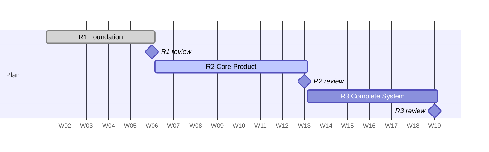

# RoadAssist Bharat — Review-Based Work Plan

**4 members · 3 reviews · 18 weeks** — "One Platform. Every Vehicle. Every Phone. Every Road."

---

## 1. The Team

| | Role | Owns end-to-end | Total effort |
|---|---|---|---|
| **P1** | Backend & Database Lead | Server services, PostgreSQL/PostGIS schema, all API contracts, authentication + RBAC, booking & dispatch engine, emergency core, payments, sync server | 87 days |
| **P2** | Frontend & Mobile Lead | React Native app, web + government + admin portals, design system, offline client, maps UI, accessibility, 8 languages | 86 days |
| **P3** | AI & Data Lead | 9 AI subsystems, model training + serving, on-device inference, feature store, voice/NLU, analytics pipeline | 70 days |
| **P4** | DevOps, QA & Security Lead | Cloud infrastructure, CI/CD, observability, all testing, security, SMS/IVR/USSD telecom gateway, deployment, compliance | 76 days |

**Backup pairs (so no single point of failure):** P1 ↔ P3 · P2 ↔ P4
Each member reviews the other's code. Nobody merges their own work.

---

## 2. Review Calendar

| Review | Weeks | Duration | Theme | Completion |
|---|---|---|---|---|
| **Review 1** | 1 – 5 | 5 weeks | **Foundation** — research, design, database, login working | 25% |
| **Review 2** | 6 – 12 | 7 weeks | **Core Product** — full booking journey, AI, offline, maps | 70% |
| **Review 3** | 13 – 18 | 6 weeks | **Complete System** — emergency, government, testing, deployment | 100% |

---

## 3. Effort Distribution

| Member | Review 1 (5 wk) | Review 2 (7 wk) | Review 3 (6 wk) | **Total** |
|---|---|---|---|---|
| **P1** Backend | 25 days | 33 days | 29 days | **87** |
| **P2** Frontend | 17 days | 36 days | 33 days | **86** |
| **P3** AI | 13 days | 33 days | 24 days | **70** |
| **P4** DevOps/QA | 17 days | 27 days | 32 days | **76** |
| **Team total** | **72 days** | **129 days** | **118 days** | **319** |
| *Per person per week* | *3.6 days* | *4.6 days* | *4.9 days* | |

**Review 1 is deliberately light.** Design work that is rushed costs three times as much to undo later. The load rises as the design stabilises.

**Two rebalancing decisions were made so nobody is overloaded:**
1. P4 takes the **Admin console and Fleet dashboard** off P2 in Review 2 (P2 would otherwise be at 6.3 days/week).
2. P1, P2 and P3 each absorb **2 days of test execution** from P4 in Review 3 (P4 would otherwise be at 6.0 days/week).

P2 remains the tightest at 5.1 days/week in Review 2. Mitigation: the **Android Auto prototype is the declared first cut** — dropping it releases 2 days without touching any graded deliverable.

---

# REVIEW 1 — Foundation
### Weeks 1–5 · 72 team-days · 25% complete

**Goal:** prove the problem is real, the design is sound, and the system's skeleton runs. No feature is complete yet — and that is correct at this stage.

## What the panel will see

1. **Field evidence** — 20 vehicle owners, 10 mechanics, 2 fleet managers interviewed. Real quotes, not assumptions.
2. **Live database** — migrations run on an empty database, 100,000 realistic rows seeded in under 2 minutes, geospatial "nearest mechanic" query returning in under 50 ms.
3. **Working login** — OTP arrives on a real phone, user logs in, token refreshes automatically. Then a stolen token is replayed and the system revokes the entire session family.
4. **Clickable prototype** — the complete breakdown journey as a click-through, in Hindi.
5. **CI pipeline** — a pull request with a bug, a failing test and a hardcoded password is blocked automatically in under 8 minutes.

## Work split

| | P1 — Backend | P2 — Frontend | P3 — AI | P4 — DevOps/QA |
|---|---|---|---|---|
| **Weeks 1–2** | Integration feasibility study (VAHAN, ERSS 112, UPI); candidate entity list; backend backlog; monorepo scaffold | Device + connectivity study; 20 user interviews; 6 personas; 4 journey maps; wireframes for 12 screens | Data availability audit; model feasibility (which of the 9 are real in v1); labelling plan | Cloud + compliance research; **start TRAI DLT registration** (longest lead item); CI skeleton |
| **Weeks 3–4** | **C4 architecture + 15 ADRs**; API style guide; **60-table schema**, indexes, audit log, soft delete | Information architecture; design system foundations; app scaffolds; local (offline) schema | AI Gateway design; feature store schema; **label capture design** | STRIDE threat model; SLO definitions; database infrastructure + backups |
| **Week 5** | **Authentication** — OTP, JWT + rotating refresh, RBAC engine, consent ledger | Auth screens, secure token storage, silent refresh, consent centre | Fraud signal catalogue | Vault secrets, SMS gateway with 2 vendors, edge rate limiting, WAF |
| **Days** | **25** | **17** | **13** | **17** |

## Acceptance criteria

| # | Criterion | Owner |
|---|---|---|
| 1 | Every product assumption is backed by field evidence or explicitly marked as an open bet | All |
| 2 | Migrations apply and roll back cleanly on an empty database, twice in a row | P1 |
| 3 | Every table has a primary key, timestamps, soft delete, version column and an owning service | P1 |
| 4 | Zero sequential scans on the top-20 queries at 100,000 rows | P1 |
| 5 | OTP brute force blocked at 5 attempts / 15 minutes; refresh token reuse revokes the whole family | P1 |
| 6 | 20 RBAC policy tests pass, including 6 negative access-control cases | P1 |
| 7 | Wireframes cover loading, empty, error **and offline** states for all 12 screens | P2 |
| 8 | Design system renders correctly in all 8 languages with no text truncation | P2 |
| 9 | Each of the 9 AI systems is classified honestly: trainable now / trainable later / rules-only in v1 | P3 |
| 10 | Every model has a **baseline recorded before training begins** | P3 |
| 11 | CI blocks lint errors, failing tests and secrets in under 8 minutes | P4 |
| 12 | Every regulatory obligation is mapped to the phase that satisfies it | P4 |

---

# REVIEW 2 — Core Product
### Weeks 6–12 · 129 team-days · 70% complete

**Goal:** a person can use this. The complete breakdown journey works on a real phone, on a real network — and keeps working when the network disappears.

## What the panel will see

1. **A full booking, end to end** — request help → AI diagnosis → 3 mechanics offered → one accepts → live tracking on a map → work completed → UPI payment → rating.
2. **The offline demo (the differentiator)** — phone in **airplane mode**: add a vehicle, run a diagnosis using the on-device model, create a help request, view an offline map. Reconnect. Everything syncs, one deliberate conflict is raised and resolved.
3. **The feature-phone demo** — on an actual ₹1,200 phone with no internet: send `MADAD` by SMS, receive the reply, confirm location, get the mechanic's details, cancel. Then the same in Tamil over an IVR call.
4. **AI with the plug pulled** — the AI service is switched off completely, mid-demo. The product keeps working on rule-based fallbacks. Nothing breaks.
5. **A real diagnosis** — photograph an actual damaged part, get the fault, severity, parts list and a "do not drive this" verdict in Hindi.

## Work split

| | P1 — Backend | P2 — Frontend | P3 — AI | P4 — DevOps/QA |
|---|---|---|---|---|
| **Weeks 6–8** | **140 API endpoints**; booking state machine; dispatch engine; pricing; UPI payments; webhooks | **Design system + 48 screens**; onboarding, garage, request-help flow, live tracking, payment | **AI Gateway live with rule-based logic** for all 8 capabilities (so nothing waits on models) | Observability stack (metrics, logs, traces); preview environments; mobile CI with signed builds |
| **Weeks 9–10** | AI client with circuit breakers + **fallback registry**; feature pipeline; BFF composite endpoints | Mechanic app; web PWA; AI confidence UI; user feedback loop | **7 models trained** — diagnosis, image, voice, maintenance, matching, crash, fraud | ML infrastructure; GPU cost controls; **Admin console + Fleet dashboard** (taken off P2) |
| **Weeks 11–12** | **Sync server** — change feed, conflict resolution, tombstones, replay; geofencing; diagnostics service | **Offline client** — local DB, operation queue, sync engine, conflict UI; maps + offline packs; OBD Bluetooth | **On-device model bundle ≤ 15 MB**; vehicle-class rule packs; EV diagnostics | **Telecom gateway** — SMS commands, IVR in 8 languages, USSD; tile server; network chaos harness |
| **Days** | **33** | **36** | **33** | **27** |

## Acceptance criteria

| # | Criterion | Owner |
|---|---|---|
| 1 | 100% of the v1 API implemented; specification generated from code, never hand-written | P1 |
| 2 | Every write endpoint is idempotent — proven by a replay test | P1 |
| 3 | The booking state machine rejects **every** illegal transition (exhaustive test) | P1 |
| 4 | Complete booking journey works on Android 10 / 2 GB RAM / throttled 3G | P2 |
| 5 | Every screen has loading, empty, error and offline states built — verified in review | P2 |
| 6 | Airplane-mode journey completes and syncs with zero data loss | P2 + P1 |
| 7 | 30-scenario conflict test suite passes; no scenario produces a corrupt state | P1 + P2 |
| 8 | Every model beats its recorded baseline on a held-out test set | P3 |
| 9 | On-device inference under 120 ms on the low-end reference phone | P3 |
| 10 | Diagnosis never wrongly says "safe to drive" — measured false-safe rate is **zero** | P3 |
| 11 | Kill the AI service entirely: the full booking still completes on fallbacks | P1 + P3 |
| 12 | A feature-phone user can request help, track and cancel entirely over SMS | P4 |
| 13 | Navigation and search work with the device fully offline | P2 + P4 |
| 14 | Sync of 100 queued operations completes in under 8 seconds on 3G | P1 + P2 |

---

# REVIEW 3 — Complete System
### Weeks 13–18 · 118 team-days · 100% complete

**Goal:** the life-safety features work, the system is tested under failure, and it is deployed and running in production.

## What the panel will see

1. **Crash to responder** — a simulated crash on a real phone. A 30-second countdown takes over the locked screen with alarm and vibration. It completes. Emergency contacts receive an SMS with a live location link, the nearest responder is notified, the incident room opens. **Under 10 seconds.**
2. **The proof that it is engineered, not assembled** — the entire platform is scaled to **zero replicas**, live, in front of the panel. An SOS is triggered. It still works, over the isolated degraded path.
3. **False-positive proof** — driving over a real speed breaker on camera. Nothing happens. Measured over 200 hours of real driving.
4. **Government dashboard** — log in as a district officer, see live incidents in that jurisdiction only, identify an accident blackspot, generate the statutory monthly report as a PDF. Then **attempt to identify an individual citizen and fail** — with the audit log showing the attempt.
5. **Accessibility proof** — the complete booking journey driven by a screen reader **with the display switched off**.
6. **Deployment** — one commit reaches production through the full pipeline. Then a broken version is deployed on purpose and rolls back automatically in under 2 minutes.

## Work split

| | P1 — Backend | P2 — Frontend | P3 — AI | P4 — DevOps/QA |
|---|---|---|---|---|
| **Weeks 13–14** | **Emergency engine** — escalation ladder, ERSS 112 handoff, break-glass medical access, degraded SMS path | **SOS UI + crash countdown + incident room**; **government portal** with live map and 6 statutory reports | Crash detection tuned to production; severity model; blackspot detection; incident forecasting | Isolated emergency infrastructure; **chaos test proving SOS survives total platform failure**; mTLS for government |
| **Weeks 15–16** | Anonymization with k-anonymity ≥ 10; CDC pipeline; **property-based + mutation testing** | Analytics dashboards; fleet + mechanic screens; **Detox end-to-end tests**; device farm; accessibility + 8-language QA | **ClickHouse analytics + metric dictionary**; bias audit across all models; adversarial testing | **Load testing** (10k requests/sec), **chaos**, **security testing**; bug burn-down to zero critical issues |
| **Weeks 17–18** | Online migrations; health probes; query tuning, caching; scaling plan + tech debt register | App store submission; over-the-air updates; APK size, startup, jank and data-usage optimisation | Model serving + automated rollback; inference optimisation; AI roadmap and data flywheel | **Terraform production, ArgoCD, disaster-recovery drill**; infrastructure right-sizing; cost model; compliance roadmap |
| **Days** | **29** | **33** | **24** | **32** |

## Acceptance criteria

| # | Criterion | Owner |
|---|---|---|
| 1 | Crash → contacts and responders notified in under 10 seconds (95th percentile) | P1 |
| 2 | Emergency path survives a chaos test with **every other service down** | P4 |
| 3 | The AI **cannot** auto-dispatch emergency services — enforced in code, not policy | P1 + P3 |
| 4 | Crash false-positive rate ≤ 1 per 1,000 driving hours, measured over real driving | P3 |
| 5 | Break-glass medical access logs the actor and reason, and notifies the user afterwards | P1 |
| 6 | No citizen is identifiable in any government view or export — proven by a re-identification test | P1 + P2 |
| 7 | Test coverage ≥ 80% on new code; zero open critical or high-priority bugs | P4 |
| 8 | Load test: 95th percentile under 300 ms at 10,000 requests/second | P4 |
| 9 | Zero high or critical security findings survive | P4 |
| 10 | Full journey passes a screen-reader walkthrough (WCAG 2.1 AA) | P2 |
| 11 | Disaster-recovery drill: restore into a clean region, recovery time under 4 hours | P4 |
| 12 | Rollback of any service completes in under 5 minutes — proven by drill | P4 |
| 13 | Every metric has exactly one definition; no two dashboards disagree | P3 |
| 14 | Every alert has a runbook a new person can follow unaided | P4 |

---

## 4. Weekly Working Rules

| When | What | Duration |
|---|---|---|
| Daily 9:45 | Standup — *yesterday / today / blocked*. Hard stop. | 12 min |
| Daily 16:30 | Pull request sweep — every open PR reviewed or explicitly deferred | 30 min |
| Daily 18:00 | Build must be green. Whoever broke it fixes or reverts it. | — |
| Monday | Sprint planning (2-week sprints) | 60 min |
| Thursday | Risk + security review | 30 min |
| Friday | **Demo of working software** (recorded) + retrospective | 45 min |

**Rules that are not negotiable**
1. Branch names: `feat/r2-p1-booking-state-machine` — *type / review / owner / summary*. Maximum 3 days alive.
2. Commits: `feat(booking): reject illegal state transitions` — type, scope, imperative summary.
3. Every pull request needs **1 approval**; **2 approvals** for database migrations, authentication, payments and the emergency service.
4. Nobody merges their own code.
5. Blocked for more than 2 hours? Say so publicly. Sitting silently on a blocker is the only genuinely unacceptable behaviour on this team.

**Definition of Done** — code merged · tests written (≥ 80%) · works on the low-end reference phone · has loading/empty/error/offline states · documented · demoed on Friday.

---

## 5. If You Fall Behind — Cut In This Order

Decide this now, not under pressure the week before a review.

| Order | Cut | Days freed | Cost |
|---|---|---|---|
| 1 | Android Auto prototype | 2 | Zero — it was always a bonus |
| 2 | USSD (keep SMS + IVR) | 3 | Low — SMS and IVR already cover feature phones |
| 3 | Sound-based diagnosis | 2 | Low — it is already flagged as a spike |
| 4 | Fleet dashboard | 4 | Medium — reduces the business story |
| 5 | 3 of the 8 languages | 3 | Medium — keep Hindi, English, Tamil, Telugu, Marathi |
| 6 | Predictive maintenance model | 4 | Medium — rules-based version still ships |

**Never cut, under any circumstance:** the emergency path, the offline engine, the SMS fallback, or security testing. These are the four things that make this a platform rather than an app.

---

## 6. Top Risks

| Risk | Who | What we do about it |
|---|---|---|
| TRAI DLT approval for SMS takes weeks | P4 | **Started in Week 1**, before anything else. Two gateway vendors registered. |
| No real training data at the start | P3 | Every AI feature ships rule-based in Review 2. Models are an upgrade, never a dependency. |
| Offline sync corrupts booking data | P1 + P2 | Conflict matrix written *before* coding; 30-scenario test suite; server is always authoritative on booking state. |
| Crash detection falsely calls emergency services | P3 + P1 | Model raises a *signal*, never an incident. 30-second cancel window. Call-back verification. Auto-dispatch blocked in code. |
| P2 overloaded in Review 2 | P2 | Admin + Fleet portals moved to P4; Android Auto is the declared first cut. |
| Team of 4 undersized for the scope | All | Reviews are milestone-gated, features are flag-controlled, and the cut list above is agreed in advance. |
